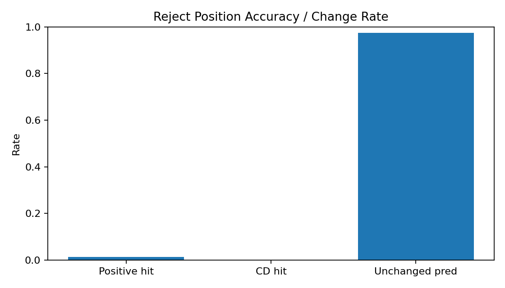
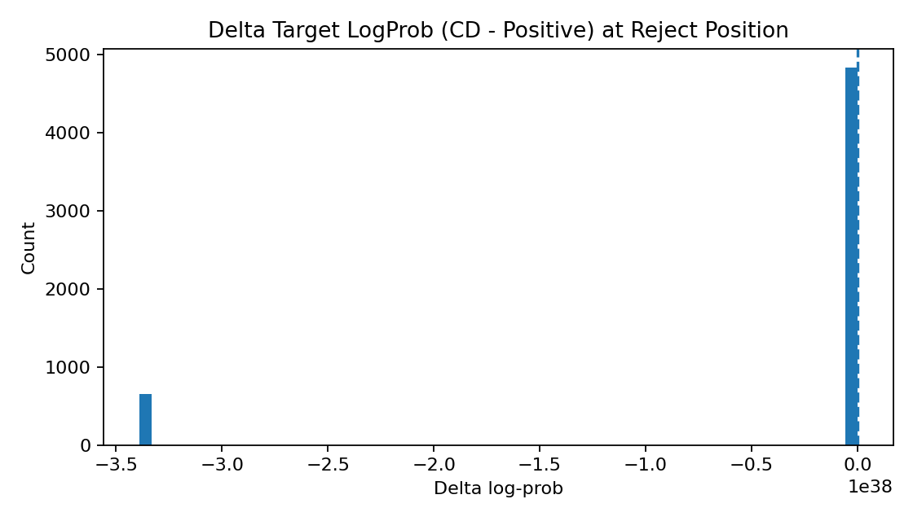
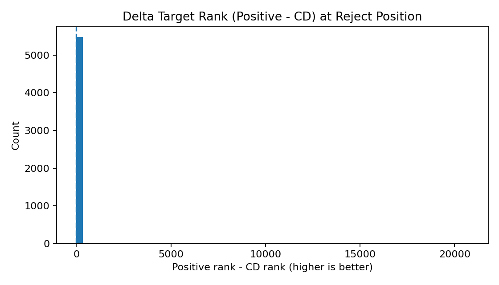
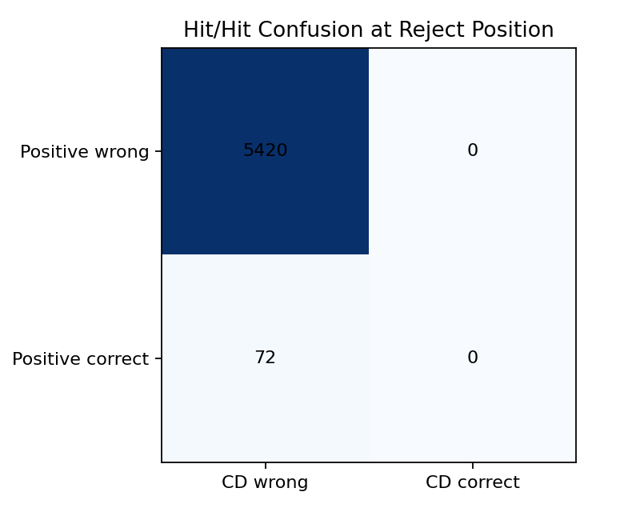
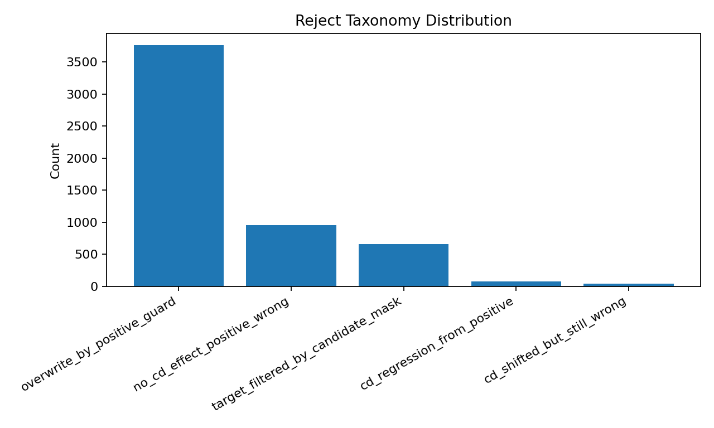

# Reject Token Analysis: Positive vs CD

## Overall
- Reject events: **5492**
- Positive hit rate: **1.31%**
- CD hit rate: **0.00%**
- Hit-rate gain (CD - Positive): **-1.31%**
- Prediction changed rate: **2.55%**

## Target LogProb Delta (CD - Positive)
- Mean: -inf
- Median: 0.00000
- P10 / P90: -338953138925153547590470800371487866880.00000 / 0.10346
- Improved rate (>0): 14.00%

## Target Rank Delta (Positive - CD)
- Mean: 6.002
- Median: 0.000
- P10 / P90: 0.000 / 0.000
- Improved rate (>0): 8.63%

## Why Rejected
- Target in candidate mask rate: **67.64%**
- Sampled token in candidate mask rate: **100.00%**
- CD overwritten-by-positive rate (n_keep region): **68.45%**
- Sampled token rank in posterior (mean/median): **2062.08 / 3.00**

## Reject Taxonomy
| Taxonomy | Count | Rate |
|---|---:|---:|
| overwrite_by_positive_guard | 3759 | 68.45% |
| no_cd_effect_positive_wrong | 957 | 17.43% |
| target_filtered_by_candidate_mask | 659 | 12.00% |
| cd_regression_from_positive | 72 | 1.31% |
| cd_shifted_but_still_wrong | 45 | 0.82% |

## Confusion (Positive Hit vs CD Hit)
| Positive\CD | CD wrong | CD correct |
|---|---:|---:|
| Positive wrong | 5420 | 0 |
| Positive correct | 72 | 0 |

## Plots

## Top Improved Reject Events
| sample | turn | step | abs_pos | taxonomy | target | sampled_draft | positive_pred | cd_pred | d_logprob | d_rank | why_reject |
|---:|---:|---:|---:|---|---|---|---|---|---:|---:|---|
| 89 | 0 | 31 | 293 | no_cd_effect_positive_wrong |  Step (14822) |  cube (23739) |  cube (23739) |  cube (23739) | 1.2469 | 0 | Reject vì draft đề xuất ` cube` (23739) khác posterior ` Step` (14822). CD không đổi argmax so với positive ở vị trí reject. Cả positive và CD đều chưa đưa target token lên top-1. |
| 79 | 0 | 29 | 293 | cd_shifted_but_still_wrong | pins (74558) | ch (331) | en (268) | ch (331) | 1.1736 | 0 | Reject vì draft đề xuất `ch` (331) khác posterior `pins` (74558). CD đã đổi argmax từ `en` sang `ch`. Cả positive và CD đều chưa đưa target token lên top-1. |
| 83 | 0 | 34 | 287 | no_cd_effect_positive_wrong | erry (5400) |  spends (37102) |  spends (37102) |  spends (37102) | 0.9506 | 1 | Reject vì draft đề xuất ` spends` (37102) khác posterior `erry` (5400). CD không đổi argmax so với positive ở vị trí reject. Cả positive và CD đều chưa đưa target token lên top-1. |
| 69 | 0 | 46 | 329 | no_cd_effect_positive_wrong | 8 (23) | $ (3) | $ (3) | $ (3) | 0.9031 | 0 | Reject vì draft đề xuất `$` (3) khác posterior `8` (23). CD không đổi argmax so với positive ở vị trí reject. Cả positive và CD đều chưa đưa target token lên top-1. |
| 102 | 0 | 6 | 114 | no_cd_effect_positive_wrong |  lion (39032) |  c (272) |  c (272) |  c (272) | 0.8462 | 0 | Reject vì draft đề xuất ` c` (272) khác posterior ` lion` (39032). CD không đổi argmax so với positive ở vị trí reject. Cả positive và CD đều chưa đưa target token lên top-1. |
| 68 | 0 | 4 | 92 | no_cd_effect_positive_wrong | Insurance (78754) | After (6025) | After (6025) | After (6025) | 0.7974 | 0 | Reject vì draft đề xuất `After` (6025) khác posterior `Insurance` (78754). CD không đổi argmax so với positive ở vị trí reject. Cả positive và CD đều chưa đưa target token lên top-1. |
| 28 | 0 | 65 | 431 | no_cd_effect_positive_wrong | half (37006) | 1 (16) | 1 (16) | 1 (16) | 0.7840 | 0 | Reject vì draft đề xuất `1` (16) khác posterior `half` (37006). CD không đổi argmax so với positive ở vị trí reject. Cả positive và CD đều chưa đưa target token lên top-1. |
| 126 | 0 | 33 | 268 | no_cd_effect_positive_wrong |  Break (15623) |  First (5512) |  First (5512) |  First (5512) | 0.7587 | -1 | Reject vì draft đề xuất ` First` (5512) khác posterior ` Break` (15623). CD không đổi argmax so với positive ở vị trí reject. Cả positive và CD đều chưa đưa target token lên top-1. |
| 15 | 0 | 12 | 144 | no_cd_effect_positive_wrong |  Percentage (63241) |  How (2585) |  How (2585) |  How (2585) | 0.7563 | 0 | Reject vì draft đề xuất ` How` (2585) khác posterior ` Percentage` (63241). CD không đổi argmax so với positive ở vị trí reject. Cả positive và CD đều chưa đưa target token lên top-1. |
| 55 | 0 | 1 | 116 | no_cd_effect_positive_wrong |  Calculate (20517) |  Total (10657) |  Total (10657) |  Total (10657) | 0.7538 | 1 | Reject vì draft đề xuất ` Total` (10657) khác posterior ` Calculate` (20517). CD không đổi argmax so với positive ở vị trí reject. Cả positive và CD đều chưa đưa target token lên top-1. |
| 126 | 0 | 176 | 903 | no_cd_effect_positive_wrong | account (4608) |  accounted (40753) |  accounted (40753) |  accounted (40753) | 0.7515 | 0 | Reject vì draft đề xuất ` accounted` (40753) khác posterior `account` (4608). CD không đổi argmax so với positive ở vị trí reject. Cả positive và CD đều chưa đưa target token lên top-1. |
| 127 | 0 | 16 | 199 | no_cd_effect_positive_wrong | por (4308) | on (263) | on (263) | on (263) | 0.7356 | 1 | Reject vì draft đề xuất `on` (263) khác posterior `por` (4308). CD không đổi argmax so với positive ở vị trí reject. Cả positive và CD đều chưa đưa target token lên top-1. |
| 116 | 0 | 17 | 203 | no_cd_effect_positive_wrong |  football (8964) |  team (2083) |  team (2083) |  team (2083) | 0.7071 | 0 | Reject vì draft đề xuất ` team` (2083) khác posterior ` football` (8964). CD không đổi argmax so với positive ở vị trí reject. Cả positive và CD đều chưa đưa target token lên top-1. |
| 87 | 0 | 1 | 143 | no_cd_effect_positive_wrong |  Understand (70894) |  Revenue (37393) |  Revenue (37393) |  Revenue (37393) | 0.7010 | 1 | Reject vì draft đề xuất ` Revenue` (37393) khác posterior ` Understand` (70894). CD không đổi argmax so với positive ở vị trí reject. Cả positive và CD đều chưa đưa target token lên top-1. |
| 125 | 0 | 8 | 143 | no_cd_effect_positive_wrong | To (1249) | $$ (14085) | $$ (14085) | $$ (14085) | 0.6945 | 1 | Reject vì draft đề xuất `$$` (14085) khác posterior `To` (1249). CD không đổi argmax so với positive ở vị trí reject. Cả positive và CD đều chưa đưa target token lên top-1. |
| 20 | 0 | 17 | 271 | no_cd_effect_positive_wrong |  well (1632) | ly (398) | ly (398) | ly (398) | 0.6711 | 0 | Reject vì draft đề xuất `ly` (398) khác posterior ` well` (1632). CD không đổi argmax so với positive ở vị trí reject. Cả positive và CD đều chưa đưa target token lên top-1. |
| 63 | 0 | 49 | 376 | no_cd_effect_positive_wrong | Ford (58563) | \n (198) | \n (198) | \n (198) | 0.6646 | 0 | Reject vì draft đề xuất `\n` (198) khác posterior `Ford` (58563). CD không đổi argmax so với positive ở vị trí reject. Cả positive và CD đều chưa đưa target token lên top-1. |
| 90 | 0 | 40 | 309 | no_cd_effect_positive_wrong | { (90) |  Answer (21806) |  Answer (21806) |  Answer (21806) | 0.6634 | 0 | Reject vì draft đề xuất ` Answer` (21806) khác posterior `{` (90). CD không đổi argmax so với positive ở vị trí reject. Cả positive và CD đều chưa đưa target token lên top-1. |
| 4 | 0 | 24 | 272 | no_cd_effect_positive_wrong |  Beth (28003) | \n (198) | \n (198) | \n (198) | 0.6539 | 0 | Reject vì draft đề xuất `\n` (198) khác posterior ` Beth` (28003). CD không đổi argmax so với positive ở vị trí reject. Cả positive và CD đều chưa đưa target token lên top-1. |
| 58 | 0 | 32 | 339 | no_cd_effect_positive_wrong | }_{ (51535) | 's (594) | 's (594) | 's (594) | 0.6527 | 1 | Reject vì draft đề xuất `'s` (594) khác posterior `}_{` (51535). CD không đổi argmax so với positive ở vị trí reject. Cả positive và CD đều chưa đưa target token lên top-1. |
| 13 | 0 | 15 | 193 | no_cd_effect_positive_wrong | 2 (17) |  ** (3070) |  ** (3070) |  ** (3070) | 0.6499 | 0 | Reject vì draft đề xuất ` **` (3070) khác posterior `2` (17). CD không đổi argmax so với positive ở vị trí reject. Cả positive và CD đều chưa đưa target token lên top-1. |
| 78 | 0 | 9 | 151 | no_cd_effect_positive_wrong |  via (4566) | .\n (624) | .\n (624) | .\n (624) | 0.6388 | 1 | Reject vì draft đề xuất `.\n` (624) khác posterior ` via` (4566). CD không đổi argmax so với positive ở vị trí reject. Cả positive và CD đều chưa đưa target token lên top-1. |
| 86 | 0 | 36 | 212 | no_cd_effect_positive_wrong | } (92) |  trees (12408) |  trees (12408) |  trees (12408) | 0.6328 | 0 | Reject vì draft đề xuất ` trees` (12408) khác posterior `}` (92). CD không đổi argmax so với positive ở vị trí reject. Cả positive và CD đều chưa đưa target token lên top-1. |
| 115 | 0 | 70 | 521 | no_cd_effect_positive_wrong |  collections (15302) |  per (817) |  per (817) |  per (817) | 0.6205 | 0 | Reject vì draft đề xuất ` per` (817) khác posterior ` collections` (15302). CD không đổi argmax so với positive ở vị trí reject. Cả positive và CD đều chưa đưa target token lên top-1. |
| 64 | 0 | 40 | 341 | cd_shifted_but_still_wrong |  containers (23853) |  find (1477) | \ (59) |  find (1477) | 0.6200 | 0 | Reject vì draft đề xuất ` find` (1477) khác posterior ` containers` (23853). CD đã đổi argmax từ `\` sang ` find`. Cả positive và CD đều chưa đưa target token lên top-1. |
| 29 | 0 | 26 | 338 | no_cd_effect_positive_wrong |  lbs (28060) |  ( (320) |  ( (320) |  ( (320) | 0.6177 | 0 | Reject vì draft đề xuất ` (` (320) khác posterior ` lbs` (28060). CD không đổi argmax so với positive ở vị trí reject. Cả positive và CD đều chưa đưa target token lên top-1. |
| 105 | 0 | 21 | 263 | no_cd_effect_positive_wrong |  were (1033) |  pencils (96338) |  pencils (96338) |  pencils (96338) | 0.6163 | 0 | Reject vì draft đề xuất ` pencils` (96338) khác posterior ` were` (1033). CD không đổi argmax so với positive ở vị trí reject. Cả positive và CD đều chưa đưa target token lên top-1. |
| 127 | 0 | 1 | 131 | no_cd_effect_positive_wrong | ### (14374) |  how (1246) |  how (1246) |  how (1246) | 0.6088 | 0 | Reject vì draft đề xuất ` how` (1246) khác posterior `###` (14374). CD không đổi argmax so với positive ở vị trí reject. Cả positive và CD đều chưa đưa target token lên top-1. |
| 13 | 0 | 47 | 367 | no_cd_effect_positive_wrong |  drove (23108) |  through (1526) |  through (1526) |  through (1526) | 0.5897 | 1 | Reject vì draft đề xuất ` through` (1526) khác posterior ` drove` (23108). CD không đổi argmax so với positive ở vị trí reject. Cả positive và CD đều chưa đưa target token lên top-1. |
| 5 | 0 | 41 | 275 | no_cd_effect_positive_wrong | 3 (18) | 1 (16) | 1 (16) | 1 (16) | 0.5854 | 0 | Reject vì draft đề xuất `1` (16) khác posterior `3` (18). CD không đổi argmax so với positive ở vị trí reject. Cả positive và CD đều chưa đưa target token lên top-1. |

## Top Worsened Reject Events
| sample | turn | step | abs_pos | taxonomy | target | sampled_draft | positive_pred | cd_pred | d_logprob | d_rank | why_reject |
|---:|---:|---:|---:|---|---|---|---|---|---:|---:|---|
| 0 | 0 | 14 | 141 | target_filtered_by_candidate_mask |  how (1246) |  Samantha (62808) |  Samantha (62808) |  Samantha (62808) | -338953138925153547590470800371487866880.0000 | 17 | Reject vì draft đề xuất ` Samantha` (62808) khác posterior ` how` (1246). CD không đổi argmax so với positive ở vị trí reject. Token target không nằm trong candidate mask (beta filter), nên khó được CD chọn. Cả positive và CD đều chưa đưa target token lên top-1. |
| 0 | 0 | 18 | 164 | target_filtered_by_candidate_mask | tha (22410) | 's (594) | 's (594) | 's (594) | -338953138925153547590470800371487866880.0000 | 48 | Reject vì draft đề xuất `'s` (594) khác posterior `tha` (22410). CD không đổi argmax so với positive ở vị trí reject. Token target không nằm trong candidate mask (beta filter), nên khó được CD chọn. Cả positive và CD đều chưa đưa target token lên top-1. |
| 0 | 0 | 31 | 280 | target_filtered_by_candidate_mask | } (92) |  amount (3311) |  amount (3311) |  amount (3311) | -338953138925153547590470800371487866880.0000 | 7 | Reject vì draft đề xuất ` amount` (3311) khác posterior `}` (92). CD không đổi argmax so với positive ở vị trí reject. Token target không nằm trong candidate mask (beta filter), nên khó được CD chọn. Cả positive và CD đều chưa đưa target token lên top-1. |
| 0 | 0 | 34 | 319 | target_filtered_by_candidate_mask | \n (198) |  = (284) |  = (284) |  = (284) | -338953138925153547590470800371487866880.0000 | 0 | Reject vì draft đề xuất ` =` (284) khác posterior `\n` (198). CD không đổi argmax so với positive ở vị trí reject. Token target không nằm trong candidate mask (beta filter), nên khó được CD chọn. Cả positive và CD đều chưa đưa target token lên top-1. |
| 0 | 0 | 35 | 327 | target_filtered_by_candidate_mask | Total (7595) | 1 (16) | 1 (16) | 1 (16) | -338953138925153547590470800371487866880.0000 | 6 | Reject vì draft đề xuất `1` (16) khác posterior `Total` (7595). CD không đổi argmax so với positive ở vị trí reject. Token target không nằm trong candidate mask (beta filter), nên khó được CD chọn. Cả positive và CD đều chưa đưa target token lên top-1. |
| 0 | 0 | 38 | 356 | target_filtered_by_candidate_mask | <|endoftext|> (151643) |  three (2326) |  three (2326) |  three (2326) | -338953138925153547590470800371487866880.0000 | 109 | Reject vì draft đề xuất ` three` (2326) khác posterior `<|endoftext|>` (151643). CD không đổi argmax so với positive ở vị trí reject. Token target không nằm trong candidate mask (beta filter), nên khó được CD chọn. Cả positive và CD đều chưa đưa target token lên top-1. |
| 1 | 0 | 0 | 88 | target_filtered_by_candidate_mask |  ** (3070) | 9 (24) | 9 (24) | 9 (24) | -338953138925153547590470800371487866880.0000 | 0 | Reject vì draft đề xuất `9` (24) khác posterior ` **` (3070). CD không đổi argmax so với positive ở vị trí reject. Token target không nằm trong candidate mask (beta filter), nên khó được CD chọn. Cả positive và CD đều chưa đưa target token lên top-1. |
| 1 | 0 | 14 | 160 | target_filtered_by_candidate_mask |  the (279) | 's (594) | 's (594) | 's (594) | -338953138925153547590470800371487866880.0000 | 4 | Reject vì draft đề xuất `'s` (594) khác posterior ` the` (279). CD không đổi argmax so với positive ở vị trí reject. Token target không nằm trong candidate mask (beta filter), nên khó được CD chọn. Cả positive và CD đều chưa đưa target token lên top-1. |
| 1 | 0 | 18 | 191 | target_filtered_by_candidate_mask | 2 (17) |  \ (1124) |  \ (1124) |  \ (1124) | -338953138925153547590470800371487866880.0000 | 5 | Reject vì draft đề xuất ` \` (1124) khác posterior `2` (17). CD không đổi argmax so với positive ở vị trí reject. Token target không nằm trong candidate mask (beta filter), nên khó được CD chọn. Cả positive và CD đều chưa đưa target token lên top-1. |
| 1 | 0 | 23 | 243 | target_filtered_by_candidate_mask | We (1654) | ** (334) | ** (334) | ** (334) | -338953138925153547590470800371487866880.0000 | 10 | Reject vì draft đề xuất `**` (334) khác posterior `We` (1654). CD không đổi argmax so với positive ở vị trí reject. Token target không nằm trong candidate mask (beta filter), nên khó được CD chọn. Cả positive và CD đều chưa đưa target token lên top-1. |
| 1 | 0 | 31 | 308 | target_filtered_by_candidate_mask | } (92) | }\n (532) | }\n (532) | }\n (532) | -338953138925153547590470800371487866880.0000 | 0 | Reject vì draft đề xuất `}\n` (532) khác posterior `}` (92). CD không đổi argmax so với positive ở vị trí reject. Token target không nằm trong candidate mask (beta filter), nên khó được CD chọn. Cả positive và CD đều chưa đưa target token lên top-1. |
| 1 | 0 | 32 | 317 | target_filtered_by_candidate_mask | <|endoftext|> (151643) | \n (198) | \n (198) | \n (198) | -338953138925153547590470800371487866880.0000 | 18 | Reject vì draft đề xuất `\n` (198) khác posterior `<|endoftext|>` (151643). CD không đổi argmax so với positive ở vị trí reject. Token target không nằm trong candidate mask (beta filter), nên khó được CD chọn. Cả positive và CD đều chưa đưa target token lên top-1. |
| 2 | 0 | 18 | 219 | target_filtered_by_candidate_mask |  L (444) |  A (362) |  A (362) |  A (362) | -338953138925153547590470800371487866880.0000 | 1 | Reject vì draft đề xuất ` A` (362) khác posterior ` L` (444). CD không đổi argmax so với positive ở vị trí reject. Token target không nằm trong candidate mask (beta filter), nên khó được CD chọn. Cả positive và CD đều chưa đưa target token lên top-1. |
| 2 | 0 | 39 | 414 | target_filtered_by_candidate_mask | 2 (17) | 3 (18) | 3 (18) | 3 (18) | -338953138925153547590470800371487866880.0000 | 0 | Reject vì draft đề xuất `3` (18) khác posterior `2` (17). CD không đổi argmax so với positive ở vị trí reject. Token target không nằm trong candidate mask (beta filter), nên khó được CD chọn. Cả positive và CD đều chưa đưa target token lên top-1. |
| 2 | 0 | 50 | 515 | target_filtered_by_candidate_mask | W (54) | 3 (18) | 3 (18) | 3 (18) | -338953138925153547590470800371487866880.0000 | 1 | Reject vì draft đề xuất `3` (18) khác posterior `W` (54). CD không đổi argmax so với positive ở vị trí reject. Token target không nằm trong candidate mask (beta filter), nên khó được CD chọn. Cả positive và CD đều chưa đưa target token lên top-1. |
| 2 | 0 | 54 | 549 | target_filtered_by_candidate_mask | <|endoftext|> (151643) | \n (198) | \n (198) | \n (198) | -338953138925153547590470800371487866880.0000 | 10 | Reject vì draft đề xuất `\n` (198) khác posterior `<|endoftext|>` (151643). CD không đổi argmax so với positive ở vị trí reject. Token target không nằm trong candidate mask (beta filter), nên khó được CD chọn. Cả positive và CD đều chưa đưa target token lên top-1. |
| 3 | 0 | 2 | 115 | target_filtered_by_candidate_mask |  for (369) |  water (3015) |  water (3015) |  water (3015) | -338953138925153547590470800371487866880.0000 | 2 | Reject vì draft đề xuất ` water` (3015) khác posterior ` for` (369). CD không đổi argmax so với positive ở vị trí reject. Token target không nằm trong candidate mask (beta filter), nên khó được CD chọn. Cả positive và CD đều chưa đưa target token lên top-1. |
| 3 | 0 | 5 | 144 | target_filtered_by_candidate_mask |  per (817) | /h (7530) | /h (7530) | /h (7530) | -338953138925153547590470800371487866880.0000 | 5 | Reject vì draft đề xuất `/h` (7530) khác posterior ` per` (817). CD không đổi argmax so với positive ở vị trí reject. Token target không nằm trong candidate mask (beta filter), nên khó được CD chọn. Cả positive và CD đều chưa đưa target token lên top-1. |
| 3 | 0 | 15 | 236 | target_filtered_by_candidate_mask | 1 (16) | 0 (15) | 0 (15) | 0 (15) | -338953138925153547590470800371487866880.0000 | 0 | Reject vì draft đề xuất `0` (15) khác posterior `1` (16). CD không đổi argmax so với positive ở vị trí reject. Token target không nằm trong candidate mask (beta filter), nên khó được CD chọn. Cả positive và CD đều chưa đưa target token lên top-1. |
| 3 | 0 | 20 | 280 | target_filtered_by_candidate_mask |  for (369) |   (220) |   (220) |   (220) | -338953138925153547590470800371487866880.0000 | 1 | Reject vì draft đề xuất ` ` (220) khác posterior ` for` (369). CD không đổi argmax so với positive ở vị trí reject. Token target không nằm trong candidate mask (beta filter), nên khó được CD chọn. Cả positive và CD đều chưa đưa target token lên top-1. |
| 3 | 0 | 28 | 328 | target_filtered_by_candidate_mask | 8 (23) | 1 (16) | 1 (16) | 1 (16) | -338953138925153547590470800371487866880.0000 | 5 | Reject vì draft đề xuất `1` (16) khác posterior `8` (23). CD không đổi argmax so với positive ở vị trí reject. Token target không nằm trong candidate mask (beta filter), nên khó được CD chọn. Cả positive và CD đều chưa đưa target token lên top-1. |
| 4 | 0 | 1 | 104 | target_filtered_by_candidate_mask |  run (1598) |   (220) |   (220) |   (220) | -338953138925153547590470800371487866880.0000 | 0 | Reject vì draft đề xuất ` ` (220) khác posterior ` run` (1598). CD không đổi argmax so với positive ở vị trí reject. Token target không nằm trong candidate mask (beta filter), nên khó được CD chọn. Cả positive và CD đều chưa đưa target token lên top-1. |
| 4 | 0 | 3 | 123 | target_filtered_by_candidate_mask |  more (803) | 4 (19) | 4 (19) | 4 (19) | -338953138925153547590470800371487866880.0000 | 0 | Reject vì draft đề xuất `4` (19) khác posterior ` more` (803). CD không đổi argmax so với positive ở vị trí reject. Token target không nằm trong candidate mask (beta filter), nên khó được CD chọn. Cả positive và CD đều chưa đưa target token lên top-1. |
| 4 | 0 | 15 | 204 | target_filtered_by_candidate_mask |   \n (2303) |  in (304) |  in (304) |  in (304) | -338953138925153547590470800371487866880.0000 | 2 | Reject vì draft đề xuất ` in` (304) khác posterior `  \n` (2303). CD không đổi argmax so với positive ở vị trí reject. Token target không nằm trong candidate mask (beta filter), nên khó được CD chọn. Cả positive và CD đều chưa đưa target token lên top-1. |
| 4 | 0 | 16 | 211 | target_filtered_by_candidate_mask | 1 (16) | 4 (19) | 4 (19) | 4 (19) | -338953138925153547590470800371487866880.0000 | 2 | Reject vì draft đề xuất `4` (19) khác posterior `1` (16). CD không đổi argmax so với positive ở vị trí reject. Token target không nằm trong candidate mask (beta filter), nên khó được CD chọn. Cả positive và CD đều chưa đưa target token lên top-1. |
| 5 | 0 | 0 | 104 | target_filtered_by_candidate_mask |  to (311) |  costs (7049) |  costs (7049) |  costs (7049) | -338953138925153547590470800371487866880.0000 | 12 | Reject vì draft đề xuất ` costs` (7049) khác posterior ` to` (311). CD không đổi argmax so với positive ở vị trí reject. Token target không nằm trong candidate mask (beta filter), nên khó được CD chọn. Cả positive và CD đều chưa đưa target token lên top-1. |
| 5 | 0 | 2 | 115 | target_filtered_by_candidate_mask | L (43) | Each (4854) | Each (4854) | Each (4854) | -338953138925153547590470800371487866880.0000 | 4 | Reject vì draft đề xuất `Each` (4854) khác posterior `L` (43). CD không đổi argmax so với positive ở vị trí reject. Token target không nằm trong candidate mask (beta filter), nên khó được CD chọn. Cả positive và CD đều chưa đưa target token lên top-1. |
| 5 | 0 | 28 | 211 | target_filtered_by_candidate_mask |  le (512) | mons (23570) | mons (23570) | mons (23570) | -338953138925153547590470800371487866880.0000 | 0 | Reject vì draft đề xuất `mons` (23570) khác posterior ` le` (512). CD không đổi argmax so với positive ở vị trí reject. Token target không nằm trong candidate mask (beta filter), nên khó được CD chọn. Cả positive và CD đều chưa đưa target token lên top-1. |
| 5 | 0 | 40 | 261 | target_filtered_by_candidate_mask |  per (817) | :** (66963) | :** (66963) | :** (66963) | -338953138925153547590470800371487866880.0000 | 0 | Reject vì draft đề xuất `:**` (66963) khác posterior ` per` (817). CD không đổi argmax so với positive ở vị trí reject. Token target không nằm trong candidate mask (beta filter), nên khó được CD chọn. Cả positive và CD đều chưa đưa target token lên top-1. |
| 5 | 0 | 57 | 342 | target_filtered_by_candidate_mask |  years (1635) |  many (1657) |  many (1657) |  many (1657) | -338953138925153547590470800371487866880.0000 | 0 | Reject vì draft đề xuất ` many` (1657) khác posterior ` years` (1635). CD không đổi argmax so với positive ở vị trí reject. Token target không nằm trong candidate mask (beta filter), nên khó được CD chọn. Cả positive và CD đều chưa đưa target token lên top-1. |

## Detailed Case Explanations
### Case 1: sample=89, turn=0, step=31, pos=293
- Taxonomy: `no_cd_effect_positive_wrong` - CD khong doi huong du doan va positive da sai target tu dau.
- Proposed draft token: ` cube` (23739); posterior token: ` Step` (14822)
- Positive pred: ` cube` (23739), CD pred: ` cube` (23739)
- Reason: Reject vì draft đề xuất ` cube` (23739) khác posterior ` Step` (14822). CD không đổi argmax so với positive ở vị trí reject. Cả positive và CD đều chưa đưa target token lên top-1.
- Candidate mask: target_in=1, sampled_in=1, cd_overwritten=0
- Delta target logprob/rank: 1.2469 / 0
- Positive top-3:  cube (23739, p=0.8846);  Step (14822, p=0.1056);  cubes (54104, p=0.0032)
- CD top-3:  cube (23739, p=0.6324);  Step (14822, p=0.3676); # (2, p=0.0000)
- Posterior top-3:  Step (14822, p=1.0000); Step (8304, p=0.0000);  step (3019, p=0.0000)

### Case 2: sample=79, turn=0, step=29, pos=293
- Taxonomy: `cd_shifted_but_still_wrong` - CD co doi huong du doan nhung chua dua target len top-1.
- Proposed draft token: `ch` (331); posterior token: `pins` (74558)
- Positive pred: `en` (268), CD pred: `ch` (331)
- Reason: Reject vì draft đề xuất `ch` (331) khác posterior `pins` (74558). CD đã đổi argmax từ `en` sang `ch`. Cả positive và CD đều chưa đưa target token lên top-1.
- Candidate mask: target_in=1, sampled_in=1, cd_overwritten=0
- Delta target logprob/rank: 1.1736 / 0
- Positive top-3: en (268, p=0.2813); ch (331, p=0.2191); pins (74558, p=0.0806)
- CD top-3: ch (331, p=0.2953); en (268, p=0.2862); pins (74558, p=0.2606)
- Posterior top-3: pins (74558, p=1.0000); _pins (90089, p=0.0000); pin (13273, p=0.0000)

### Case 3: sample=83, turn=0, step=34, pos=287
- Taxonomy: `no_cd_effect_positive_wrong` - CD khong doi huong du doan va positive da sai target tu dau.
- Proposed draft token: ` spends` (37102); posterior token: `erry` (5400)
- Positive pred: ` spends` (37102), CD pred: ` spends` (37102)
- Reason: Reject vì draft đề xuất ` spends` (37102) khác posterior `erry` (5400). CD không đổi argmax so với positive ở vị trí reject. Cả positive và CD đều chưa đưa target token lên top-1.
- Candidate mask: target_in=1, sampled_in=1, cd_overwritten=0
- Delta target logprob/rank: 0.9506 / 1
- Positive top-3:  spends (37102, p=0.1677); \n (198, p=0.0843); erry (5400, p=0.0744)
- CD top-3:  spends (37102, p=0.2251); erry (5400, p=0.1925); ty (1881, p=0.1205)
- Posterior top-3: erry (5400, p=1.0000); ERRY (72895, p=0.0000); ery (722, p=0.0000)

### Case 4: sample=69, turn=0, step=46, pos=329
- Taxonomy: `no_cd_effect_positive_wrong` - CD khong doi huong du doan va positive da sai target tu dau.
- Proposed draft token: `$` (3); posterior token: `8` (23)
- Positive pred: `$` (3), CD pred: `$` (3)
- Reason: Reject vì draft đề xuất `$` (3) khác posterior `8` (23). CD không đổi argmax so với positive ở vị trí reject. Cả positive và CD đều chưa đưa target token lên top-1.
- Candidate mask: target_in=1, sampled_in=1, cd_overwritten=0
- Delta target logprob/rank: 0.9031 / 0
- Positive top-3: $ (3, p=0.4406); 6 (21, p=0.0983); 2 (17, p=0.0983)
- CD top-3: $ (3, p=0.4862); 2 (17, p=0.2059); 6 (21, p=0.1934)
- Posterior top-3: 8 (23, p=1.0000); 6 (21, p=0.0000); 7 (22, p=0.0000)

### Case 5: sample=102, turn=0, step=6, pos=114
- Taxonomy: `no_cd_effect_positive_wrong` - CD khong doi huong du doan va positive da sai target tu dau.
- Proposed draft token: ` c` (272); posterior token: ` lion` (39032)
- Positive pred: ` c` (272), CD pred: ` c` (272)
- Reason: Reject vì draft đề xuất ` c` (272) khác posterior ` lion` (39032). CD không đổi argmax so với positive ở vị trí reject. Cả positive và CD đều chưa đưa target token lên top-1.
- Candidate mask: target_in=1, sampled_in=1, cd_overwritten=0
- Delta target logprob/rank: 0.8462 / 0
- Positive top-3:  c (272, p=0.8646);  lion (39032, p=0.0911);  lions (68032, p=0.0158)
- CD top-3:  c (272, p=0.7876);  lion (39032, p=0.2124); # (2, p=0.0000)
- Posterior top-3:  lion (39032, p=1.0000);  cub (18728, p=0.0000); lion (78151, p=0.0000)

### Case 6: sample=0, turn=0, step=14, pos=141
- Taxonomy: `target_filtered_by_candidate_mask` - Token target bi loai khoi candidate mask (beta filter), nen draft/CD kho de de xuat dung target.
- Proposed draft token: ` Samantha` (62808); posterior token: ` how` (1246)
- Positive pred: ` Samantha` (62808), CD pred: ` Samantha` (62808)
- Reason: Reject vì draft đề xuất ` Samantha` (62808) khác posterior ` how` (1246). CD không đổi argmax so với positive ở vị trí reject. Token target không nằm trong candidate mask (beta filter), nên khó được CD chọn. Cả positive và CD đều chưa đưa target token lên top-1.
- Candidate mask: target_in=0, sampled_in=1, cd_overwritten=0
- Delta target logprob/rank: -338953138925153547590470800371487866880.0000 / 17
- Positive top-3:  Samantha (62808, p=0.9536);  the (279, p=0.0326);  Carmen (69958, p=0.0050)
- CD top-3:  Samantha (62808, p=1.0000); # (2, p=0.0000); ! (0, p=0.0000)
- Posterior top-3:  how (1246, p=0.9225);  out (700, p=0.0459);  Samantha (62808, p=0.0316)

### Case 7: sample=0, turn=0, step=18, pos=164
- Taxonomy: `target_filtered_by_candidate_mask` - Token target bi loai khoi candidate mask (beta filter), nen draft/CD kho de de xuat dung target.
- Proposed draft token: `'s` (594); posterior token: `tha` (22410)
- Positive pred: `'s` (594), CD pred: `'s` (594)
- Reason: Reject vì draft đề xuất `'s` (594) khác posterior `tha` (22410). CD không đổi argmax so với positive ở vị trí reject. Token target không nằm trong candidate mask (beta filter), nên khó được CD chọn. Cả positive và CD đều chưa đưa target token lên top-1.
- Candidate mask: target_in=0, sampled_in=1, cd_overwritten=0
- Delta target logprob/rank: -338953138925153547590470800371487866880.0000 / 48
- Positive top-3: 's (594, p=0.6487); aman (12715, p=0.0532);  Samantha (62808, p=0.0470)
- CD top-3: 's (594, p=1.0000); # (2, p=0.0000); ! (0, p=0.0000)
- Posterior top-3: tha (22410, p=1.0000); th (339, p=0.0000); atha (65726, p=0.0000)

### Case 8: sample=0, turn=0, step=31, pos=280
- Taxonomy: `target_filtered_by_candidate_mask` - Token target bi loai khoi candidate mask (beta filter), nen draft/CD kho de de xuat dung target.
- Proposed draft token: ` amount` (3311); posterior token: `}` (92)
- Positive pred: ` amount` (3311), CD pred: ` amount` (3311)
- Reason: Reject vì draft đề xuất ` amount` (3311) khác posterior `}` (92). CD không đổi argmax so với positive ở vị trí reject. Token target không nằm trong candidate mask (beta filter), nên khó được CD chọn. Cả positive và CD đều chưa đưa target token lên top-1.
- Candidate mask: target_in=0, sampled_in=1, cd_overwritten=0
- Delta target logprob/rank: -338953138925153547590470800371487866880.0000 / 7
- Positive top-3:  amount (3311, p=0.8350);  combined (10856, p=0.0685);  total (2790, p=0.0367)
- CD top-3:  amount (3311, p=1.0000); # (2, p=0.0000); ! (0, p=0.0000)
- Posterior top-3: } (92, p=0.9909);  money (3220, p=0.0067);  combined (10856, p=0.0015)

### Case 9: sample=0, turn=0, step=34, pos=319
- Taxonomy: `target_filtered_by_candidate_mask` - Token target bi loai khoi candidate mask (beta filter), nen draft/CD kho de de xuat dung target.
- Proposed draft token: ` =` (284); posterior token: `\n` (198)
- Positive pred: ` =` (284), CD pred: ` =` (284)
- Reason: Reject vì draft đề xuất ` =` (284) khác posterior `\n` (198). CD không đổi argmax so với positive ở vị trí reject. Token target không nằm trong candidate mask (beta filter), nên khó được CD chọn. Cả positive và CD đều chưa đưa target token lên top-1.
- Candidate mask: target_in=0, sampled_in=1, cd_overwritten=0
- Delta target logprob/rank: -338953138925153547590470800371487866880.0000 / 0
- Positive top-3:  = (284, p=0.9398); \n (198, p=0.0601);  \\\n (90155, p=0.0000)
- CD top-3:  = (284, p=1.0000); # (2, p=0.0000); ! (0, p=0.0000)
- Posterior top-3: \n (198, p=0.7773);  = (284, p=0.2227);  \n (715, p=0.0000)

### Case 10: sample=0, turn=0, step=35, pos=327
- Taxonomy: `target_filtered_by_candidate_mask` - Token target bi loai khoi candidate mask (beta filter), nen draft/CD kho de de xuat dung target.
- Proposed draft token: `1` (16); posterior token: `Total` (7595)
- Positive pred: `1` (16), CD pred: `1` (16)
- Reason: Reject vì draft đề xuất `1` (16) khác posterior `Total` (7595). CD không đổi argmax so với positive ở vị trí reject. Token target không nằm trong candidate mask (beta filter), nên khó được CD chọn. Cả positive và CD đều chưa đưa target token lên top-1.
- Candidate mask: target_in=0, sampled_in=1, cd_overwritten=0
- Delta target logprob/rank: -338953138925153547590470800371487866880.0000 / 6
- Positive top-3: 1 (16, p=0.7897); 5 (20, p=0.0648); 4 (19, p=0.0393)
- CD top-3: 1 (16, p=1.0000); # (2, p=0.0000); ! (0, p=0.0000)
- Posterior top-3: Total (7595, p=1.0000);  Total (10657, p=0.0000); total (5035, p=0.0000)
