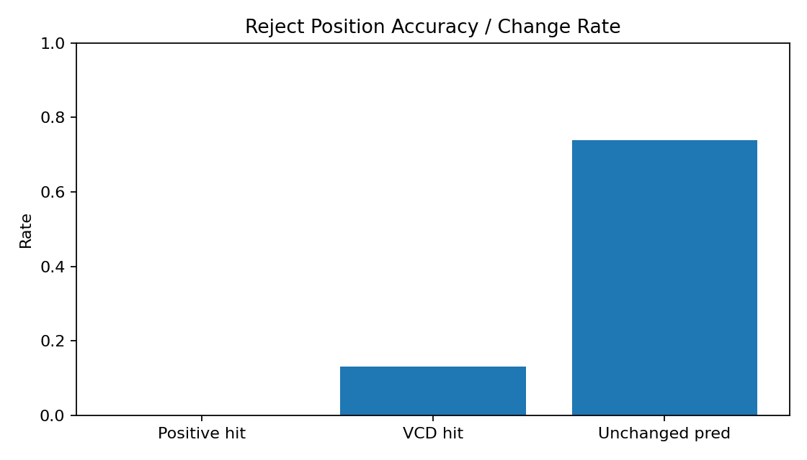
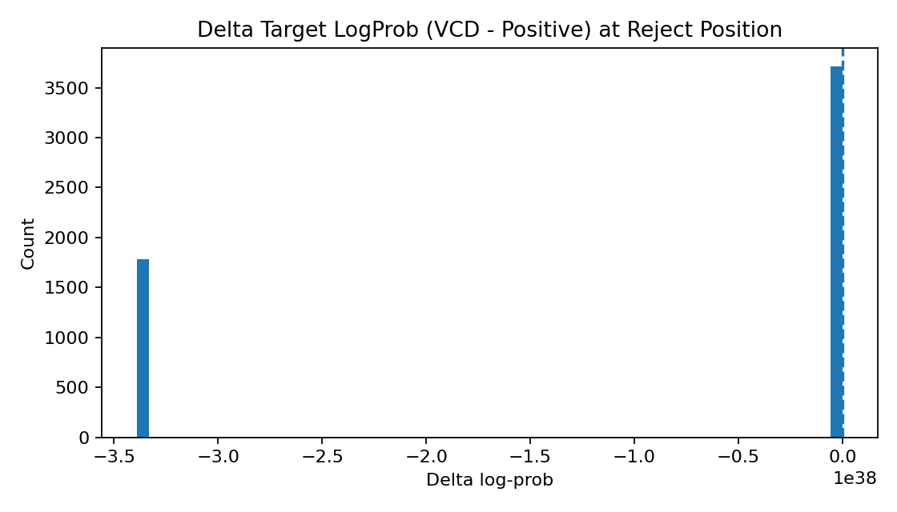
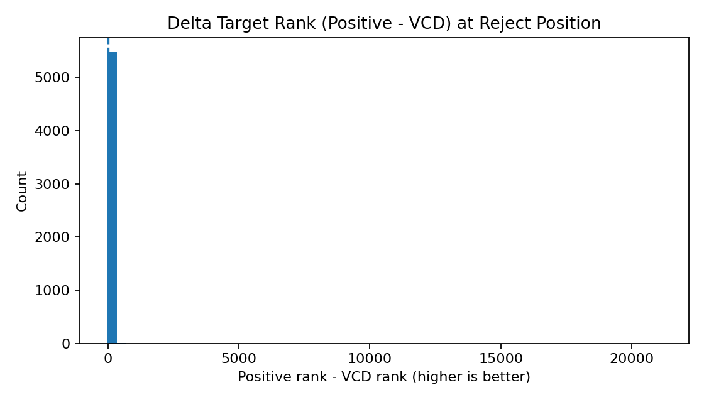
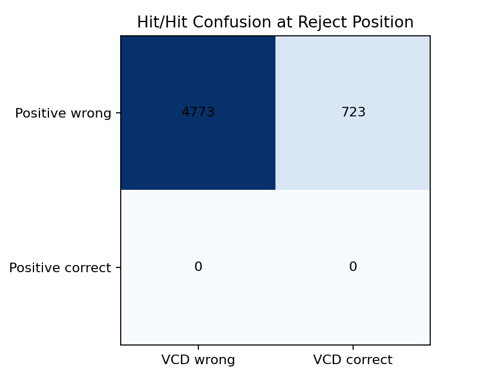
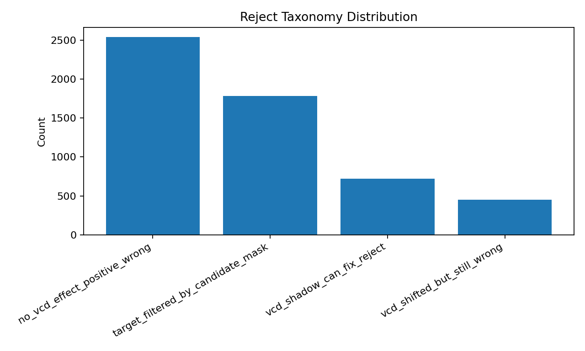

# Reject Token Analysis: Positive vs VCD

## Overall
- Reject events: **5496**
- Positive hit rate: **0.00%**
- VCD hit rate: **13.16%**
- Hit-rate gain (VCD - Positive): **+13.16%**
- VCD shadow fix rate @reject: **13.16%**
- Mean rescue-prob (Positive / VCD-shadow): **0.1619 / 0.1721**
- Mean rescue-prob gain (VCD - Positive): **+0.0102**
- Rescue-prob improved-rate (>0): **12.15%**
- Prediction changed rate: **26.13%**

## Target LogProb Delta (VCD - Positive)
- Mean: -inf
- Median: -0.68318
- P10 / P90: -338953138925153547590470800371487866880.00000 / 0.72976
- Improved rate (>0): 32.48%

## Target Rank Delta (Positive - VCD)
- Mean: 9.495
- Median: 0.000
- P10 / P90: 0.000 / 5.000
- Improved rate (>0): 39.23%

## Why Rejected
- Target in candidate mask rate: **67.56%**
- Sampled token in candidate mask rate: **100.00%**
- Sampled token rank in posterior (mean/median): **2010.94 / 3.00**
- Target is posterior argmax rate: **100.00%**
- Posterior prefers target over sampled rate: **98.42%**
- Target minus sampled posterior logprob (mean/median): **13.9780 / 7.1250**

## Reject Taxonomy
| Taxonomy | Count | Rate |
|---|---:|---:|
| no_vcd_effect_positive_wrong | 2537 | 46.16% |
| target_filtered_by_candidate_mask | 1783 | 32.44% |
| vcd_shadow_can_fix_reject | 723 | 13.16% |
| vcd_shifted_but_still_wrong | 453 | 8.24% |

## Confusion (Positive Hit vs VCD Hit)
| Positive\VCD | VCD wrong | VCD correct |
|---|---:|---:|
| Positive wrong | 4773 | 723 |
| Positive correct | 0 | 0 |

## Plots

## Top Improved Reject Events
| sample | turn | step | abs_pos | taxonomy | target | sampled_draft | positive_pred | vcd_pred | d_logprob | d_rank | why_reject |
|---:|---:|---:|---:|---|---|---|---|---|---:|---:|---|
| 89 | 0 | 12 | 170 | vcd_shadow_can_fix_reject |  Shannon (53663) |  The (576) |  The (576) |  Shannon (53663) | 3.2596 | 6 | Reject vì draft đề xuất ` The` (576) khác posterior ` Shannon` (53663). VCD shadow sample đã đổi token từ ` The` sang ` Shannon`. VCD shadow sample trùng target token ở vị trí reject, cho thấy có khả năng cứu reject nếu rollout theo VCD. VCD đã sửa đúng token target tốt hơn positive. |
| 9 | 0 | 20 | 173 | vcd_shadow_can_fix_reject |  Griffin (40396) |  after (1283) |  after (1283) |  Griffin (40396) | 2.8586 | 5 | Reject vì draft đề xuất ` after` (1283) khác posterior ` Griffin` (40396). VCD shadow sample đã đổi token từ ` after` sang ` Griffin`. VCD shadow sample trùng target token ở vị trí reject, cho thấy có khả năng cứu reject nếu rollout theo VCD. VCD đã sửa đúng token target tốt hơn positive. |
| 20 | 0 | 9 | 209 | vcd_shadow_can_fix_reject | -rounded (64218) | Well (11395) | Well (11395) | -rounded (64218) | 2.6909 | 5 | Reject vì draft đề xuất `Well` (11395) khác posterior `-rounded` (64218). VCD shadow sample đã đổi token từ `Well` sang `-rounded`. VCD shadow sample trùng target token ở vị trí reject, cho thấy có khả năng cứu reject nếu rollout theo VCD. VCD đã sửa đúng token target tốt hơn positive. |
| 51 | 0 | 31 | 246 | vcd_shadow_can_fix_reject |  mural (73373) |  the (279) |  the (279) |  mural (73373) | 2.6739 | 3 | Reject vì draft đề xuất ` the` (279) khác posterior ` mural` (73373). VCD shadow sample đã đổi token từ ` the` sang ` mural`. VCD shadow sample trùng target token ở vị trí reject, cho thấy có khả năng cứu reject nếu rollout theo VCD. VCD đã sửa đúng token target tốt hơn positive. |
| 123 | 0 | 5 | 92 | vcd_shadow_can_fix_reject |  Charm (57500) |  is (374) |  is (374) |  Charm (57500) | 2.6677 | 4 | Reject vì draft đề xuất ` is` (374) khác posterior ` Charm` (57500). VCD shadow sample đã đổi token từ ` is` sang ` Charm`. VCD shadow sample trùng target token ở vị trí reject, cho thấy có khả năng cứu reject nếu rollout theo VCD. VCD đã sửa đúng token target tốt hơn positive. |
| 127 | 0 | 16 | 199 | vcd_shadow_can_fix_reject | por (4308) | on (263) | on (263) | por (4308) | 2.6516 | 8 | Reject vì draft đề xuất `on` (263) khác posterior `por` (4308). VCD shadow sample đã đổi token từ `on` sang `por`. VCD shadow sample trùng target token ở vị trí reject, cho thấy có khả năng cứu reject nếu rollout theo VCD. VCD đã sửa đúng token target tốt hơn positive. |
| 47 | 0 | 31 | 265 | vcd_shadow_can_fix_reject | which (8206) | i (72) | i (72) | which (8206) | 2.6232 | 2 | Reject vì draft đề xuất `i` (72) khác posterior `which` (8206). VCD shadow sample đã đổi token từ `i` sang `which`. VCD shadow sample trùng target token ở vị trí reject, cho thấy có khả năng cứu reject nếu rollout theo VCD. VCD đã sửa đúng token target tốt hơn positive. |
| 71 | 0 | 10 | 133 | vcd_shadow_can_fix_reject |  squirt (72481) |  the (279) |  the (279) |  squirt (72481) | 2.3712 | 2 | Reject vì draft đề xuất ` the` (279) khác posterior ` squirt` (72481). VCD shadow sample đã đổi token từ ` the` sang ` squirt`. VCD shadow sample trùng target token ở vị trí reject, cho thấy có khả năng cứu reject nếu rollout theo VCD. VCD đã sửa đúng token target tốt hơn positive. |
| 107 | 0 | 18 | 137 | vcd_shadow_can_fix_reject | imon (25417) | 2 (17) | 2 (17) | imon (25417) | 2.3627 | 4 | Reject vì draft đề xuất `2` (17) khác posterior `imon` (25417). VCD shadow sample đã đổi token từ `2` sang `imon`. VCD shadow sample trùng target token ở vị trí reject, cho thấy có khả năng cứu reject nếu rollout theo VCD. VCD đã sửa đúng token target tốt hơn positive. |
| 126 | 0 | 138 | 735 | vcd_shadow_can_fix_reject |  mood (19671) |  the (279) |  the (279) |  mood (19671) | 2.3455 | 5 | Reject vì draft đề xuất ` the` (279) khác posterior ` mood` (19671). VCD shadow sample đã đổi token từ ` the` sang ` mood`. VCD shadow sample trùng target token ở vị trí reject, cho thấy có khả năng cứu reject nếu rollout theo VCD. VCD đã sửa đúng token target tốt hơn positive. |
| 83 | 0 | 37 | 287 | vcd_shadow_can_fix_reject | erry (5400) |  spends (37102) |  spends (37102) | erry (5400) | 2.3007 | 2 | Reject vì draft đề xuất ` spends` (37102) khác posterior `erry` (5400). VCD shadow sample đã đổi token từ ` spends` sang `erry`. VCD shadow sample trùng target token ở vị trí reject, cho thấy có khả năng cứu reject nếu rollout theo VCD. VCD đã sửa đúng token target tốt hơn positive. |
| 70 | 0 | 19 | 175 | vcd_shadow_can_fix_reject |  told (3229) |  two (1378) |  two (1378) |  told (3229) | 2.2665 | 1 | Reject vì draft đề xuất ` two` (1378) khác posterior ` told` (3229). VCD shadow sample đã đổi token từ ` two` sang ` told`. VCD shadow sample trùng target token ở vị trí reject, cho thấy có khả năng cứu reject nếu rollout theo VCD. VCD đã sửa đúng token target tốt hơn positive. |
| 22 | 0 | 16 | 177 | vcd_shadow_can_fix_reject |  dog (5562) |  snow (11794) |  snow (11794) |  dog (5562) | 2.2657 | 1 | Reject vì draft đề xuất ` snow` (11794) khác posterior ` dog` (5562). VCD shadow sample đã đổi token từ ` snow` sang ` dog`. VCD shadow sample trùng target token ở vị trí reject, cho thấy có khả năng cứu reject nếu rollout theo VCD. VCD đã sửa đúng token target tốt hơn positive. |
| 102 | 0 | 6 | 114 | vcd_shadow_can_fix_reject |  lion (39032) |  c (272) |  c (272) |  lion (39032) | 2.2353 | 1 | Reject vì draft đề xuất ` c` (272) khác posterior ` lion` (39032). VCD shadow sample đã đổi token từ ` c` sang ` lion`. VCD shadow sample trùng target token ở vị trí reject, cho thấy có khả năng cứu reject nếu rollout theo VCD. VCD đã sửa đúng token target tốt hơn positive. |
| 90 | 0 | 6 | 113 | vcd_shadow_can_fix_reject | akers (8312) |  morning (6556) |  morning (6556) | akers (8312) | 2.2286 | 3 | Reject vì draft đề xuất ` morning` (6556) khác posterior `akers` (8312). VCD shadow sample đã đổi token từ ` morning` sang `akers`. VCD shadow sample trùng target token ở vị trí reject, cho thấy có khả năng cứu reject nếu rollout theo VCD. VCD đã sửa đúng token target tốt hơn positive. |
| 5 | 0 | 21 | 189 | vcd_shadow_can_fix_reject |  Carlos (29297) | net (4711) | net (4711) |  Carlos (29297) | 2.1479 | 4 | Reject vì draft đề xuất `net` (4711) khác posterior ` Carlos` (29297). VCD shadow sample đã đổi token từ `net` sang ` Carlos`. VCD shadow sample trùng target token ở vị trí reject, cho thấy có khả năng cứu reject nếu rollout theo VCD. VCD đã sửa đúng token target tốt hơn positive. |
| 126 | 0 | 36 | 281 | vcd_shadow_can_fix_reject |  Good (7684) |   (220) |   (220) |  Good (7684) | 2.1364 | 3 | Reject vì draft đề xuất ` ` (220) khác posterior ` Good` (7684). VCD shadow sample đã đổi token từ ` ` sang ` Good`. VCD shadow sample trùng target token ở vị trí reject, cho thấy có khả năng cứu reject nếu rollout theo VCD. VCD đã sửa đúng token target tốt hơn positive. |
| 66 | 0 | 25 | 207 | vcd_shadow_can_fix_reject |  the (279) | **\n\n (56177) | **\n\n (56177) |  the (279) | 2.0532 | 2 | Reject vì draft đề xuất `**\n\n` (56177) khác posterior ` the` (279). VCD shadow sample đã đổi token từ `**\n\n` sang ` the`. VCD shadow sample trùng target token ở vị trí reject, cho thấy có khả năng cứu reject nếu rollout theo VCD. VCD đã sửa đúng token target tốt hơn positive. |
| 24 | 0 | 25 | 301 | vcd_shadow_can_fix_reject |  \ (1124) |   (220) |   (220) |  \ (1124) | 2.0392 | 4 | Reject vì draft đề xuất ` ` (220) khác posterior ` \` (1124). VCD shadow sample đã đổi token từ ` ` sang ` \`. VCD shadow sample trùng target token ở vị trí reject, cho thấy có khả năng cứu reject nếu rollout theo VCD. VCD đã sửa đúng token target tốt hơn positive. |
| 124 | 0 | 57 | 460 | vcd_shadow_can_fix_reject |  Fire (6647) |  ** (3070) |  ** (3070) |  Fire (6647) | 2.0315 | 2 | Reject vì draft đề xuất ` **` (3070) khác posterior ` Fire` (6647). VCD shadow sample đã đổi token từ ` **` sang ` Fire`. VCD shadow sample trùng target token ở vị trí reject, cho thấy có khả năng cứu reject nếu rollout theo VCD. VCD đã sửa đúng token target tốt hơn positive. |
| 9 | 0 | 31 | 267 | vcd_shadow_can_fix_reject |  Griffin (40396) |  some (1045) |  some (1045) |  Griffin (40396) | 2.0123 | 3 | Reject vì draft đề xuất ` some` (1045) khác posterior ` Griffin` (40396). VCD shadow sample đã đổi token từ ` some` sang ` Griffin`. VCD shadow sample trùng target token ở vị trí reject, cho thấy có khả năng cứu reject nếu rollout theo VCD. VCD đã sửa đúng token target tốt hơn positive. |
| 55 | 0 | 7 | 131 | vcd_shadow_can_fix_reject |  company (2813) |  hired (21446) |  hired (21446) |  company (2813) | 1.9810 | 2 | Reject vì draft đề xuất ` hired` (21446) khác posterior ` company` (2813). VCD shadow sample đã đổi token từ ` hired` sang ` company`. VCD shadow sample trùng target token ở vị trí reject, cho thấy có khả năng cứu reject nếu rollout theo VCD. VCD đã sửa đúng token target tốt hơn positive. |
| 28 | 0 | 66 | 431 | vcd_shadow_can_fix_reject | half (37006) | 1 (16) | 1 (16) | half (37006) | 1.9531 | 1 | Reject vì draft đề xuất `1` (16) khác posterior `half` (37006). VCD shadow sample đã đổi token từ `1` sang `half`. VCD shadow sample trùng target token ở vị trí reject, cho thấy có khả năng cứu reject nếu rollout theo VCD. VCD đã sửa đúng token target tốt hơn positive. |
| 47 | 0 | 16 | 193 | vcd_shadow_can_fix_reject | 4 (19) |  the (279) |  the (279) | 4 (19) | 1.9269 | 2 | Reject vì draft đề xuất ` the` (279) khác posterior `4` (19). VCD shadow sample đã đổi token từ ` the` sang `4`. VCD shadow sample trùng target token ở vị trí reject, cho thấy có khả năng cứu reject nếu rollout theo VCD. VCD đã sửa đúng token target tốt hơn positive. |
| 51 | 0 | 37 | 298 | vcd_shadow_can_fix_reject | \n\n (271) | \n (198) | \n (198) | \n\n (271) | 1.9246 | 1 | Reject vì draft đề xuất `\n` (198) khác posterior `\n\n` (271). VCD shadow sample đã đổi token từ `\n` sang `\n\n`. VCD shadow sample trùng target token ở vị trí reject, cho thấy có khả năng cứu reject nếu rollout theo VCD. VCD đã sửa đúng token target tốt hơn positive. |
| 115 | 0 | 0 | 104 | vcd_shadow_can_fix_reject |  following (2701) |  problem (3491) |  problem (3491) |  following (2701) | 1.9199 | 1 | Reject vì draft đề xuất ` problem` (3491) khác posterior ` following` (2701). VCD shadow sample đã đổi token từ ` problem` sang ` following`. VCD shadow sample trùng target token ở vị trí reject, cho thấy có khả năng cứu reject nếu rollout theo VCD. VCD đã sửa đúng token target tốt hơn positive. |
| 59 | 0 | 27 | 254 | vcd_shadow_can_fix_reject |    (256) | $ (3) | $ (3) |    (256) | 1.9103 | 3 | Reject vì draft đề xuất `$` (3) khác posterior `  ` (256). VCD shadow sample đã đổi token từ `$` sang `  `. VCD shadow sample trùng target token ở vị trí reject, cho thấy có khả năng cứu reject nếu rollout theo VCD. VCD đã sửa đúng token target tốt hơn positive. |
| 75 | 0 | 1 | 83 | vcd_shadow_can_fix_reject |  Ali (14583) |  his (806) |  his (806) |  Ali (14583) | 1.8933 | 1 | Reject vì draft đề xuất ` his` (806) khác posterior ` Ali` (14583). VCD shadow sample đã đổi token từ ` his` sang ` Ali`. VCD shadow sample trùng target token ở vị trí reject, cho thấy có khả năng cứu reject nếu rollout theo VCD. VCD đã sửa đúng token target tốt hơn positive. |
| 53 | 0 | 19 | 188 | vcd_shadow_can_fix_reject |  organizations (11104) |  = (284) |  = (284) |  organizations (11104) | 1.8893 | 3 | Reject vì draft đề xuất ` =` (284) khác posterior ` organizations` (11104). VCD shadow sample đã đổi token từ ` =` sang ` organizations`. VCD shadow sample trùng target token ở vị trí reject, cho thấy có khả năng cứu reject nếu rollout theo VCD. VCD đã sửa đúng token target tốt hơn positive. |
| 126 | 0 | 159 | 830 | no_vcd_effect_positive_wrong | number (4082) |  of (315) |  of (315) |  of (315) | 1.8815 | 3 | Reject vì draft đề xuất ` of` (315) khác posterior `number` (4082). VCD shadow sample không đổi token so với original ở vị trí reject. Cả positive và VCD đều chưa đưa target token lên top-1. |

## Top Worsened Reject Events
| sample | turn | step | abs_pos | taxonomy | target | sampled_draft | positive_pred | vcd_pred | d_logprob | d_rank | why_reject |
|---:|---:|---:|---:|---|---|---|---|---|---:|---:|---|
| 0 | 0 | 0 | 69 | target_filtered_by_candidate_mask |  information (1995) | :\n\n (1447) | :\n\n (1447) | :\n\n (1447) | -338953138925153547590470800371487866880.0000 | 0 | Reject vì draft đề xuất `:\n\n` (1447) khác posterior ` information` (1995). VCD shadow sample không đổi token so với original ở vị trí reject. Token target không nằm trong candidate mask (beta filter), nên khó được VCD chọn. Cả positive và VCD đều chưa đưa target token lên top-1. |
| 0 | 0 | 9 | 123 | target_filtered_by_candidate_mask |  that (429) |  of (315) |  of (315) |  of (315) | -338953138925153547590470800371487866880.0000 | 1 | Reject vì draft đề xuất ` of` (315) khác posterior ` that` (429). VCD shadow sample không đổi token so với original ở vị trí reject. Token target không nằm trong candidate mask (beta filter), nên khó được VCD chọn. Cả positive và VCD đều chưa đưa target token lên top-1. |
| 0 | 0 | 12 | 130 | target_filtered_by_candidate_mask |  ** (3070) |  combined (10856) |  combined (10856) |  combined (10856) | -338953138925153547590470800371487866880.0000 | 2 | Reject vì draft đề xuất ` combined` (10856) khác posterior ` **` (3070). VCD shadow sample không đổi token so với original ở vị trí reject. Token target không nằm trong candidate mask (beta filter), nên khó được VCD chọn. Cả positive và VCD đều chưa đưa target token lên top-1. |
| 0 | 0 | 14 | 141 | target_filtered_by_candidate_mask |  how (1246) |  Samantha (62808) |  Samantha (62808) |  Samantha (62808) | -338953138925153547590470800371487866880.0000 | 17 | Reject vì draft đề xuất ` Samantha` (62808) khác posterior ` how` (1246). VCD shadow sample không đổi token so với original ở vị trí reject. Token target không nằm trong candidate mask (beta filter), nên khó được VCD chọn. Cả positive và VCD đều chưa đưa target token lên top-1. |
| 0 | 0 | 18 | 164 | target_filtered_by_candidate_mask | tha (22410) | 's (594) | 's (594) | 's (594) | -338953138925153547590470800371487866880.0000 | 48 | Reject vì draft đề xuất `'s` (594) khác posterior `tha` (22410). VCD shadow sample không đổi token so với original ở vị trí reject. Token target không nằm trong candidate mask (beta filter), nên khó được VCD chọn. Cả positive và VCD đều chưa đưa target token lên top-1. |
| 0 | 0 | 20 | 169 | target_filtered_by_candidate_mask |  \ (1124) |   (220) |   (220) |   (220) | -338953138925153547590470800371487866880.0000 | 0 | Reject vì draft đề xuất ` ` (220) khác posterior ` \` (1124). VCD shadow sample không đổi token so với original ở vị trí reject. Token target không nằm trong candidate mask (beta filter), nên khó được VCD chọn. Cả positive và VCD đều chưa đưa target token lên top-1. |
| 0 | 0 | 30 | 280 | target_filtered_by_candidate_mask | } (92) |  amount (3311) |  amount (3311) |  amount (3311) | -338953138925153547590470800371487866880.0000 | 7 | Reject vì draft đề xuất ` amount` (3311) khác posterior `}` (92). VCD shadow sample không đổi token so với original ở vị trí reject. Token target không nằm trong candidate mask (beta filter), nên khó được VCD chọn. Cả positive và VCD đều chưa đưa target token lên top-1. |
| 0 | 0 | 33 | 319 | target_filtered_by_candidate_mask | \n (198) |  = (284) |  = (284) |  = (284) | -338953138925153547590470800371487866880.0000 | 0 | Reject vì draft đề xuất ` =` (284) khác posterior `\n` (198). VCD shadow sample không đổi token so với original ở vị trí reject. Token target không nằm trong candidate mask (beta filter), nên khó được VCD chọn. Cả positive và VCD đều chưa đưa target token lên top-1. |
| 0 | 0 | 34 | 327 | target_filtered_by_candidate_mask | Total (7595) | 1 (16) | 1 (16) | 1 (16) | -338953138925153547590470800371487866880.0000 | 6 | Reject vì draft đề xuất `1` (16) khác posterior `Total` (7595). VCD shadow sample không đổi token so với original ở vị trí reject. Token target không nằm trong candidate mask (beta filter), nên khó được VCD chọn. Cả positive và VCD đều chưa đưa target token lên top-1. |
| 0 | 0 | 35 | 331 | target_filtered_by_candidate_mask | 4 (19) | 1 (16) | 1 (16) | 3 (18) | -338953138925153547590470800371487866880.0000 | 0 | Reject vì draft đề xuất `1` (16) khác posterior `4` (19). VCD shadow sample đã đổi token từ `1` sang `3`. Token target không nằm trong candidate mask (beta filter), nên khó được VCD chọn. Cả positive và VCD đều chưa đưa target token lên top-1. |
| 1 | 0 | 1 | 93 | target_filtered_by_candidate_mask | ** (334) |  in (304) |  in (304) |  in (304) | -338953138925153547590470800371487866880.0000 | 0 | Reject vì draft đề xuất ` in` (304) khác posterior `**` (334). VCD shadow sample không đổi token so với original ở vị trí reject. Token target không nằm trong candidate mask (beta filter), nên khó được VCD chọn. Cả positive và VCD đều chưa đưa target token lên top-1. |
| 1 | 0 | 5 | 115 | target_filtered_by_candidate_mask |  ( (320) | ** (334) | ** (334) | ** (334) | -338953138925153547590470800371487866880.0000 | 2 | Reject vì draft đề xuất `**` (334) khác posterior ` (` (320). VCD shadow sample không đổi token so với original ở vị trí reject. Token target không nằm trong candidate mask (beta filter), nên khó được VCD chọn. Cả positive và VCD đều chưa đưa target token lên top-1. |
| 1 | 0 | 8 | 127 | target_filtered_by_candidate_mask |  cat (8251) |  the (279) |  the (279) |  the (279) | -338953138925153547590470800371487866880.0000 | 1 | Reject vì draft đề xuất ` the` (279) khác posterior ` cat` (8251). VCD shadow sample không đổi token so với original ở vị trí reject. Token target không nằm trong candidate mask (beta filter), nên khó được VCD chọn. Cả positive và VCD đều chưa đưa target token lên top-1. |
| 1 | 0 | 18 | 191 | target_filtered_by_candidate_mask | 2 (17) |  \ (1124) |  \ (1124) |  \ (1124) | -338953138925153547590470800371487866880.0000 | 5 | Reject vì draft đề xuất ` \` (1124) khác posterior `2` (17). VCD shadow sample không đổi token so với original ở vị trí reject. Token target không nằm trong candidate mask (beta filter), nên khó được VCD chọn. Cả positive và VCD đều chưa đưa target token lên top-1. |
| 1 | 0 | 23 | 243 | target_filtered_by_candidate_mask | We (1654) | ** (334) | ** (334) | ** (334) | -338953138925153547590470800371487866880.0000 | 11 | Reject vì draft đề xuất `**` (334) khác posterior `We` (1654). VCD shadow sample không đổi token so với original ở vị trí reject. Token target không nằm trong candidate mask (beta filter), nên khó được VCD chọn. Cả positive và VCD đều chưa đưa target token lên top-1. |
| 1 | 0 | 27 | 266 | target_filtered_by_candidate_mask |  $\ (57960) | $$ (14085) | $$ (14085) | $$ (14085) | -338953138925153547590470800371487866880.0000 | 84 | Reject vì draft đề xuất `$$` (14085) khác posterior ` $\` (57960). VCD shadow sample không đổi token so với original ở vị trí reject. Token target không nằm trong candidate mask (beta filter), nên khó được VCD chọn. Cả positive và VCD đều chưa đưa target token lên top-1. |
| 1 | 0 | 31 | 308 | target_filtered_by_candidate_mask | } (92) | }\n (532) | }\n (532) | }\n (532) | -338953138925153547590470800371487866880.0000 | 0 | Reject vì draft đề xuất `}\n` (532) khác posterior `}` (92). VCD shadow sample không đổi token so với original ở vị trí reject. Token target không nằm trong candidate mask (beta filter), nên khó được VCD chọn. Cả positive và VCD đều chưa đưa target token lên top-1. |
| 1 | 0 | 32 | 317 | target_filtered_by_candidate_mask | <|endoftext|> (151643) | \n (198) | \n (198) | \n (198) | -338953138925153547590470800371487866880.0000 | 18 | Reject vì draft đề xuất `\n` (198) khác posterior `<|endoftext|>` (151643). VCD shadow sample không đổi token so với original ở vị trí reject. Token target không nằm trong candidate mask (beta filter), nên khó được VCD chọn. Cả positive và VCD đều chưa đưa target token lên top-1. |
| 2 | 0 | 7 | 151 | target_filtered_by_candidate_mask | Total (7595) | Hel (32713) | Hel (32713) | Hel (32713) | -338953138925153547590470800371487866880.0000 | 1 | Reject vì draft đề xuất `Hel` (32713) khác posterior `Total` (7595). VCD shadow sample không đổi token so với original ở vị trí reject. Token target không nằm trong candidate mask (beta filter), nên khó được VCD chọn. Cả positive và VCD đều chưa đưa target token lên top-1. |
| 2 | 0 | 16 | 208 | target_filtered_by_candidate_mask |  $ (400) |   (220) |   (220) |   (220) | -338953138925153547590470800371487866880.0000 | 0 | Reject vì draft đề xuất ` ` (220) khác posterior ` $` (400). VCD shadow sample không đổi token so với original ở vị trí reject. Token target không nằm trong candidate mask (beta filter), nên khó được VCD chọn. Cả positive và VCD đều chưa đưa target token lên top-1. |
| 2 | 0 | 18 | 219 | target_filtered_by_candidate_mask |  L (444) |  A (362) |  A (362) |  A (362) | -338953138925153547590470800371487866880.0000 | 1 | Reject vì draft đề xuất ` A` (362) khác posterior ` L` (444). VCD shadow sample không đổi token so với original ở vị trí reject. Token target không nằm trong candidate mask (beta filter), nên khó được VCD chọn. Cả positive và VCD đều chưa đưa target token lên top-1. |
| 2 | 0 | 42 | 432 | target_filtered_by_candidate_mask |  the (279) |  as (438) |  as (438) |  as (438) | -338953138925153547590470800371487866880.0000 | 5 | Reject vì draft đề xuất ` as` (438) khác posterior ` the` (279). VCD shadow sample không đổi token so với original ở vị trí reject. Token target không nằm trong candidate mask (beta filter), nên khó được VCD chọn. Cả positive và VCD đều chưa đưa target token lên top-1. |
| 2 | 0 | 46 | 466 | target_filtered_by_candidate_mask |  Wil (10562) |  $ (400) |  $ (400) |  $ (400) | -338953138925153547590470800371487866880.0000 | 4 | Reject vì draft đề xuất ` $` (400) khác posterior ` Wil` (10562). VCD shadow sample không đổi token so với original ở vị trí reject. Token target không nằm trong candidate mask (beta filter), nên khó được VCD chọn. Cả positive và VCD đều chưa đưa target token lên top-1. |
| 2 | 0 | 51 | 515 | target_filtered_by_candidate_mask | W (54) | 3 (18) | 3 (18) | 3 (18) | -338953138925153547590470800371487866880.0000 | 1 | Reject vì draft đề xuất `3` (18) khác posterior `W` (54). VCD shadow sample không đổi token so với original ở vị trí reject. Token target không nằm trong candidate mask (beta filter), nên khó được VCD chọn. Cả positive và VCD đều chưa đưa target token lên top-1. |
| 2 | 0 | 55 | 549 | target_filtered_by_candidate_mask | <|endoftext|> (151643) | \n (198) | \n (198) | \n (198) | -338953138925153547590470800371487866880.0000 | 10 | Reject vì draft đề xuất `\n` (198) khác posterior `<|endoftext|>` (151643). VCD shadow sample không đổi token so với original ở vị trí reject. Token target không nằm trong candidate mask (beta filter), nên khó được VCD chọn. Cả positive và VCD đều chưa đưa target token lên top-1. |
| 3 | 0 | 2 | 115 | target_filtered_by_candidate_mask |  for (369) |  water (3015) |  water (3015) |  water (3015) | -338953138925153547590470800371487866880.0000 | 2 | Reject vì draft đề xuất ` water` (3015) khác posterior ` for` (369). VCD shadow sample không đổi token so với original ở vị trí reject. Token target không nằm trong candidate mask (beta filter), nên khó được VCD chọn. Cả positive và VCD đều chưa đưa target token lên top-1. |
| 3 | 0 | 5 | 144 | target_filtered_by_candidate_mask |  per (817) | /h (7530) | /h (7530) | /h (7530) | -338953138925153547590470800371487866880.0000 | 5 | Reject vì draft đề xuất `/h` (7530) khác posterior ` per` (817). VCD shadow sample không đổi token so với original ở vị trí reject. Token target không nằm trong candidate mask (beta filter), nên khó được VCD chọn. Cả positive và VCD đều chưa đưa target token lên top-1. |
| 3 | 0 | 8 | 177 | target_filtered_by_candidate_mask | \n\n (271) |  burned (26626) |  burned (26626) |  burned (26626) | -338953138925153547590470800371487866880.0000 | 7 | Reject vì draft đề xuất ` burned` (26626) khác posterior `\n\n` (271). VCD shadow sample không đổi token so với original ở vị trí reject. Token target không nằm trong candidate mask (beta filter), nên khó được VCD chọn. Cả positive và VCD đều chưa đưa target token lên top-1. |
| 3 | 0 | 9 | 179 | target_filtered_by_candidate_mask | A (32) |  ** (3070) |  ** (3070) |  ** (3070) | -338953138925153547590470800371487866880.0000 | 3 | Reject vì draft đề xuất ` **` (3070) khác posterior `A` (32). VCD shadow sample không đổi token so với original ở vị trí reject. Token target không nằm trong candidate mask (beta filter), nên khó được VCD chọn. Cả positive và VCD đều chưa đưa target token lên top-1. |
| 3 | 0 | 22 | 280 | target_filtered_by_candidate_mask |  for (369) |   (220) |   (220) |   (220) | -338953138925153547590470800371487866880.0000 | 1 | Reject vì draft đề xuất ` ` (220) khác posterior ` for` (369). VCD shadow sample không đổi token so với original ở vị trí reject. Token target không nằm trong candidate mask (beta filter), nên khó được VCD chọn. Cả positive và VCD đều chưa đưa target token lên top-1. |

## Detailed Case Explanations
### Case 1: sample=89, turn=0, step=12, pos=170
- Taxonomy: `vcd_shadow_can_fix_reject` - Trong che do shadow, token sample tu VCD trung target tai vi tri reject cua original.
- Proposed draft token: ` The` (576); posterior token: ` Shannon` (53663)
- Positive pred: ` The` (576), VCD pred: ` Shannon` (53663)
- Reason: Reject vì draft đề xuất ` The` (576) khác posterior ` Shannon` (53663). VCD shadow sample đã đổi token từ ` The` sang ` Shannon`. VCD shadow sample trùng target token ở vị trí reject, cho thấy có khả năng cứu reject nếu rollout theo VCD. VCD đã sửa đúng token target tốt hơn positive.
- Candidate mask: target_in=1, sampled_in=1
- Delta target logprob/rank: 3.2596 / 6
- Positive top-3:  The (576, p=0.1738); 1 (16, p=0.1354); 2 (17, p=0.0931)
- VCD top-3:  Shannon (53663, p=0.6942);  The (576, p=0.0829); 2 (17, p=0.0646)
- Posterior top-3:  Shannon (53663, p=0.9798);  The (576, p=0.0109);  ** (3070, p=0.0085)

### Case 2: sample=9, turn=0, step=20, pos=173
- Taxonomy: `vcd_shadow_can_fix_reject` - Trong che do shadow, token sample tu VCD trung target tai vi tri reject cua original.
- Proposed draft token: ` after` (1283); posterior token: ` Griffin` (40396)
- Positive pred: ` after` (1283), VCD pred: ` Griffin` (40396)
- Reason: Reject vì draft đề xuất ` after` (1283) khác posterior ` Griffin` (40396). VCD shadow sample đã đổi token từ ` after` sang ` Griffin`. VCD shadow sample trùng target token ở vị trí reject, cho thấy có khả năng cứu reject nếu rollout theo VCD. VCD đã sửa đúng token target tốt hơn positive.
- Candidate mask: target_in=1, sampled_in=1
- Delta target logprob/rank: 2.8586 / 5
- Positive top-3:  after (1283, p=0.2535);  ** (3070, p=0.1197);  the (279, p=0.1197)
- VCD top-3:  Griffin (40396, p=0.5279);  after (1283, p=0.2826);  the (279, p=0.1040)
- Posterior top-3:  Griffin (40396, p=0.8586);  after (1283, p=0.1162);  now (1431, p=0.0157)

### Case 3: sample=20, turn=0, step=9, pos=209
- Taxonomy: `vcd_shadow_can_fix_reject` - Trong che do shadow, token sample tu VCD trung target tai vi tri reject cua original.
- Proposed draft token: `Well` (11395); posterior token: `-rounded` (64218)
- Positive pred: `Well` (11395), VCD pred: `-rounded` (64218)
- Reason: Reject vì draft đề xuất `Well` (11395) khác posterior `-rounded` (64218). VCD shadow sample đã đổi token từ `Well` sang `-rounded`. VCD shadow sample trùng target token ở vị trí reject, cho thấy có khả năng cứu reject nếu rollout theo VCD. VCD đã sửa đúng token target tốt hơn positive.
- Candidate mask: target_in=1, sampled_in=1
- Delta target logprob/rank: 2.6909 / 5
- Positive top-3: Well (11395, p=0.3165); - (12, p=0.1920);  Well (8325, p=0.0907)
- VCD top-3: -rounded (64218, p=0.6317); Well (11395, p=0.2633);  Well (8325, p=0.0458)
- Posterior top-3: -rounded (64218, p=0.9625); -R (10911, p=0.0373); -bal (83125, p=0.0001)

### Case 4: sample=51, turn=0, step=31, pos=246
- Taxonomy: `vcd_shadow_can_fix_reject` - Trong che do shadow, token sample tu VCD trung target tai vi tri reject cua original.
- Proposed draft token: ` the` (279); posterior token: ` mural` (73373)
- Positive pred: ` the` (279), VCD pred: ` mural` (73373)
- Reason: Reject vì draft đề xuất ` the` (279) khác posterior ` mural` (73373). VCD shadow sample đã đổi token từ ` the` sang ` mural`. VCD shadow sample trùng target token ở vị trí reject, cho thấy có khả năng cứu reject nếu rollout theo VCD. VCD đã sửa đúng token target tốt hơn positive.
- Candidate mask: target_in=1, sampled_in=1
- Delta target logprob/rank: 2.6739 / 3
- Positive top-3:  the (279, p=0.3771);  half (4279, p=0.2592);  is (374, p=0.1781)
- VCD top-3:  mural (73373, p=0.8384);  the (279, p=0.0607);  half (4279, p=0.0536)
- Posterior top-3:  mural (73373, p=0.9943);  paint (6177, p=0.0036);  total (2790, p=0.0019)

### Case 5: sample=123, turn=0, step=5, pos=92
- Taxonomy: `vcd_shadow_can_fix_reject` - Trong che do shadow, token sample tu VCD trung target tai vi tri reject cua original.
- Proposed draft token: ` is` (374); posterior token: ` Charm` (57500)
- Positive pred: ` is` (374), VCD pred: ` Charm` (57500)
- Reason: Reject vì draft đề xuất ` is` (374) khác posterior ` Charm` (57500). VCD shadow sample đã đổi token từ ` is` sang ` Charm`. VCD shadow sample trùng target token ở vị trí reject, cho thấy có khả năng cứu reject nếu rollout theo VCD. VCD đã sửa đúng token target tốt hơn positive.
- Candidate mask: target_in=1, sampled_in=1
- Delta target logprob/rank: 2.6677 / 4
- Positive top-3: 's (594, p=0.1632);  is (374, p=0.1632);  current (1482, p=0.1271)
- VCD top-3:  Charm (57500, p=0.9804);  she (1340, p=0.0051);  current (1482, p=0.0040)
- Posterior top-3:  Charm (57500, p=0.9858);  her (1059, p=0.0141);  out (700, p=0.0001)

### Case 6: sample=0, turn=0, step=0, pos=69
- Taxonomy: `target_filtered_by_candidate_mask` - Token target bi loai khoi candidate mask (beta filter), nen draft/VCD kho de de xuat dung target.
- Proposed draft token: `:\n\n` (1447); posterior token: ` information` (1995)
- Positive pred: `:\n\n` (1447), VCD pred: `:\n\n` (1447)
- Reason: Reject vì draft đề xuất `:\n\n` (1447) khác posterior ` information` (1995). VCD shadow sample không đổi token so với original ở vị trí reject. Token target không nằm trong candidate mask (beta filter), nên khó được VCD chọn. Cả positive và VCD đều chưa đưa target token lên top-1.
- Candidate mask: target_in=0, sampled_in=1
- Delta target logprob/rank: -338953138925153547590470800371487866880.0000 / 0
- Positive top-3: :\n\n (1447, p=0.4378);  of (315, p=0.0977);  steps (7354, p=0.0761)
- VCD top-3: :\n\n (1447, p=0.3714);  amounts (14713, p=0.2253);  of (315, p=0.1988)
- Posterior top-3:  information (1995, p=0.7663); :\n\n (1447, p=0.2195);  amounts (14713, p=0.0140)

### Case 7: sample=0, turn=0, step=9, pos=123
- Taxonomy: `target_filtered_by_candidate_mask` - Token target bi loai khoi candidate mask (beta filter), nen draft/VCD kho de de xuat dung target.
- Proposed draft token: ` of` (315); posterior token: ` that` (429)
- Positive pred: ` of` (315), VCD pred: ` of` (315)
- Reason: Reject vì draft đề xuất ` of` (315) khác posterior ` that` (429). VCD shadow sample không đổi token so với original ở vị trí reject. Token target không nằm trong candidate mask (beta filter), nên khó được VCD chọn. Cả positive và VCD đều chưa đưa target token lên top-1.
- Candidate mask: target_in=0, sampled_in=1
- Delta target logprob/rank: -338953138925153547590470800371487866880.0000 / 1
- Positive top-3:  of (315, p=0.9563);  all (678, p=0.0155);  that (429, p=0.0073)
- VCD top-3:  of (315, p=1.0000); # (2, p=0.0000); ! (0, p=0.0000)
- Posterior top-3:  that (429, p=0.9872);  all (678, p=0.0097);  of (315, p=0.0031)

### Case 8: sample=0, turn=0, step=12, pos=130
- Taxonomy: `target_filtered_by_candidate_mask` - Token target bi loai khoi candidate mask (beta filter), nen draft/VCD kho de de xuat dung target.
- Proposed draft token: ` combined` (10856); posterior token: ` **` (3070)
- Positive pred: ` combined` (10856), VCD pred: ` combined` (10856)
- Reason: Reject vì draft đề xuất ` combined` (10856) khác posterior ` **` (3070). VCD shadow sample không đổi token so với original ở vị trí reject. Token target không nằm trong candidate mask (beta filter), nên khó được VCD chọn. Cả positive và VCD đều chưa đưa target token lên top-1.
- Candidate mask: target_in=0, sampled_in=1
- Delta target logprob/rank: -338953138925153547590470800371487866880.0000 / 2
- Positive top-3:  combined (10856, p=0.7080);  together (3786, p=0.2605);  have (614, p=0.0147)
- VCD top-3:  combined (10856, p=0.9740);  together (3786, p=0.0260); # (2, p=0.0000)
- Posterior top-3:  ** (3070, p=0.6190);  combined (10856, p=0.3754);  together (3786, p=0.0054)

### Case 9: sample=0, turn=0, step=14, pos=141
- Taxonomy: `target_filtered_by_candidate_mask` - Token target bi loai khoi candidate mask (beta filter), nen draft/VCD kho de de xuat dung target.
- Proposed draft token: ` Samantha` (62808); posterior token: ` how` (1246)
- Positive pred: ` Samantha` (62808), VCD pred: ` Samantha` (62808)
- Reason: Reject vì draft đề xuất ` Samantha` (62808) khác posterior ` how` (1246). VCD shadow sample không đổi token so với original ở vị trí reject. Token target không nằm trong candidate mask (beta filter), nên khó được VCD chọn. Cả positive và VCD đều chưa đưa target token lên top-1.
- Candidate mask: target_in=0, sampled_in=1
- Delta target logprob/rank: -338953138925153547590470800371487866880.0000 / 17
- Positive top-3:  Samantha (62808, p=0.9536);  the (279, p=0.0326);  Carmen (69958, p=0.0050)
- VCD top-3:  Samantha (62808, p=1.0000); # (2, p=0.0000); ! (0, p=0.0000)
- Posterior top-3:  how (1246, p=0.9225);  out (700, p=0.0459);  Samantha (62808, p=0.0316)

### Case 10: sample=0, turn=0, step=18, pos=164
- Taxonomy: `target_filtered_by_candidate_mask` - Token target bi loai khoi candidate mask (beta filter), nen draft/VCD kho de de xuat dung target.
- Proposed draft token: `'s` (594); posterior token: `tha` (22410)
- Positive pred: `'s` (594), VCD pred: `'s` (594)
- Reason: Reject vì draft đề xuất `'s` (594) khác posterior `tha` (22410). VCD shadow sample không đổi token so với original ở vị trí reject. Token target không nằm trong candidate mask (beta filter), nên khó được VCD chọn. Cả positive và VCD đều chưa đưa target token lên top-1.
- Candidate mask: target_in=0, sampled_in=1
- Delta target logprob/rank: -338953138925153547590470800371487866880.0000 / 48
- Positive top-3: 's (594, p=0.6487); aman (12715, p=0.0532);  Samantha (62808, p=0.0470)
- VCD top-3: 's (594, p=1.0000); # (2, p=0.0000); ! (0, p=0.0000)
- Posterior top-3: tha (22410, p=1.0000); th (339, p=0.0000); atha (65726, p=0.0000)
