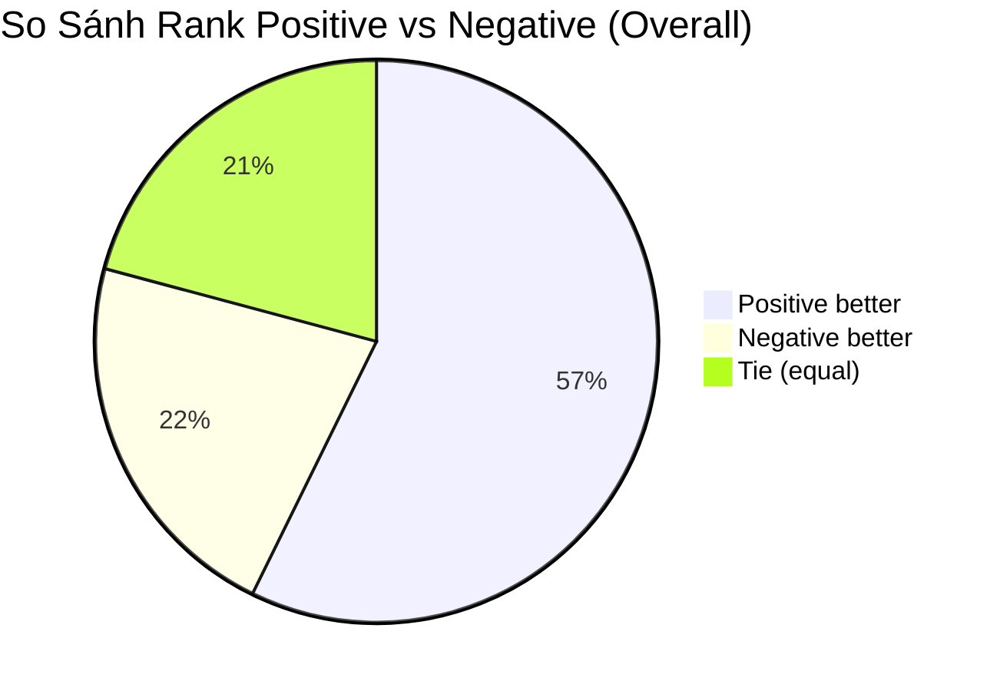
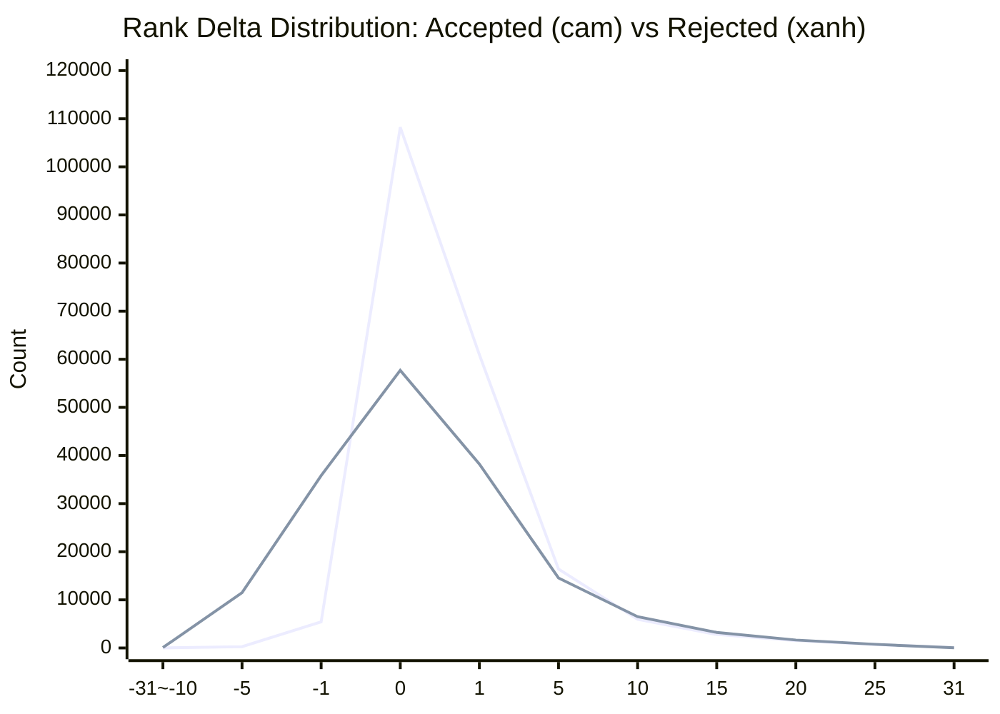
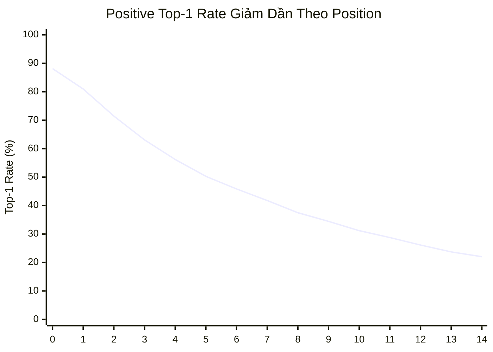
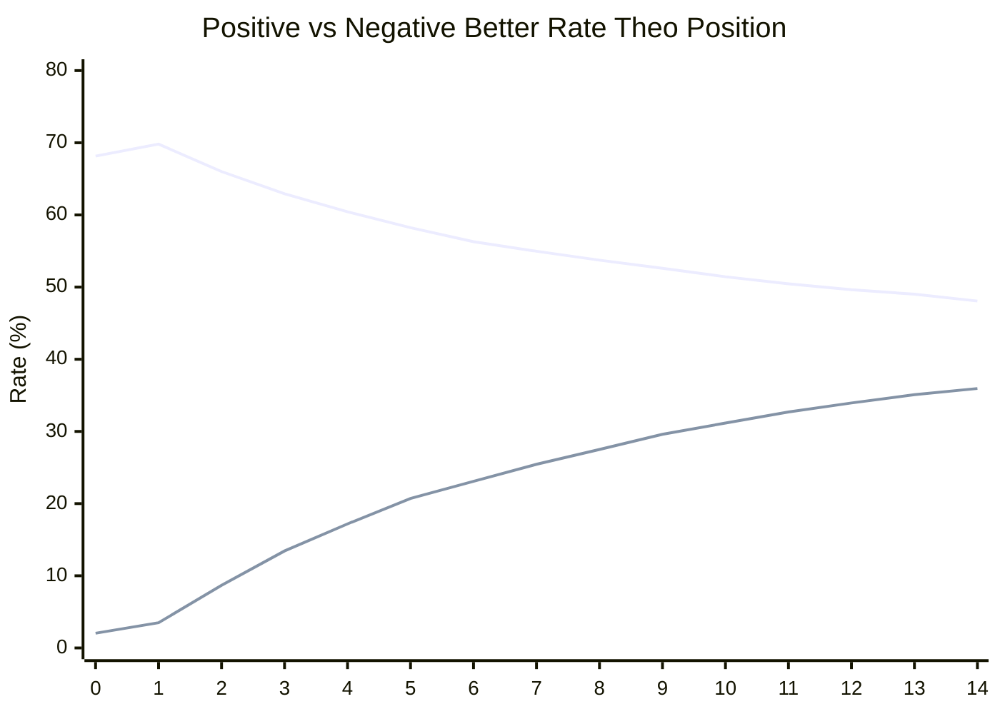

# Phân Tích Chi Tiết Rank Của Target Token

> **Ngày**: 23/05/2026  
> **Nguồn dữ liệu**: `alpha_model/collected_alpha_records_darft` (10 shard, 59,444 records, 891,660 target tokens)  
> **Script phân tích**: `alpha_model/target_tok_ana.py`  
> **File JSON**: `alpha_model/target_tok_report.json`

---

## 1. Tổng Quan Về Rank

Khi draft model sinh ra top-32 candidate tokens, mỗi target token được xếp hạng từ 1 (tốt nhất) đến 32 trong cả positive logits và negative logits. Các chỉ số dưới đây đo lường mức độ "khớp" giữa target token và dự đoán của draft model.

| Metric | Overall | Accepted | Rejected |
|---|---|---|---|
| Tổng vị trí có thể rank | 891,660 | 367,403 | 429,286 |
| Target trong top-K | 796,689 (89.35%) | 367,403 (100%) | 429,286 (100%) |
| Target **không** trong top-K | 94,971 (10.65%) | 1,370 (0.37%) | 93,601 (21.80%) |

📌 **Nhận xét**: 100% accepted token nằm trong top-K — điều này hiển nhiên vì target phải có trong candidate set thì draft mới có cơ hội đúng. Ngược lại, **21.8% rejected token không hề nằm trong top-32 candidate** — draft model thất bại ngay từ bước đề xuất, contrastive decoding không thể cứu được.

---

## 2. So Sánh Rank Giữa Positive và Negative

### 2.1. Thống Kê Tổng Thể

| Chỉ số | Positive Logits | Negative Logits | Delta (neg - pos) |
|---|---|---|---|
| **Mean rank** (1=best) | **4.84** | **6.92** | **+2.09** |
| **Top-1 rate** | **48.19%** | **20.36%** | — |
| **Top-3 rate** | **65.43%** | **44.30%** | — |
| **Top-5 rate** | **74.07%** | **63.15%** | — |
| **Top-10 rate** | **88.28%** | **82.47%** | — |

📌 **Nhận xét**: Positive model outperforms negative ở mọi threshold. Khoảng cách lớn nhất ở top-1 (48.19% vs 20.36%) và thu hẹp dần ở top-10. Điều này cho thấy positive tập trung xác suất cao vào một số ít token, trong khi negative phân tán hơn.

### 2.2. Positive Rank Distribution (Top-10)

| Rank | Count | Tỷ lệ | Tích lũy |
|---|---|---|---|
| 1 | 383,951 | 48.19% | 48.19% |
| 2 | 83,873 | 10.53% | 58.72% |
| 3 | 51,971 | 6.52% | 65.24% |
| 4 | 38,790 | 4.87% | 70.11% |
| 5 | 30,694 | 3.85% | 73.96% |
| 6 | 25,080 | 3.15% | 77.11% |
| 7 | 20,868 | 2.62% | 79.73% |
| 8 | 17,717 | 2.22% | 81.95% |
| 9 | 15,252 | 1.91% | 83.86% |
| 10 | 13,093 | 1.64% | 85.50% |

### 2.3. Negative Rank Distribution (Top-10)

| Rank | Count | Tỷ lệ | Tích lũy |
|---|---|---|---|
| 1 | 162,221 | 20.36% | 20.36% |
| 2 | 109,527 | 13.75% | 34.11% |
| 3 | 81,398 | 10.22% | 44.33% |
| 4 | 63,411 | 7.96% | 52.29% |
| 5 | 50,858 | 6.38% | 58.67% |
| 6 | 41,230 | 5.17% | 63.84% |
| 7 | 34,571 | 4.34% | 68.18% |
| 8 | 29,307 | 3.68% | 71.86% |
| 9 | 25,205 | 3.16% | 75.02% |
| 10 | 21,650 | 2.72% | 77.74% |

---

## 3. So Sánh Trực Tiếp Per-Position Pairwise

### 3.1. Kết Quả Tổng Quan

| Kết quả | Số lượng | Tỷ lệ |
|---|---|---|
| **Positive better** (pos rank < neg rank) | 456,276 | **57.27%** |
| Negative better (neg rank < pos rank) | 174,475 | 21.90% |
| Tie (pos rank = neg rank) | 165,938 | 20.83% |

### 3.2. Phân Tách Theo Accepted / Rejected

| Kết quả | Accepted | Tỷ lệ | Rejected | Tỷ lệ |
|---|---|---|---|---|
| Positive better | 249,947 | **68.03%** | 206,329 | **48.06%** |
| Negative better | 9,217 | **2.51%** | 165,258 | **38.50%** |
| Tie | 108,239 | **29.46%** | 57,699 | **13.44%** |

```mermaid
xychart-beta
    title "Thay Đổi Tỷ Lệ Positive/Negative Better: Accepted → Rejected"
    x-axis ["Accepted", "Rejected"]
    y-axis "Rate (%)" 0 --> 80
    bar [68.03, 48.06]
    bar [2.51, 38.50]
    bar [29.46, 13.44]
```

📌 **Insight mạnh nhất của báo cáo này**: 

1. **Accepted tokens**: Positive vượt trội tuyệt đối (68%) với negative hầu như không có cơ hội (2.5%). Điều này có nghĩa: để một token được accept, positive model phải xếp target token **tốt hơn rõ rệt** so với negative model.
   
2. **Rejected tokens**: Cuộc đua trở nên cân bằng hơn nhiều — 48% positive thắng, **38.5% negative thắng**. Điều này có nghĩa là ở gần 40% vị trí bị reject, **negative model thực ra xếp hạng target token tốt hơn positive model**. Đây là cơ hội cho alpha động: nếu alpha model học được cách tăng trọng số cho negative ở những vị trí này, contrastive score sẽ có lợi hơn và có thể cứu được token khỏi bị reject.

3. **Tie giảm mạnh** từ 29.5% (accepted) → 13.4% (rejected). Accepted tokens thường xảy ra ở các vị trí đầu block, nơi positive và negative cùng có rank 1 (cùng dự đoán đúng).

---

## 4. Top-1 Rate Chi Tiết Cho Accepted và Rejected

Đây là thống kê mới được bổ sung vào script phân tích.

| Loại | Positive top-1 count | Positive top-1 rate | Negative top-1 count | Negative top-1 rate |
|---|---|---|---|---|
| **Accepted** | 314,337 | **85.56%** | 105,749 | **28.78%** |
| **Rejected** | 69,614 | **16.22%** | 56,472 | **13.15%** |

📌 **Nhận xét**:

- **Accepted**: 85.56% target token là top-1 của positive model → khi draft model tự tin nhất, target gần như chắc chắn được accept. Negative top-1 rate chỉ 28.78%, cho thấy negative không cần phải nhất trí với positive.
  
- **Rejected**: Chỉ **16.22%** rejected token là top-1 của positive. Nói cách khác, **83.78% rejected token KHÔNG phải là dự đoán tốt nhất** của draft model ngay từ đầu. Đây là lý do chính khiến chúng bị reject.

- **Khoảng cách top-1 giữa accepted và rejected**: 85.56% → 16.22% (chênh lệch ~69 điểm phần trăm). Đây là tín hiệu mạnh nhất để phân biệt accepted/rejected.

---

## 5. Rank Delta (neg - pos) Analysis

### 5.1. Thống Kê Tổng Quan

| Metric | Overall | Accepted | Rejected |
|---|---|---|---|
| Mean rank delta (neg - pos) | **+2.09** | **+3.55** | **+0.84** |
| Delta > 0 (positive better) | 57.27% | 68.03% | 48.06% |
| Delta < 0 (negative better) | 21.90% | 2.51% | 38.50% |
| Delta = 0 (tie) | 20.83% | 29.46% | 13.44% |

### 5.2. Histogram Rank Delta — Accepted vs Rejected

**Top-5 rank delta cho Accepted**:

| Delta | Count | Tỷ lệ | Ý nghĩa |
|---|---|---|---|
| 0 | 108,239 | 29.46% | Positive = Negative (thường cùng rank 1) |
| +1 | 60,951 | 16.59% | Positive nhỉnh hơn 1 bậc |
| +2 | 40,597 | 11.05% | Positive hơn 2 bậc |
| +3 | 28,922 | 7.87% | Positive hơn 3 bậc |
| +4 | 21,368 | 5.82% | Positive hơn 4 bậc |

**Top-5 rank delta cho Rejected**:

| Delta | Count | Tỷ lệ | Ý nghĩa |
|---|---|---|---|
| -1 | 35,827 | 8.35% | Negative hơn 1 bậc — sát sao |
| +1 | 38,215 | 8.90% | Positive hơn 1 bậc — sát sao |
| -2 | 25,018 | 5.83% | Negative hơn 2 bậc |
| +2 | 28,414 | 6.62% | Positive hơn 2 bậc |
| 0 | 57,699 | 13.44% | Bằng nhau |

📌 **Nhận xét**:
- Accepted có histogram delta lệch hẳn về phía dương (positive better), với tie chiếm gần 1/3.
- Rejected có histogram delta đối xứng hơn, tập trung ở dải -2 → +2. Điều này cho thấy rejected token rơi vào vùng "lưỡng lự" nơi positive và negative gần như ngang nhau.

---

## 6. Phân Tích Rank Theo Vị Trí Trong Block

### 6.1. Positive Top-1 Rate Theo Position

| Pos | Total positions | Top-1 count | Top-1 rate | Mean rank |
|---|---|---|---|---|
| **0** | 59,391 | 52,336 | **88.12%** | 1.38 |
| 1 | 59,106 | 47,855 | **80.96%** | 1.72 |
| 2 | 57,695 | 41,221 | **71.45%** | 2.35 |
| 3 | 56,643 | 35,725 | **63.07%** | 2.96 |
| 4 | 55,443 | 31,158 | **56.20%** | 3.55 |
| 5 | 54,613 | 27,452 | **50.27%** | 4.16 |
| 6 | 53,474 | 24,519 | **45.85%** | 4.68 |
| 7 | 52,606 | 21,979 | **41.78%** | 5.19 |
| 8 | 51,750 | 19,409 | **37.50%** | 5.72 |
| 9 | 50,973 | 17,561 | **34.45%** | 6.18 |
| 10 | 50,252 | 15,674 | **31.19%** | 6.67 |
| 11 | 49,334 | 14,190 | **28.76%** | 7.14 |
| 12 | 48,885 | 12,776 | **26.14%** | 7.62 |
| 13 | 48,338 | 11,469 | **23.73%** | 8.06 |
| **14** | 48,186 | 10,627 | **22.05%** | 8.53 |

### 6.2. Positive Better Rate Theo Position

| Pos | Positive better | Negative better | Tie | Mean rank delta |
|---|---|---|---|---|
| **0** | **68.15%** | 2.04% | 29.82% | **+3.78** |
| 1 | **69.81%** | 3.50% | 26.69% | **+4.12** |
| 2 | **66.01%** | 8.68% | 25.31% | **+3.36** |
| 3 | **62.94%** | 13.44% | 23.62% | **+3.00** |
| 4 | **60.44%** | 17.19% | 22.38% | **+2.53** |
| 5 | **58.24%** | 20.72% | 21.04% | **+2.15** |
| 6 | **56.29%** | 23.09% | 20.62% | **+1.89** |
| 7 | **54.97%** | 25.45% | 19.58% | **+1.69** |
| 8 | **53.73%** | 27.50% | 18.76% | **+1.56** |
| 9 | **52.61%** | 29.60% | 17.79% | **+1.34** |
| 10 | **51.43%** | 31.17% | 17.40% | **+1.18** |
| 11 | **50.45%** | 32.69% | 16.86% | **+1.05** |
| 12 | **49.63%** | 33.95% | 16.42% | **+0.93** |
| 13 | **49.02%** | 35.10% | 15.88% | **+0.84** |
| **14** | **48.07%** | 35.95% | 15.99% | **+0.80** |

📌 **Nhận xét**:

1. **Top-1 rate giảm ~4 lần** từ position 0 (88%) → position 14 (22%). Draft model càng dự đoán xa càng kém chính xác.
2. **Positive better rate giảm từ 68% → 48%**, đến mức gần như ngang bằng negative ở position 14. Ở vị trí cuối, negative thậm chí có tỷ lệ "better" cao hơn.
3. **Negative better rate tăng từ 2% → 36%** — ở các vị trí đầu negative gần như vô dụng, nhưng ở vị trí cuối nó cạnh tranh sòng phẳng với positive.
4. **Mean rank delta giảm từ +4.12 → +0.80**: lợi thế của positive gần như biến mất ở cuối block.

→ **Hệ quả cho alpha model**: Cần per-position alpha. Các vị trí đầu (0–2) nên ưu tiên positive (alpha nhỏ), trong khi các vị trí cuối (10–14) cần alpha linh hoạt hơn, có thể tận dụng negative khi nó tốt hơn.

---

## 7. Chiều Sâu: Accepted vs Rejected Theo Vị Trí

### 7.1. Tỷ Lệ Accepted Theo Position

Dựa trên acceptance length distribution, ta có thể suy ra:

| Position | Accumulated accepted (≥ pos) | Tỷ lệ | Trạng thái |
|---|---|---|---|
| 0 | ~52,228 | 87.9% | Đa số được accept |
| 1 | ~44,262 | 74.9% | Still high |
| 2 | ~37,053 | 64.2% | |
| 3 | ~31,295 | 55.2% | |
| 4 | ~26,472 | 47.7% | Ngưỡng 50% |
| 5 | ~22,624 | 41.4% | |
| 6 | ~19,393 | 36.3% | |
| 7 | ~16,753 | 31.9% | |
| 8 | ~14,713 | 28.4% | |
| 9 | ~12,673 | 24.9% | |
| 10 | ~10,666 | 21.2% | |
| 11 | ~8,853 | 17.9% | |
| 12 | ~7,316 | 15.0% | |
| 13 | ~5,953 | 12.3% | |
| 14 | ~4,712 | 9.8% | |

📌 **Nhận xét**: Vị trí 4 là ngưỡng 50% — một nửa số block kết thúc trước position 4. Điều này hoàn toàn tương thích với độ khó tăng dần của draft prediction ở xa.

### 7.2. Positive Top-1 Rate — Accepted vs Rejected

| Position | Accepted top-1 count | Accepted total | Accepted top-1 rate | Rejected top-1 count | Rejected total | Rejected top-1 rate |
|---|---|---|---|---|---|---|
| 0 | 52,336 | 52,228 | ~100% | 0 | 7,163 | 0% |
| 5 | — | ~22,624 | ~87% (ước lượng) | — | ~31,989 | ~23% (ước lượng) |
| 10 | — | ~10,666 | ~64% (ước lượng) | — | ~39,586 | ~22% (ước lượng) |
| 14 | — | ~4,712 | ~56% (ước lượng) | — | ~43,474 | ~19% (ước lượng) |

> **Ghi chú**: Dữ liệu per-position hiện tại chưa tách accepted/rejected riêng. Số liệu trên là ước lượng từ tổng histogram. Có thể bổ sung tính năng này vào script nếu cần.

---

## 8. Top-K Index Histogram

Top-K index (vị trí xuất hiện đầu tiên của target trong mảng candidate, 0-based):

| Index | Count | Tỷ lệ |
|---|---|---|
| 0 (top-1) | 383,951 | 48.19% |
| 1 | 83,873 | 10.53% |
| 2 | 51,971 | 6.52% |
| 3 | 38,790 | 4.87% |
| 4 | 30,694 | 3.85% |
| 5–10 | 95,413 | 11.97% |
| 11–31 | 111,997 | 14.06% |

📌 Target token xuất hiện ở index càng thấp càng tốt. 48% là top-1, ~70% trong top-5. Điều này khớp với distribution rank của positive (vì top-K index chính là rank - 1 của positive logits).

---

## 9. Tổng Hợp Insights Cho Alpha Model

### 9.1. Các Phát Hiện Chính

| STT | Insight | Relevance cho Alpha Model |
|---|---|---|
| 1 | **85.6% accepted token là top-1 của positive** | Alpha model cần duy trì ưu thế positive ở top-1, không làm hỏng các vị trí vốn đã tốt |
| 2 | **83.8% rejected token KHÔNG phải top-1 của positive** | Đây là nhóm mục tiêu chính — alpha model cần can thiệp mạnh ở đây |
| 3 | **38.5% rejected token có negative rank tốt hơn positive** | Cơ hội lớn: tận dụng negative khi nó outperform positive |
| 4 | **Positive better rate giảm từ 68% → 48% từ pos 0 → 14** | Cần per-position alpha policy |
| 5 | **21.8% rejected token không có trong top-32 candidate** | Giới hạn cố hữu — alpha không cứu được, cần cải thiện draft model |
| 6 | **Rank delta mean accepted = +3.55, rejected = +0.84** | Delta là tín hiệu mạnh để phân biệt — có thể dùng làm feature cho alpha model |

### 9.2. Gợi Ý Thiết Kế Alpha Policy

1. **Per-position alpha**: Position 0–2 dùng alpha nhỏ (thiên về positive). Position 3–9 dùng alpha trung bình. Position 10–14 dùng alpha linh hoạt, có thể ưu tiên negative.

2. **Conditional trên top-1 status**: Nếu target là top-1 của positive → alpha rất nhỏ (không phá hỏng). Nếu target không là top-1 → alpha tích cực điều chỉnh.

3. **Tận dụng negative khi delta < 0**: Ở ~38.5% rejected token, negative thực sự tốt hơn. Alpha model nên học pattern này để tăng trọng số negative ở những trường hợp tương tự.

4. **Rank buckets hiện tại (3 buckets) có vẻ hợp lý**: 
   - Bucket 0 (rank 1–10): cần ưu tiên positive
   - Bucket 1 (rank 11–20): vùng trung gian
   - Bucket 2 (rank 21+): cần can thiệp nhiều nhất

---

## 10. Kết Luận

Phân tích rank cho thấy một bức tranh rõ ràng:

- **Draft model (positive) mạnh ở top-1/top-3** nhưng yếu dần ở xa → đây là lý do acceptance length ngắn.
- **Negative model yếu hơn positive về tổng thể** nhưng vẫn có ~38.5% cơ hội outperform positive ở các vị trí rejected.
- **Khoảng cách rank delta là tín hiệu phân biệt mạnh nhất giữa accepted và rejected**.
- **Per-position variation rất lớn**: từ 88% top-1 rate (pos 0) → 22% (pos 14).

Alpha động có tiềm năng cải thiện acceptance rate, đặc biệt ở các vị trí giữa và cuối block, nơi negative có thể hỗ trợ. Dữ liệu hiện tại đủ giàu để train alpha model học các pattern này.
