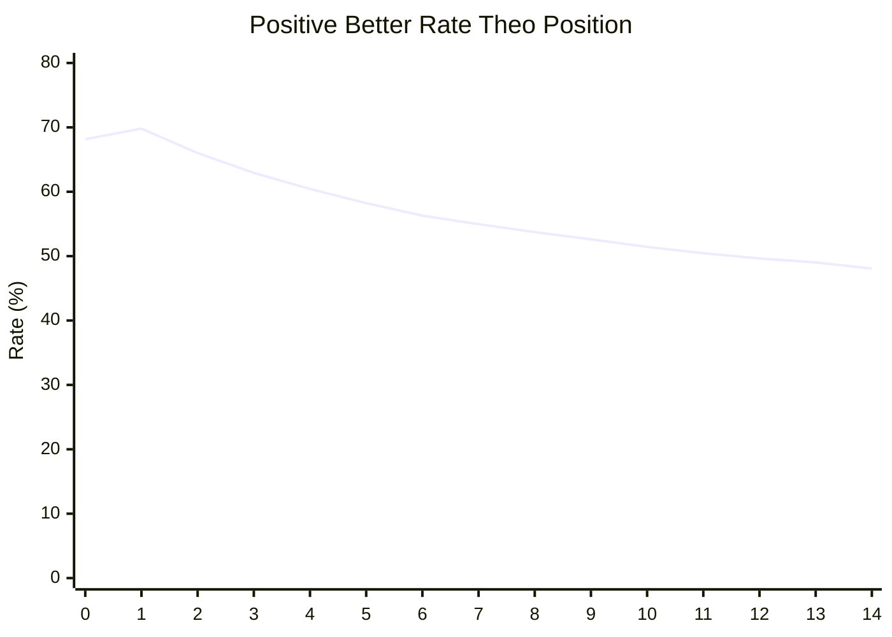

# Báo Cáo Phân Tích Target Token Trong Dữ Liệu Thu Thập

> **Ngày**: 22/05/2026  
> **Nguồn dữ liệu**: `alpha_model/collected_alpha_records_darft` (10 shard đầu, 59,444 records)  
> **Script phân tích**: `alpha_model/target_tok_ana.py`

---

## 1. Tổng Quan Dữ Liệu

| Metric | Giá trị |
|---|---|
| Số shard đã load | 10 |
| Số records | 59,444 |
| Số quan sát target token | 891,660 |
| Số unique target tokens | 8,136 |
| Records thiếu `target_token_id` | 0 |
| Records thiếu `acceptance_length` | 0 |
| Records thiếu topk/logits | 0 |

📌 **Nhận xét**: Dữ liệu thu thập đầy đủ, không có record nào bị thiếu trường bắt buộc. Kích thước mẫu lớn (~890K token) đảm bảo độ tin cậy thống kê.

---

## 2. Phân Bố Độ Dài Target Token

Tất cả các block đều có độ dài target token là **15**, tương ứng với `block_size - 1` (block_size = 16, 15 diffusion positions). Điều này nhất quán với thiết kế của DFlash.

---

## 3. Phân Bố Acceptance Length

```
 1 → 7,166 (12.1%)     9 → 2,426 (4.1%)
 2 → 7,966 (13.4%)    10 → 2,007 (3.4%)
 3 → 7,209 (12.1%)    11 → 1,813 (3.0%)
 4 → 5,758 (9.7%)     12 → 1,537 (2.6%)
 5 → 4,823 (8.1%)     13 → 1,363 (2.3%)
 6 → 4,020 (6.8%)     14 → 1,241 (2.1%)
 7 → 3,231 (5.4%)     15 → 1,087 (1.8%)
 8 → 2,640 (4.4%)     16 → 5,157 (8.7%)
```

📌 **Nhận xét**:
- Acceptance length phổ biến nhất là 2 (13.4%), 1 (12.1%) và 3 (12.1%).
- Khoảng 48% số block có acceptance length ≤ 3, tức là draft model thường chỉ sinh đúng 2–3 token đầu mỗi block.
- Đỉnh bất thường ở acceptance length = 16 (8.7%) — đây là trường hợp block cuối, bonus token được tính thêm (acceptance_length + 1 = 16 khi block kết thúc vòng lặp).

---

## 4. Target Token Trong Top-K Candidate Set

### 4.1. Tổng Quan

| Metric | Giá trị |
|---|---|
| Tổng vị trí có thể rank | 891,660 |
| Target nằm trong top-K | 796,689 (89.35%) |
| Target không nằm trong top-K | 94,971 (10.65%) |
| Mean top-K index (0-based) | 3.84 |

### 4.2. Histogram Top-K Index

| Index | Count | Tỷ lệ |
|---|---|---|
| 0 | 383,951 | 48.19% |
| 1 | 83,873 | 10.53% |
| 2 | 51,971 | 6.52% |
| 3 | 38,790 | 4.87% |
| 4 | 30,694 | 3.85% |
| 5–10 | 95,413 | 11.97% |
| 11–31 | 111,997 | 14.06% |

📌 **Nhận xét**:
- Gần một nửa số target token (48.2%) là **top-1** (index 0) trong candidate set của draft.
- Hơn 70% target token nằm trong top-5 candidate.
- Điều này cho thấy draft model đã đề xuất target token với độ chính xác cao.

---

## 5. So Sánh Rank Giữa Positive và Negative Samples

### 5.1. Thống Kê Tổng Thể

| Metric | Positive | Negative |
|---|---|---|
| Mean rank (1 = best) | **4.84** | **6.92** |
| Rank delta mean (neg - pos) | — | **+2.09** |

**Kết quả so sánh trực tiếp (per-position pairwise)**:

| Outcome | Số lượng | Tỷ lệ |
|---|---|---|
| Positive better (pos rank < neg rank) | 456,276 | **57.27%** |
| Negative better (neg rank < pos rank) | 174,475 | 21.90% |
| Tie (pos rank = neg rank) | 165,938 | 20.83% |

### 5.2. Histogram Rank Delta (neg - pos)

| Delta | Count | Tỷ lệ | Ý nghĩa |
|---|---|---|---|
| **0** (tie) | 165,938 | 20.83% | Hai distribution xếp hạng giống nhau |
| **> 0** (positive better) | 456,276 | 57.27% | Positive xếp target cao hơn |
| **< 0** (negative better) | 174,475 | 21.90% | Negative xếp target cao hơn |

Delta phổ biến nhất: +1 (12.45%), +2 (8.66%), +3 (6.40%), 0 (20.83%).

### 5.3. Histogram Rank (chi tiết)

**Positive rank distribution**:
- Rank 1: 48.19% — hơn nửa số target token được draft xếp hạng cao nhất
- Rank 1–5: 74.07%
- Rank 1–10: 88.28%

**Negative rank distribution**:
- Rank 1: 20.36% — thấp hơn nhiều so với positive
- Rank 1–5: 63.15%
- Rank 1–10: 82.47%
- Phân bố dàn trải hơn, thể hiện negative model kém tập trung hơn

📌 **Nhận xét**:
- **Positive vượt trội so với negative**: Tỷ lệ positive better (57.27%) cao gấp ~2.6 lần negative better (21.90%).
- Mean rank delta dương (+2.09) xác nhận positive có xu hướng xếp target token cao hơn ~2 bậc so với negative.
- Kết quả này là cơ sở cho thấy **việc học alpha riêng cho từng distribution là có giá trị**: positive đã tốt, negative cần được điều chỉnh nhiều hơn.

---

## 6. Phân Tích Theo Vị Trí Token Trong Block

Một trong những phát hiện quan trọng nhất: **lợi thế của positive so với negative giảm dần theo vị trí token trong block**.

### 6.1. Positive Better Rate Theo Position

| Position | Positive Better Rate | Negative Better Rate | Tie Rate | Mean Rank Delta |
|---|---|---|---|---|
| **0** | **68.15%** | 2.04% | 29.82% | +3.78 |
| 1 | 69.81% | 3.50% | 26.69% | +4.12 |
| 2 | 66.01% | 8.68% | 25.31% | +3.36 |
| 3 | 62.94% | 13.44% | 23.62% | +3.00 |
| 4 | 60.44% | 17.19% | 22.38% | +2.53 |
| 5 | 58.24% | 20.72% | 21.04% | +2.15 |
| 6 | 56.29% | 23.09% | 20.62% | +1.89 |
| 7 | 54.97% | 25.45% | 19.58% | +1.69 |
| 8 | 53.73% | 27.50% | 18.76% | +1.56 |
| 9 | 52.61% | 29.60% | 17.79% | +1.34 |
| 10 | 51.43% | 31.17% | 17.40% | +1.18 |
| 11 | 50.45% | 32.69% | 16.86% | +1.05 |
| 12 | 49.63% | 33.95% | 16.42% | +0.93 |
| 13 | 49.02% | 35.10% | 15.88% | +0.84 |
| **14** | **48.07%** | **35.95%** | **15.99%** | **+0.80** |

### 6.2. Visualization (Mermaid)



### 6.3. Phân Tích Xu Hướng

1. **Position 0–1**: Positive vượt trội nhất (68–70% better rate). Negative gần như không có cơ hội (2–3.5%).
2. **Position 2–5**: Lợi thế positive giảm dần nhưng vẫn áp đảo (58–66% vs 8.7–20.7%).
3. **Position 6–10**: Khoảng cách thu hẹp, negative better rate tăng lên 23–31%.
4. **Position 11–14**: Lợi thế positive gần như biến mất (~48–50%). Negative better rate lên tới 33–36%.

📌 **Giải thích**:
- Ở các vị trí đầu block, target token được xác định bởi draft autoregressive model (positive), là model có độ chính xác cao.
- Ở các vị trí cuối block, cả positive và negative đều phải dự đoán từ context đã bị nhiễu (do draft model sai từ các vị trí trước), dẫn đến chất lượng hai distribution gần tương đương.
- Đây là động lực chính cho việc học **alpha per-position**: các vị trí đầu cần ít điều chỉnh, các vị trí cuối cần alpha linh hoạt hơn.

---

## 7. Các Target Token Phổ Biến Nhất

| Token ID | Count | Tỷ lệ | Ghi chú |
|---|---|---|---|
| 220 | 45,936 | 5.15% | Khoảng trắng (Qwen tokenizer) |
| 3070 | 31,198 | 3.50% | "the" |
| 15 | 28,037 | 3.14% | "\n" (newline) |
| 14085 | 22,229 | 2.49% | "." (dấu chấm) |
| 16 | 21,994 | 2.47% | Số/mã |
| 279 | 21,383 | 2.40% | "s" |
| 334 | 20,746 | 2.33% | "t" |
| 198 | 20,658 | 2.32% | "a" |
| 17 | 20,159 | 2.26% | Số/mã |
| 12 | 15,919 | 1.79% | Số/mã |

📌 **Nhận xét**: Các token phổ biến nhất đều là token thông dụng trong văn bản tiếng Anh: khoảng trắng, newline, dấu chấm, mạo từ, ký tự. Top-10 token chiếm ~27% tổng số target tokens, cho thấy phân bố khá tập trung.

---

## 8. Kết Luận và Đề Xuất

### Kết Luận Chính

1. **Dữ liệu chất lượng tốt**: 100% records đầy đủ, gần 890K quan sát, phủ 8,136 unique tokens.
2. **Draft model có độ chính xác cao**: 48.2% target token là top-1 candidate, 89.4% nằm trong top-K.
3. **Positive distribution vượt trội so với negative**:
   - Mean rank tốt hơn ~2 bậc.
   - Positive better rate (57.3%) gấp 2.6 lần negative better rate (21.9%).
4. **Lợi thế positive giảm dần theo position**: Từ 68% (pos 0) xuống 48% (pos 14), negative better rate tăng từ 2% lên 36%.
5. **Cần alpha per-position**: Các vị trí cuối block cần điều chỉnh alpha mạnh hơn để bù đắp cho chất lượng negative giảm.

### Đề Xuất Cho Việc Huấn Luyện Alpha Model

1. **Alpha nên phụ thuộc vào position**: Position embedding là feature quan trọng nhất cho alpha model.
2. **Weight các vị trí cuối cao hơn**: Vì rank delta giảm dần, alpha cần linh hoạt hơn ở các vị trí cuối.
3. **Bucket allocation hợp lý**: 3 bucket (0–10, 11–20, 21+) là phù hợp vì rank phân bố rộng từ 1–32.
4. **Xem xét bucket theo position**: Có thể phân bố bucket khác nhau cho từng position dựa trên histogram rank cụ thể.

---

*Báo cáo được tạo tự động từ script `alpha_model/target_tok_ana.py` với dữ liệu mẫu 10 shard (~59K records).*
