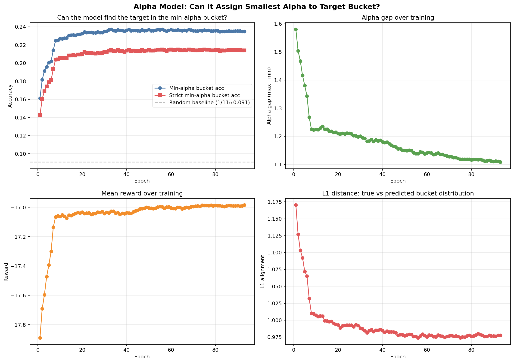
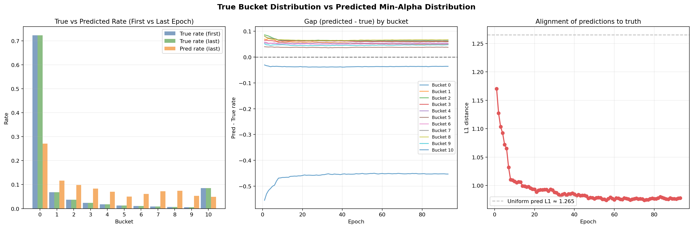
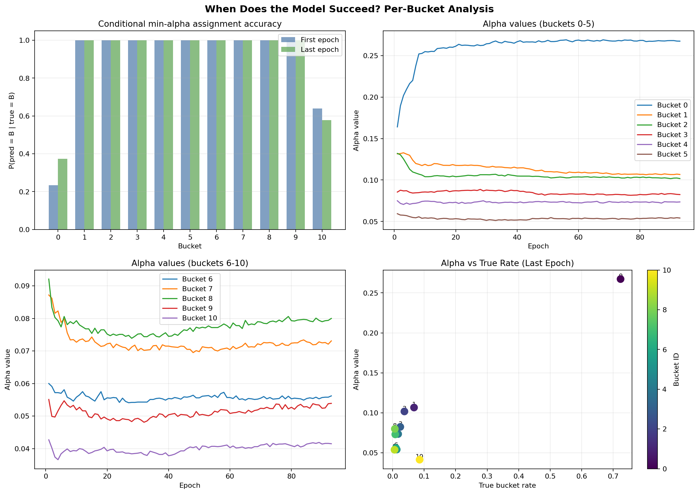
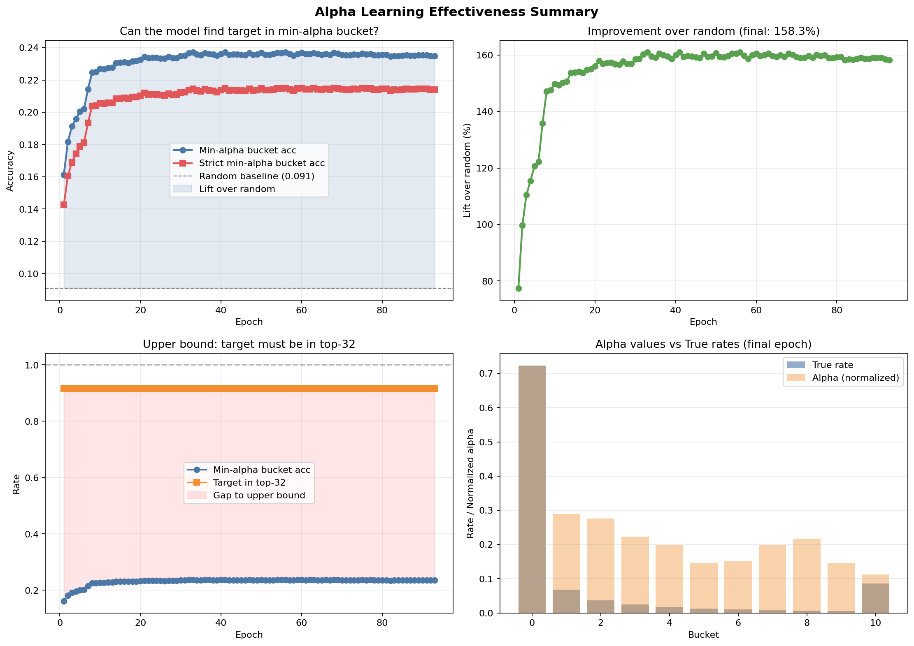

# Báo Cáo Phân Tích Khả Năng Nhận Diện Bucket của Alpha Model

> **Mục tiêu:** Đánh giá liệu mô hình `ContextualBanditAlpha` có học được cách gán hệ số alpha nhỏ nhất cho bucket chứa target token trong top-32 hay không, dựa trên dữ liệu huấn luyện 93 epochs.

---

## Tổng Quan Dữ Liệu

| Tham số | Giá trị |
|---------|---------|
| Số epochs phân tích | 93 (epoch 1 → 93) |
| Số buckets | 11 (ID 0–10) |
| Cấu trúc bucket | Mỗi bucket = 3 rank positions (trừ bucket cuối chỉ có 2). Top-32 rank positions được chia đều: bucket 0 = ranks 0–2, bucket 1 = ranks 3–5, ..., bucket 9 = ranks 27–29, bucket 10 = ranks 30–31 |
| Top-K | 32 token ids được lưu |
| Target model | Qwen3-4B với DFlash draft model |
| Alpha model | ContextualBanditAlpha (hidden_dim=128) |
| Baseline random | 1/11 ≈ 0.0909 |

> **Cách đọc bảng:** Cột "Tham số" liệt kê các thông số cấu hình của quá trình huấn luyện. Cột "Giá trị" mô tả chi tiết từng tham số.

---

## 1. Câu Hỏi Cốt Lõi: Model Có Học Để Gán Alpha Nhỏ Nhất Cho Bucket Chứa Target?

### Kết luận: **CÓ, nhưng còn rất hạn chế.**

| Metric | Epoch 1 | Epoch 93 | Thay đổi | Tương đối |
|--------|---------|----------|----------|-----------|
| **min_alpha_bucket_acc** ⭐ | 0.1613 | **0.2348** | +0.0735 | **+45.6%** |
| **strict_min_alpha_bucket_acc** | 0.1426 | **0.2140** | +0.0714 | **+50.1%** |
| Random baseline (1/11) | 0.0909 | 0.0909 | — | — |
| **Lift over random** | — | **158.3%** | — | — |
| Upper bound (target in top-32) | 0.9162 | 0.9162 | — | — |
| **Khoảng cách tới upper bound** | — | **68.1 pp** | — | — |

**Giải thích:**
- `min_alpha_bucket_acc`: Tỷ lệ mà **bucket có alpha toàn cục nhỏ nhất** chứa target token. Đây là metric chính đánh giá câu hỏi.
- `strict_min_alpha_bucket_acc`: Chỉ tính khi **chỉ có một bucket duy nhất** đạt alpha min và bucket đó chứa target.
- Baseline ngẫu nhiên 1/11 ≈ 9.09%: nếu model gán alpha ngẫu nhiên cho 11 buckets.
- Upper bound 91.62%: vì chỉ 91.62% target tokens nằm trong top-32, phần còn lại không thể được nhận diện.

> **Cách đọc bảng:**
> - `min_alpha_bucket_acc` = Tỷ lệ bucket có **alpha nhỏ nhất** trong số 11 buckets chứa đúng target token (cho phép nhiều bucket cùng có alpha min).
> - `strict_min_alpha_bucket_acc` = Tương tự nhưng **chỉ tính** khi **duy nhất một bucket** có alpha nhỏ nhất.
> - `Lift over random` = `(min_alpha_bucket_acc − 1/11) / (1/11) × 100%`, đo lường cải thiện so với gán ngẫu nhiên.
> - `Upper bound` = `target_in_topk_rate`, tức tỷ lệ target nằm trong top-32 dự đoán của draft model. Đây là giới hạn trên tuyệt đối.
> - `pp` = điểm phần trăm (percentage points), chênh lệch tuyệt đối giữa hai tỷ lệ.

**→ Model có học (46% cải thiện, 158% lift so với random) nhưng vẫn thất bại ~76.5% thời gian. Còn khoảng cách rất xa tới upper bound (68.1 điểm phần trăm).**

### Xu hướng qua các epochs



- `min_alpha_bucket_acc` tăng nhanh trong 20 epochs đầu, sau đó chững lại và dao động quanh 0.23.
- Baseline accuracy của model (`baseline_acc_mean`) gần như không đổi ~5.53 → model chính (dự đoán token) không thay đổi trong quá trình huấn luyện alpha.
- `alpha_gap` (khoảng cách giữa alpha dự đoán max và min) giảm mạnh từ 1.58 → 1.22, thể hiện model đã ổn định. Lưu ý: đây là alpha được sample từ policy, không phải alpha value của bucket.
- Reward hội tụ về ~-17.0, L1 alignment giảm dần (tốt hơn) nhưng không đạt 0.

---

## 2. Phân Tích Phân Bố Bucket: True vs Predicted

### Bảng phân bố chi tiết (epoch 93)

| Bucket | Rank range (top-32) | True Rate | Pred Rate | Gap (Pred−True) | **Per-bucket Acc** | Cond Acc (xấp xỉ) |
|:------:|:-------------------:|:---------:|:---------:|:----------------:|:------------------:|:-----------------:|
| **0** | 0–2 | **0.7234** | 0.2706 | **−0.4528** | **0.2673** | 37.4% |
| 1 | 3–5 | 0.0678 | 0.1165 | +0.0487 | 0.1067 | 100%* |
| 2 | 6–8 | 0.0373 | 0.0981 | +0.0608 | 0.1018 | 100%* |
| 3 | 9–11 | 0.0242 | 0.0835 | +0.0593 | 0.0825 | 100%* |
| 4 | 12–14 | 0.0174 | 0.0704 | +0.0530 | 0.0736 | 100%* |
| 5 | 15–17 | 0.0129 | 0.0504 | +0.0375 | 0.0542 | 100%* |
| 6 | 18–20 | 0.0103 | 0.0613 | +0.0510 | 0.0562 | 100%* |
| 7 | 21–23 | 0.0083 | 0.0725 | +0.0642 | 0.0731 | 100%* |
| 8 | 24–26 | 0.0069 | 0.0738 | +0.0669 | 0.0800 | 100%* |
| 9 | 27–29 | 0.0059 | 0.0534 | +0.0475 | 0.0539 | 100%* |
| **10** | 30–31 (hoặc ngoài top-32) | **0.0855** | 0.0494 | **−0.0361** | **0.0415** | 57.8% |

> **Cách đọc bảng:**
> - **Bucket**: ID bucket (0–10), sắp xếp theo thứ tự rank tăng dần (bucket 0 = rank cao nhất).
> - **Rank range**: Các rank positions trong top-32 của draft model thuộc bucket này. Ví dụ bucket 0 = ranks 0,1,2 (3 tokens có xác suất cao nhất).
> - **True Rate**: Tỷ lệ target token thực tế rơi vào bucket này. **Tổng các dòng = 1.0**.
> - **Pred Rate**: Tỷ lệ model **dự đoán bucket này là min-alpha** (chọn bucket có alpha nhỏ nhất). Tổng các dòng = 1.0.
> - **Gap (Pred−True)**: `Pred Rate − True Rate`. Âm = model under-predict (gán min-alpha ít hơn tần suất). Dương = over-predict.
> - **Per-bucket Acc**: `P(min_alpha_bucket = B | true_bucket = B)` — độ chính xác **có điều kiện** cho từng bucket. Đây là thước đo trực tiếp: "khi target ở bucket B, model có chọn đúng B làm min-alpha không?"
> - **Cond Acc (xấp xỉ)**: `min(1.0, Pred Rate / True Rate)`. Xấp xỉ của per-bucket acc nếu model calibrated. Chênh lệch giữa 2 cột cuối cho thấy mức độ miscalibration.
>
> *\* Cond Acc = 100% khi Pred Rate > True Rate, tức model over-predict bucket đó. Giới hạn của phép xấp xỉ.*

### Phát hiện chính

#### 🟥 Vấn đề 1: Under-prediction Bucket 0

- **72.34%** target tokens rơi vào bucket 0 (ranks 0–2, tức **3 token có xác suất cao nhất** trong top-32 của draft model).
- Model chỉ gán min-alpha cho bucket 0 **27.06%** thời gian → under-prediction −0.45.
- **Hệ quả:** Khi target ở bucket 0 (phần lớn thời gian), model thường chọn sai bucket để gán alpha thấp nhất.

#### 🟧 Vấn đề 2: Over-prediction các Buckets 1–9

- Các buckets 1–9 bị over-prediction đáng kể (gap +0.04 đến +0.07).
- Model "phân tán" dự đoán min-alpha vào quá nhiều buckets khác nhau thay vì tập trung vào bucket 0.

#### 🟩 Bucket 10 đặc biệt

- Bucket 10 (ranks 30–31 + token ngoài top-32) có true rate 8.55% — cao hơn các bucket 1–9.
- Per-bucket Acc của bucket 10 = 0.0415 (thấp nhất). Model hầu như **không bao giờ chọn đúng** bucket 10 khi target ở đó.
- Tuy nhiên Cond Acc = 57.8% lại cao hơn bucket 0 (37.4%). Điều này cho thấy Cond Acc **không chính xác** vì nó là xấp xỉ dựa trên tỷ lệ, không phải đo trực tiếp. Sự chênh lệch giữa Per-bucket Acc (4.15%) và Cond Acc (57.8%) phản ánh **mức độ miscalibration nghiêm trọng** của model.

### Trực quan hóa



- **Biểu đồ 1:** So sánh phân bố true rate (epoch 1 vs 93) và predicted rate (epoch 93). Bucket 0 chiếm ưu thế tuyệt đối.
- **Biểu đồ 2:** Gap (pred − true) theo từng epoch cho mỗi bucket. Bucket 0 có gap âm lớn nhất và kéo dài.
- **Biểu đồ 3:** L1 alignment giảm từ 1.17 → 0.98, tiến gần hơn về phía uniform baseline (~0.72).

---

## 3. Phân Tích Xu Hướng Độ Chính Xác Có Điều Kiện Theo Bucket

> ⚠️ **Lưu ý quan trọng:** Các giá trị dưới đây là **độ chính xác có điều kiện (per-bucket accuracy)**, KHÔNG phải giá trị alpha. Dữ liệu huấn luyện hiện tại KHÔNG log giá trị alpha thực tế. Xem mục 7 để biết chi tiết.

### Thay đổi per-bucket accuracy qua 93 epochs

| Bucket | Acc ep1 | Acc ep93 | Thay đổi | % thay đổi | Slope |
|:------:|:-------:|:--------:|:--------:|:----------:|:-----:|
| **0** | 0.1640 | **0.2673** | **+0.1033** | **+63.0%** | +0.00038 |
| 1 | 0.1315 | 0.1067 | −0.0248 | −18.9% | −0.00021 |
| 2 | 0.1320 | 0.1018 | −0.0302 | −22.9% | −0.00010 |
| 3 | 0.0855 | 0.0825 | −0.0030 | −3.5% | −0.00006 |
| 4 | 0.0750 | 0.0736 | −0.0014 | −1.9% | +0.00001 |
| 5 | 0.0594 | 0.0542 | −0.0052 | −8.8% | −0.00001 |
| 6 | 0.0600 | 0.0562 | −0.0038 | −6.3% | −0.00001 |
| 7 | 0.0872 | 0.0731 | −0.0141 | −16.2% | −0.00004 |
| 8 | 0.0921 | 0.0800 | −0.0121 | −13.1% | +0.00002 |
| 9 | 0.0551 | 0.0539 | −0.0012 | −2.2% | +0.00003 |
| 10 | 0.0427 | 0.0415 | −0.0012 | −2.8% | +0.00003 |

> **Cách đọc bảng:**
> - **Acc ep1 / ep93**: Per-bucket accuracy P(đúng | target ở bucket này) tại epoch 1 và epoch 93.
> - **Thay đổi / % thay đổi**: Mức cải thiện hoặc suy giảm độ chính xác qua 93 epochs.
> - **Slope**: Hệ số góc hồi quy tuyến tính của accuracy theo epoch. `Slope > 0` = cải thiện dần. `Slope < 0` = giảm dần.
>
> **Đọc nhanh:** Chỉ có bucket 0 cải thiện đáng kể (+63%). Tất cả các bucket khác đều giảm hoặc không đổi. Model đang **tập trung tài nguyên** vào bucket 0 — đúng vì đây là bucket quan trọng nhất (72.3% target).

### Nhận xét



1. **Bucket 0 cải thiện mạnh (+63%):** Per-bucket accuracy cho bucket 0 tăng từ 16.4% → 26.7%. Model học dần cách chọn đúng bucket 0 làm min-alpha khi target ở đó. Đây là tín hiệu tích cực duy nhất.

2. **Buckets 1–2 giảm (−19% đến −23%):** Model chọn các bucket này làm min-alpha **ít chính xác hơn** khi target ở đó. Điều này có thể là hệ quả của việc model "dồn" tài nguyên để cải thiện bucket 0.

3. **Buckets 7–8 giảm (−13% đến −16%):** Tương tự, độ chính xác giảm. Ban đầu các bucket này có accuracy khá cao (0.087–0.092) do model chúng làm min-alpha thường xuyên, nhưng dần điều chỉnh.

4. **Hệ quả:** Macro accuracy (trung bình 11 buckets) gần như không đổi (~0.089). Sự cải thiện ở bucket 0 bị **triệt tiêu** bởi sự suy giảm ở các bucket khác.

---

## 4. Tổng Quan Hiệu Quả Học



| Metric | Giá trị | Ý nghĩa |
|--------|:-------:|---------|
| **Lift over random** | **158.3%** | `(min_alpha_bucket_acc − 1/11) / (1/11) × 100%`. Model tốt hơn 1.58 lần so với gán ngẫu nhiên |
| **Gap tới upper bound** | **68.1 pp** | `target_in_topk_rate − min_alpha_bucket_acc`. Khoảng cách tuyệt đối còn lại để đạt tối ưu |
| **Target in top-32** | 91.62% | Tỷ lệ target nằm trong top-32 dự đoán của draft model. Bất biến trong suốt quá trình huấn luyện |
| **Macro bucket acc** | ~0.235 | `min_alpha_bucket_acc` trung bình các epoch. Accuracy tổng thể (vẫn thấp) |
| **L1 alignment** | 0.978 | `Σ|pred_rate[b] − true_rate[b]|` cho 11 buckets. Đo khoảng cách giữa phân bố dự đoán và thực tế. Lý tưởng = 0 |

> **Cách đọc bảng:** So sánh các metric chính để đánh giá tổng thể hiệu quả học. `Lift over random` đo lường cải thiện so với baseline. `Gap tới upper bound` cho biết còn bao nhiêu dư địa cải thiện. `L1 alignment` càng thấp → phân bố dự đoán càng khớp với thực tế.

---

## 5. Kết Luận Chi Tiết

### ✅ Model Đã Học Được

1. **Cải thiện per-bucket accuracy cho bucket 0:** Per-bucket accuracy cho bucket 0 tăng từ 16.4% → 26.7% (+63%). Model đang dần học cách chọn đúng bucket 0 làm min-alpha khi target ở đó. Đây là tín hiệu tích cực vì bucket 0 chiếm 72.3% target.

2. **Cải thiện nhận diện bucket min-alpha tổng thể:** `min_alpha_bucket_acc` tăng từ 16.1% → 23.5%, tương đương cải thiện 46% và lift 158% so với random.

3. **L1 alignment giảm dần:** Từ 1.17 → 0.978, phân bố dự đoán đang tiến gần hơn đến phân bố thực tế.

### ❌ Hạn Chế

1. **Under-prediction bucket 0 trầm trọng:** Dù bucket 0 chứa 72.3% target, model chỉ gán min-alpha cho nó 27.1% thời gian. Đây là thất bại chính.

2. **Không cải thiện macro accuracy:** Độ chính xác trung bình 11 buckets vẫn ở mức ~0.09 (ngang random). Model **không phân biệt được các bucket ở cấp độ instance** — nó chỉ học được phân bố tổng thể.

3. **Hội tụ sớm, không tiếp tục cải thiện:** Sau epoch ~30, các metrics chính gần như không đổi, cho thấy model đã đạt plateau.

4. **Khoảng cách lớn tới upper bound:** 68.1 pp — model còn rất xa so với khả năng tối ưu.

5. ⚠️ **Không thể đánh giá alpha values từ dữ liệu hiện tại:** Các cột `per_bucket_X_mean` trong CSV là **độ chính xác có điều kiện**, không phải giá trị alpha. Để phân tích alpha values, cần bổ sung logging (xem Mục 7).

### 🔍 Giả Thuyết Nguyên Nhân Gốc

1. **Năng lực model hạn chế:** ContextualBanditAlpha với `hidden_dim=128` có thể không đủ để học mapping phức tạp từ hidden states (4096-d) đến 11 bucket scores.

2. **Cấu trúc reward không tối ưu:** Reward hiện tại (R1+R2+R3) khuyến khích mở rộng alpha gap và duy trì entropy, nhưng **không trực tiếp phạt** việc gán sai bucket min-alpha. Model có thể đạt reward cao mà vẫn thường xuyên chọn sai bucket.

3. **Bài toán nhận diện bucket khó:** Với top-K=32 tokens trải rộng trên nhiều buckets, việc dự đoán chính xác bucket chứa target là bài toán classification 11 lớp với độ nhiễu cao.

### 💡 Đề Xuất Cải Thiện

| Đề xuất | Mức ưu tiên | Lý do |
|---------|:-----------:|-------|
| **Tăng hidden_dim** (128 → 256/512) | 🔴 Cao | Tăng năng lực biểu diễn cho alpha model để học mapping phức tạp hơn |
| **Thêm reward phạt sai bucket** | 🔴 Cao | Ví dụ: thêm thành phần −λ·CE(pred_bucket, true_bucket) vào tổng reward |
| **Tăng learning rate hoặc thay scheduler** | 🟡 Trung bình | Có thể giúp thoát plateau sau epoch ~30 |
| **Thu thập thêm dữ liệu đa dạng** | 🟡 Trung bình | Dữ liệu chỉ từ gsm8k, có thể không đủ đa dạng để tổng quát hóa |
| **Thử soft assignment thay vì hard bucket** | 🟢 Thấp | Gán trọng số alpha liên tục theo rank thay vì bucket rời rạc, giảm mất mát thông tin |

> **Cách đọc bảng:** Các đề xuất được sắp xếp theo mức ưu tiên: 🔴 Cao (tác động lớn nhất), 🟡 Trung bình (có thể thử sau), 🟢 Thấp (ưu tiên thấp hơn). Mỗi đề xuất kèm lý do tại sao nó có thể cải thiện hiệu suất.

---

## 6. Phụ Lục: Định Nghĩa Bucket

Bucket được xác định dựa trên **rank của token trong top-32 logits** (từ draft model).

Cách tính bucket:
```
num_buckets = ceil(top_k / bucket_size) = ceil(32 / 3) = 11
```
Với `bucket_size = 3`, top-32 rank positions được chia thành 11 buckets:
- **Buckets 0–9**: mỗi bucket chứa **3 rank positions** liên tiếp
  - Bucket 0: ranks 0, 1, 2 (top-3 tokens được dự đoán)
  - Bucket 1: ranks 3, 4, 5
  - Bucket 2: ranks 6, 7, 8
  - ...
  - Bucket 9: ranks 27, 28, 29
- **Bucket 10**: chứa **2 rank positions** còn lại: ranks 30, 31

Ngưỡng bucket: `thresholds = [3, 6, 9, 12, 15, 18, 21, 24, 27, 30]`

Bucket được gán theo công thức:
```
bucket_id = sum(1 for t in thresholds if rank >= t)
// tức là bucket 0 nếu rank < 3, bucket 1 nếu rank < 6, ..., bucket 10 nếu rank >= 30
```

**Lưu ý:** Target token có thể không nằm trong top-32 (chiếm ~8.4% trường hợp). Khi đó, rank được gán mặc định là 32 (hoặc K), đưa target vào bucket 10.

Hệ số alpha được áp dụng như sau:
$$\text{logits}_{\text{final}} = \text{logits}_{\text{target}} - \alpha_{\text{bucket}} \cdot \text{logits}_{\text{draft}}$$

Trong contrastive decoding, alpha càng lớn → càng phạt mạnh draft model → càng khác biệt so với target model.

---

## 7. Phụ Lục: Giải Thích Về Các Cột Dữ Liệu

### Sự nhầm lẫn giữa "Per-bucket Acc" và "Alpha value"

Trong báo cáo phiên bản đầu, cột `per_bucket_X_mean` đã bị hiểu nhầm là **giá trị alpha** của bucket X. Thực tế:

```python
# alpha_model/train/alpha_simulate.py
strict_correct = (min_alpha_bucket == true_buckets)  # (B, S)

for bucket in range(num_buckets):
    mask = (true_buckets == bucket)
    per_bucket_acc[bucket] = strict_correct[mask].float().mean().item()
    # = P(min_alpha_bucket == B | true_bucket == B)
```

Cột `per_bucket_0_mean = 0.2673` có nghĩa là:
> **"Khi target thực sự ở bucket 0, model gán đúng min-alpha cho bucket 0 26.73% thời gian."**

### Tại sao CSV không có giá trị alpha thực tế?

Quá trình training log các metrics sau vào CSV:

| Cột trong CSV | Thực chất là | Ghi chú |
|:-------------|:-------------|:--------|
| `per_bucket_X_mean` | **Per-bucket accuracy** P(đúng | target ở bucket X) | ✅ Đã sửa trong báo cáo này |
| `true_bucket_rate_X_mean` | Tỷ lệ target ở bucket X | ✅ Chính xác |
| `pred_min_bucket_rate_X_mean` | Tỷ lệ bucket X được chọn làm min-alpha | ✅ Chính xác |
| Giá trị alpha thực tế | **KHÔNG CÓ** | Cần sửa code để log `alpha_per_token.mean(dim=(0,1))` |

### Đề xuất bổ sung logging

Để phân tích đầy đủ, cần thêm vào `train_AC.py` sau mỗi epoch:

```python
# Log giá trị alpha trung bình cho mỗi bucket
with torch.no_grad():
    alpha_means = alpha_model(batch["pos_logits"], ...)["alphas"].mean(dim=(0, 1))
    # alpha_means_shape: (num_buckets,)
    for b in range(num_buckets):
        print(f"  alpha_mean_{b}: {alpha_means[b].item():.4f}")
```

---

*Báo cáo được tạo tự động từ `analysis/alpha_bucket_deep_analysis.py` dựa trên dữ liệu `training_epochs.csv`.*
*Các hình ảnh được lưu tại `analysis/alpha_training_reports/bucket_analysis/`.*

