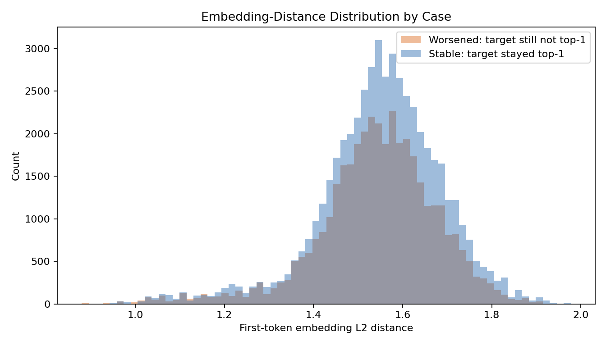
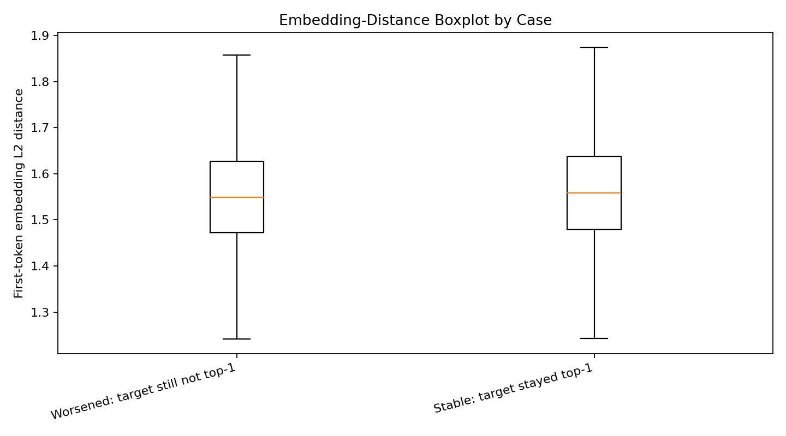
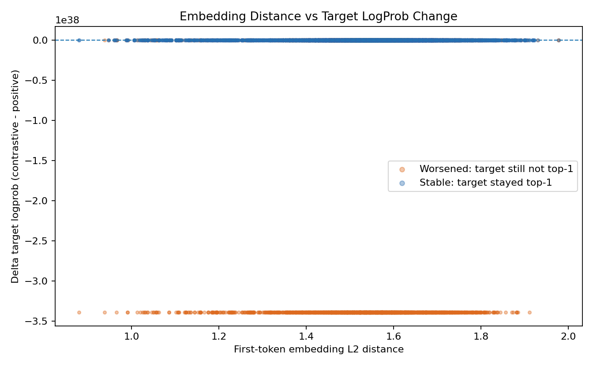
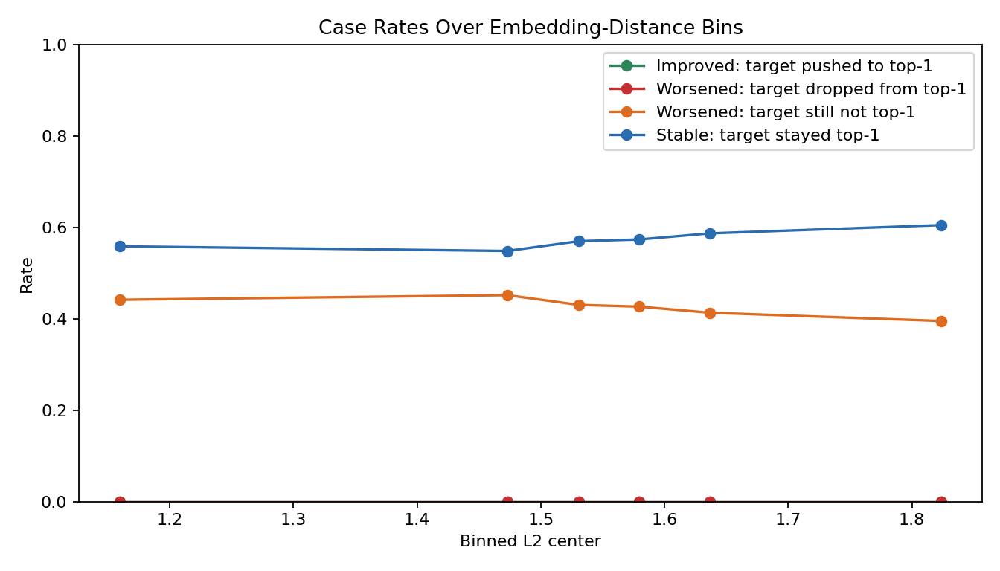

# CDv2 First-Token Embedding Distance Analysis

## Case Definitions
- `improved_push_to_top1`: positive miss, contrastive hits target top-1.
- `worsened_drop_from_top1`: positive hits target top-1, contrastive drops it.
- `worsened_not_push_to_top1`: both positive and contrastive do not put target at top-1.
- `kept_top1`: both positive and contrastive keep target at top-1.

## Overall
- Total token-level records: **90570**
- First-token same-id rate (negative token equals positive token): **0.0000%**
- Target in candidate-mask rate: **80.69%**
- Final accepted-prefix rate at position: **35.45%**
- Corr(L2, delta_target_logprob): **+0.0184**
- Corr(L2, delta_target_rank): **+0.0009**

## Focus Case Stats
| Case | Count | Rate | L2 mean | L2 median | L2 p90 | CosDist mean | Delta logprob mean | Delta rank mean |
|---|---:|---:|---:|---:|---:|---:|---:|---:|
| Improved: target pushed to top-1 | 0 | 0.00% | 0.0000 | 0.0000 | 0.0000 | 0.0000 | +0.0000 | +0.0000 |
| Worsened: target dropped from top-1 | 0 | 0.00% | 0.0000 | 0.0000 | 0.0000 | 0.0000 | +0.0000 | +0.0000 |
| Worsened: target still not top-1 | 38625 | 42.65% | 1.5411 | 1.5492 | 1.6997 | 1.0320 | -inf | +100.7075 |

## Not-Push Subtypes
| Subtype | Count | Rate within not-push |
|---|---:|---:|
| rank_unchanged_not_top1 | 20612 | 53.36% |
| rank_improved_but_not_top1 | 12145 | 31.44% |
| rank_worse_not_top1 | 5868 | 15.19% |

## Distance Bin Analysis
| Bin | L2 range | Count | Rate | Improve | Drop | Not-push | Keep-top1 | Mean d_logprob | Mean d_rank |
|---:|---|---:|---:|---:|---:|---:|---:|---:|---:|
| 0 | [0.8800, 1.4394] | 15090 | 16.66% | 0.00% | 0.00% | 44.16% | 55.84% | -inf | +44.8990 |
| 1 | [1.4394, 1.5063] | 15090 | 16.66% | 0.00% | 0.00% | 45.18% | 54.82% | -inf | +41.0360 |
| 2 | [1.5063, 1.5554] | 15105 | 16.68% | 0.00% | 0.00% | 43.04% | 56.96% | -inf | +49.7622 |
| 3 | [1.5554, 1.6036] | 15090 | 16.66% | 0.00% | 0.00% | 42.66% | 57.34% | -inf | +39.2398 |
| 4 | [1.6036, 1.6700] | 15090 | 16.66% | 0.00% | 0.00% | 41.33% | 58.67% | -inf | +32.2741 |
| 5 | [1.6700, 1.9773] | 15105 | 16.68% | 0.00% | 0.00% | 39.52% | 60.48% | -inf | +50.4643 |

## Plots

## Top Improved Cases
| sample | turn | step | abs_pos | block_pos | first_token -> negative | l2 | cos_dist | target | positive_pred | contrastive_pred | d_logprob | d_rank | target_in_mask | accepted |
|---:|---:|---:|---:|---:|---|---:|---:|---|---|---|---:|---:|---:|---:|

## Top Worsened Cases: Drop From Top-1
| sample | turn | step | abs_pos | block_pos | first_token -> negative | l2 | cos_dist | target | positive_pred | contrastive_pred | d_logprob | d_rank | target_in_mask | accepted |
|---:|---:|---:|---:|---:|---|---:|---:|---|---|---|---:|---:|---:|---:|

## Top Worsened Cases: Not Push To Top-1
| sample | turn | step | abs_pos | block_pos | subtype | first_token -> negative | l2 | cos_dist | target | positive_pred | contrastive_pred | d_logprob | d_rank | target_in_mask | accepted |
|---:|---:|---:|---:|---:|---|---|---:|---:|---|---|---|---:|---:|---:|---:|
| 101 | 0 | 2 | 130 | 7 | rank_worse_not_top1 |  Determine (29901) -> � (99359) | 1.5338 | 0.9407 |  wants (6801) |  to (311) |  to (311) | -19.0571 | -10 | 1 | 0 |
| 126 | 0 | 67 | 457 | 7 | rank_worse_not_top1 | 3 (18) -> `='$ (76116) | 1.6416 | 1.2170 |   (220) |  the (279) |  the (279) | -20.6208 | -8 | 1 | 0 |
| 126 | 0 | 162 | 847 | 9 | rank_worse_not_top1 | :\n\n (1447) ->  wird (14821) | 1.3549 | 0.9949 | 8 (23) |   (220) |   (220) | -21.2364 | -7 | 1 | 0 |
| 56 | 0 | 32 | 268 | 14 | rank_worse_not_top1 |  prevent (5358) -> .Element (20139) | 1.4481 | 0.9755 |  many (1657) |  how (1246) |  how (1246) | -19.9474 | -7 | 1 | 0 |
| 124 | 0 | 42 | 368 | 13 | rank_worse_not_top1 |  initial (2856) -> 钮 (76648) | 1.6957 | 0.9984 | - (12) | 1 (16) | 1 (16) | -19.8779 | -7 | 1 | 0 |
| 82 | 0 | 59 | 467 | 8 | rank_worse_not_top1 | **: (95518) ->  CY (29569) | 1.4757 | 0.9921 | 2 (17) |   (220) |   (220) | -22.4390 | -6 | 1 | 0 |
| 18 | 0 | 30 | 264 | 5 | rank_worse_not_top1 |  That (2938) -> 相 (48921) | 1.5529 | 1.0020 |   (220) | - (12) | - (12) | -22.1215 | -6 | 1 | 0 |
| 32 | 0 | 15 | 210 | 10 | rank_worse_not_top1 | Peter (36559) -> 许多 (100694) | 1.4433 | 0.9397 |  chocolate (17931) |  bars (15904) |  bars (15904) | -22.0195 | -6 | 1 | 0 |
| 34 | 0 | 35 | 309 | 14 | rank_worse_not_top1 |  side (3108) ->  signed (8499) | 1.6111 | 0.9721 | 2 (17) | , (11) | , (11) | -21.5056 | -6 | 1 | 0 |
| 2 | 0 | 12 | 205 | 7 | rank_worse_not_top1 |  Let (6771) -> 멉 (147956) | 0.9925 | 0.9863 |  of (315) |  $ (400) |  $ (400) | -20.3287 | -6 | 1 | 0 |
| 123 | 0 | 4 | 81 | 4 | rank_worse_not_top1 |  Let (6771) -> 慷 (103858) | 1.5221 | 0.9904 |  old (2310) |  she (1340) |  she (1340) | -20.2151 | -6 | 1 | 0 |
| 67 | 0 | 20 | 250 | 12 | rank_worse_not_top1 | \n (198) ->  (151674) | 1.3198 | 1.4715 |  has (702) |   (220) |   (220) | -19.4521 | -6 | 1 | 0 |
| 41 | 0 | 37 | 247 | 5 | rank_worse_not_top1 | :\n\n (1447) -> 芯 (102491) | 1.6319 | 1.0185 | 4 (19) | Number (2833) | Number (2833) | -17.7555 | -6 | 1 | 0 |
| 0 | 0 | 2 | 88 | 10 | rank_worse_not_top1 |  has (702) -> 总冠军 (118638) | 1.5032 | 1.0741 | tha (22410) | ** (334) | ** (334) | -338953138925153547590470800371487866880.0000 | -5 | 0 | 0 |
| 0 | 0 | 8 | 127 | 11 | rank_worse_not_top1 |  need (1184) -> 相比 (101208) | 1.5912 | 1.0075 |  have (614) |  combined (10856) |  combined (10856) | -338953138925153547590470800371487866880.0000 | -5 | 0 | 0 |
| 0 | 0 | 20 | 169 | 2 | rank_worse_not_top1 |  money (3220) -> רוג (133834) | 1.3230 | 0.9662 |  \ (1124) |   (220) |   (220) | -338953138925153547590470800371487866880.0000 | -5 | 0 | 0 |
| 0 | 0 | 28 | 282 | 12 | rank_worse_not_top1 |  up (705) -> .Wh (18444) | 1.5390 | 1.0442 |  = (284) | } (92) | } (92) | -338953138925153547590470800371487866880.0000 | -5 | 0 | 0 |
| 0 | 0 | 29 | 281 | 9 | rank_worse_not_top1 |  three (2326) -> .Fl (73459) | 1.4845 | 1.0310 | } (92) |  amount (3311) |  amount (3311) | -338953138925153547590470800371487866880.0000 | -5 | 0 | 0 |
| 0 | 0 | 31 | 291 | 10 | rank_worse_not_top1 | } (92) -> -angular (50444) | 1.5624 | 1.0632 |  + (488) |  \ (1124) |  \ (1124) | -338953138925153547590470800371487866880.0000 | -5 | 0 | 0 |
| 0 | 0 | 31 | 293 | 12 | rank_worse_not_top1 | } (92) -> -angular (50444) | 1.5624 | 1.0632 | text (1318) | { (90) | { (90) | -338953138925153547590470800371487866880.0000 | -5 | 0 | 0 |
| 0 | 0 | 33 | 319 | 13 | rank_worse_not_top1 |   (220) -> =json (37507) | 1.7553 | 1.2319 | \n (198) |  = (284) |  = (284) | -338953138925153547590470800371487866880.0000 | -5 | 0 | 0 |
| 1 | 0 | 0 | 90 | 11 | rank_worse_not_top1 | We (1654) -> CreateTime (53251) | 1.4880 | 1.0374 | ages (1134) | us (355) | us (355) | -338953138925153547590470800371487866880.0000 | -5 | 0 | 0 |
| 1 | 0 | 1 | 93 | 5 | rank_worse_not_top1 |  eats (49677) -> _ke (45476) | 1.4443 | 0.8993 | ** (334) |  in (304) |  in (304) | -338953138925153547590470800371487866880.0000 | -5 | 0 | 0 |
| 1 | 0 | 31 | 308 | 14 | rank_worse_not_top1 | \n\n (271) ->  prejudice (47686) | 1.6517 | 1.1143 | } (92) | }\n (532) | }\n (532) | -338953138925153547590470800371487866880.0000 | -5 | 0 | 0 |
| 2 | 0 | 1 | 110 | 6 | rank_worse_not_top1 | - (12) -> NV (36326) | 1.7073 | 1.1301 | , (11) | bar (2257) | bar (2257) | -338953138925153547590470800371487866880.0000 | -5 | 0 | 0 |
| 2 | 0 | 27 | 295 | 11 | rank_worse_not_top1 | \n (198) ->  Vk (32656) | 1.6535 | 1.1821 |   (220) |  + (488) |  + (488) | -338953138925153547590470800371487866880.0000 | -5 | 0 | 0 |
| 2 | 0 | 41 | 438 | 11 | rank_worse_not_top1 | , (11) -> /messages (71753) | 1.6839 | 1.2216 | ** (334) |  age (4231) |  age (4231) | -338953138925153547590470800371487866880.0000 | -5 | 0 | 0 |
| 2 | 0 | 46 | 468 | 4 | rank_worse_not_top1 | 1 (16) -> 纪录 (102866) | 1.7671 | 1.1530 |  $\n\n (84500) | \n\n (271) | \n\n (271) | -338953138925153547590470800371487866880.0000 | -5 | 0 | 0 |
| 3 | 0 | 6 | 157 | 12 | rank_worse_not_top1 |  per (817) -> 又是 (104458) | 1.7408 | 1.0174 |  ** (3070) |  burns (43054) |  burns (43054) | -338953138925153547590470800371487866880.0000 | -5 | 0 | 0 |
| 3 | 0 | 10 | 188 | 8 | rank_worse_not_top1 | A (32) ->  Whatever (32639) | 1.6169 | 1.0792 |  hours (4115) |  \ (1124) |  \ (1124) | -338953138925153547590470800371487866880.0000 | -5 | 0 | 0 |