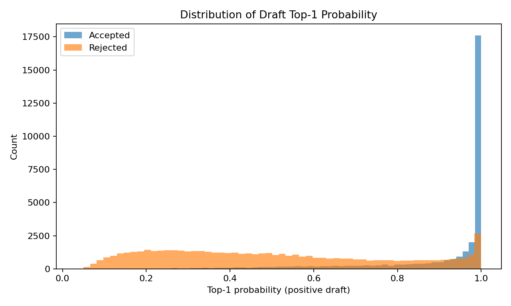
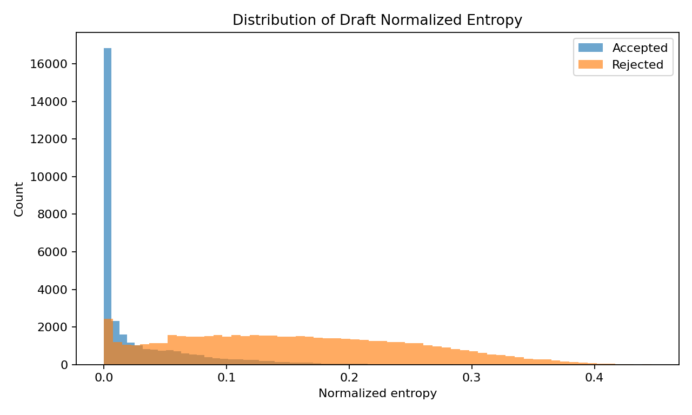
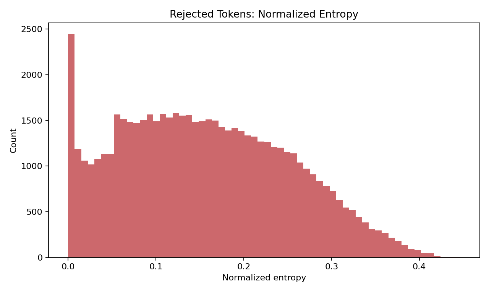
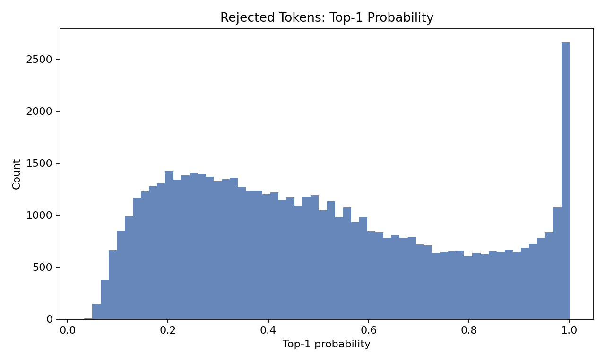
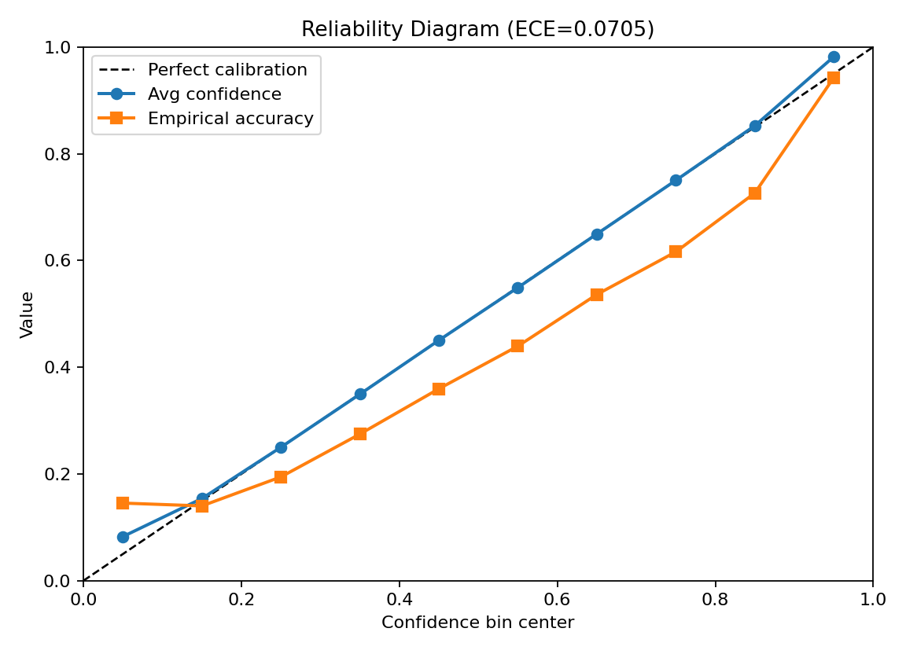
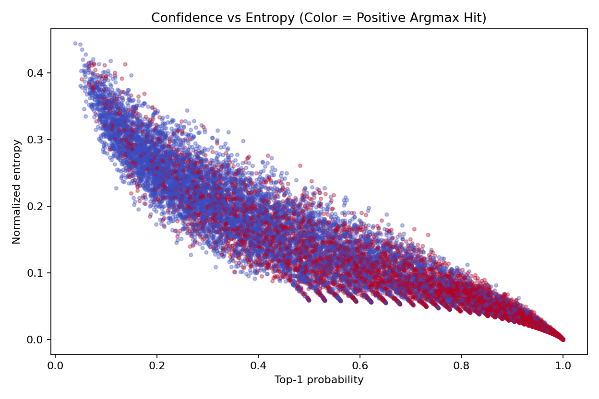
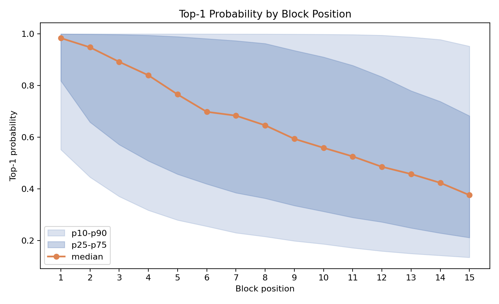
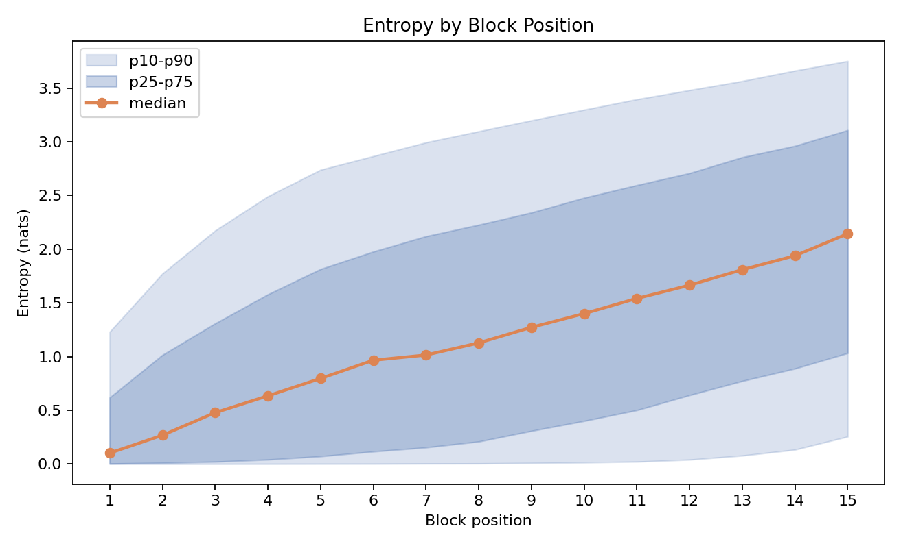
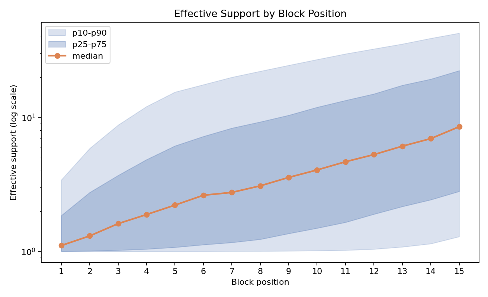
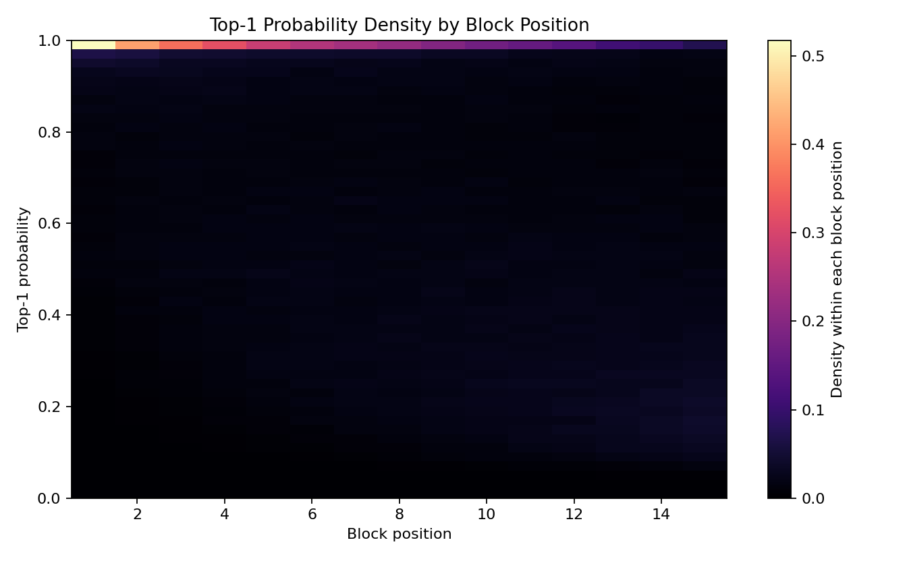

# Draft Entropy and Confidence Analysis

## Overall
- Number of draft-token records: **90525**
- Positive argmax hit rate: **57.42%**
- Sampled draft token match rate: **57.43%**
- Accepted-by-target rate: **35.47%**
- ECE (10 bins): **0.07048**
- MCE: **0.13393**

## Entropy
- Entropy (nats) mean / median / p90: **1.3266 / 1.0556 / 3.1504**
- Normalized entropy mean / median / p90: **0.1112 / 0.0885 / 0.2640**

## Rejected-Token Focus
- Rejected tokens: **58419 / 90525 (64.53%)**
- Rejected entropy (nats) mean / median / p90: **1.8709 / 1.7925 / 3.4512**
- Rejected normalized entropy mean / median / p90: **0.1568 / 0.1502 / 0.2893**
- Rejected top1-prob mean / median / p90: **0.4988 / 0.4586 / 0.9241**
- Rejected top1-margin mean / median / p90: **0.3381 / 0.2241 / 0.8826**
- Rejected positive-argmax-hit rate: **34.18%**
- Rejected ECE (10 bins): **0.15983**
- Rejected minus accepted mean entropy (nats): **+1.5346**
- Rejected minus accepted mean top1-prob: **-0.4060**

### Rejected Entropy Bands
| Band | Count | Rate within rejected |
|---|---:|---:|
| low_entropy_[0.0,0.4) | 58275 | 99.75% |
| mid_entropy_[0.4,0.7) | 144 | 0.25% |
| high_entropy_[0.7,1.0] | 0 | 0.00% |

## Confidence
- Top-1 probability mean / median / p90: **0.6429 / 0.6640 / 0.9997**
- Top-1 margin mean / median / p90: **0.5195 / 0.4860 / 0.9995**

## Distribution Shape (Vocabulary Sharpness)
Interpreting sharpness:
- Higher `top1_prob` and lower `effective_support` imply a more peaked token distribution.

### Top-1 Probability Bands
| Band | Count | Rate | Mean top1 | Mean support | Mean entropy | Local hit rate | Accepted rate |
|---|---:|---:|---:|---:|---:|---:|---:|
| very_sharp_[0.9,1.0] | 30514 | 33.71% | 0.9817 | 1.115 | 0.0995 | 94.26% | 77.39% |
| sharp_[0.7,0.9) | 12462 | 13.77% | 0.8041 | 2.249 | 0.7741 | 67.43% | 35.27% |
| medium_[0.5,0.7) | 13897 | 15.35% | 0.5954 | 4.164 | 1.3382 | 48.41% | 18.88% |
| flat_[0.0,0.5) | 33652 | 37.17% | 0.2955 | 19.981 | 2.6392 | 24.02% | 4.37% |

### Effective-Support Bands
| Band | Count | Rate | Mean top1 | Mean support | Mean entropy | Local hit rate | Accepted rate |
|---|---:|---:|---:|---:|---:|---:|---:|
| very_sharp_[1,2] | 36511 | 40.33% | 0.9564 | 1.220 | 0.1748 | 90.79% | 71.87% |
| moderate_[2,10) | 32748 | 36.18% | 0.5573 | 4.700 | 1.4394 | 45.38% | 16.65% |
| diffuse_[10,+inf) | 21266 | 23.49% | 0.2363 | 27.927 | 3.1305 | 18.64% | 1.95% |

## Position-wise Distribution (Within Block)
| block_pos | count | rate | top1 median | entropy median (nats) | support median | top1>=0.9 | support<=2 | local hit | accepted |
|---:|---:|---:|---:|---:|---:|---:|---:|---:|---:|
| 1 | 6035 | 6.67% | 0.9839 | 0.1021 | 1.108 | 67.72% | 77.73% | 88.70% | 88.68% |
| 2 | 6035 | 6.67% | 0.9481 | 0.2675 | 1.307 | 56.80% | 65.17% | 80.66% | 74.70% |
| 3 | 6035 | 6.67% | 0.8920 | 0.4783 | 1.613 | 49.20% | 57.15% | 73.97% | 62.00% |
| 4 | 6035 | 6.67% | 0.8400 | 0.6345 | 1.886 | 44.29% | 52.00% | 69.58% | 52.61% |
| 5 | 6035 | 6.67% | 0.7659 | 0.7965 | 2.218 | 39.54% | 46.66% | 64.18% | 44.74% |
| 6 | 6035 | 6.67% | 0.6986 | 0.9661 | 2.628 | 35.76% | 42.60% | 61.16% | 37.83% |
| 7 | 6035 | 6.67% | 0.6838 | 1.0145 | 2.758 | 34.10% | 40.89% | 57.98% | 32.33% |
| 8 | 6035 | 6.67% | 0.6464 | 1.1274 | 3.088 | 31.67% | 38.34% | 55.03% | 28.24% |
| 9 | 6035 | 6.67% | 0.5941 | 1.2721 | 3.568 | 28.38% | 34.63% | 51.65% | 24.29% |
| 10 | 6035 | 6.67% | 0.5594 | 1.4002 | 4.056 | 25.85% | 32.49% | 49.33% | 20.80% |
| 11 | 6035 | 6.67% | 0.5261 | 1.5414 | 4.671 | 23.53% | 29.54% | 47.27% | 17.95% |
| 12 | 6035 | 6.67% | 0.4860 | 1.6645 | 5.283 | 21.03% | 26.33% | 44.21% | 15.24% |
| 13 | 6035 | 6.67% | 0.4580 | 1.8092 | 6.105 | 18.61% | 23.10% | 42.00% | 12.87% |
| 14 | 6035 | 6.67% | 0.4240 | 1.9389 | 6.951 | 15.79% | 20.60% | 39.19% | 10.75% |
| 15 | 6035 | 6.67% | 0.3765 | 2.1431 | 8.526 | 13.36% | 17.75% | 36.32% | 8.96% |

## Correlation
- corr(top1_prob, positive_hit): **0.6158**
- corr(normalized_entropy, positive_hit): **-0.5920**
- corr(top1_prob, accepted): **0.6341**
- corr(normalized_entropy, accepted): **-0.6028**

## Calibration by Confidence Bin
| Bin | Count | Rate | Avg confidence | Accuracy | Gap |
|---|---:|---:|---:|---:|---:|
| [0.0, 0.1) | 1286 | 1.42% | 0.0827 | 0.1454 | 0.0627 |
| [0.1, 0.2) | 7216 | 7.97% | 0.1540 | 0.1401 | 0.0139 |
| [0.2, 0.3) | 8764 | 9.68% | 0.2500 | 0.1944 | 0.0556 |
| [0.3, 0.4) | 8373 | 9.25% | 0.3494 | 0.2747 | 0.0747 |
| [0.4, 0.5) | 8013 | 8.85% | 0.4504 | 0.3595 | 0.0909 |
| [0.5, 0.6) | 7491 | 8.28% | 0.5491 | 0.4395 | 0.1097 |
| [0.6, 0.7) | 6406 | 7.08% | 0.6495 | 0.5362 | 0.1133 |
| [0.7, 0.8) | 5882 | 6.50% | 0.7500 | 0.6161 | 0.1339 |
| [0.8, 0.9) | 6580 | 7.27% | 0.8524 | 0.7263 | 0.1261 |
| [0.9, 1.0) | 30514 | 33.71% | 0.9817 | 0.9426 | 0.0391 |

## Entropy Bands
| Band | Count | Rate | Mean top1 prob | Positive hit rate | Accepted rate |
|---|---:|---:|---:|---:|---:|
| low_entropy_[0.0,0.4) | 90381 | 99.84% | 0.6438 | 57.46% | 35.52% |
| mid_entropy_[0.4,0.7) | 144 | 0.16% | 0.0735 | 26.39% | 0.00% |
| high_entropy_[0.7,1.0] | 0 | 0.00% | 0.0000 | 0.00% | 0.00% |

## Plots

## Highest-Entropy Rejected Tokens
| sample | turn | step | pos | block_pos | entropy | top1_prob | top1_margin | hit | accepted | target_id | top1_id | sampled_id |
|---:|---:|---:|---:|---:|---:|---:|---:|---:|---:|---:|---:|---:|
| 67 | 0 | 21 | 251 | 12 | 0.4466 | 0.0545 | 0.0170 | 0 | 0 | 5230 | 2669 | 2669 |
| 67 | 0 | 22 | 256 | 15 | 0.4444 | 0.0476 | 0.0056 | 1 | 0 | 279 | 279 | 279 |
| 67 | 0 | 20 | 249 | 12 | 0.4440 | 0.0394 | 0.0000 | 0 | 0 | 7171 | 2669 | 566 |
| 67 | 0 | 20 | 250 | 13 | 0.4433 | 0.0335 | 0.0000 | 0 | 0 | 702 | 3070 | 220 |
| 67 | 0 | 21 | 252 | 13 | 0.4423 | 0.0590 | 0.0232 | 0 | 0 | 5230 | 2669 | 2669 |
| 67 | 0 | 22 | 255 | 14 | 0.4423 | 0.0494 | 0.0058 | 0 | 0 | 2790 | 279 | 279 |
| 67 | 0 | 22 | 254 | 13 | 0.4413 | 0.0505 | 0.0000 | 0 | 0 | 7576 | 3070 | 279 |
| 67 | 0 | 21 | 250 | 11 | 0.4410 | 0.0536 | 0.0063 | 0 | 0 | 13 | 2669 | 2669 |
| 67 | 0 | 22 | 253 | 12 | 0.4408 | 0.0536 | 0.0000 | 0 | 0 | 271 | 279 | 279 |
| 9 | 0 | 0 | 116 | 13 | 0.4384 | 0.0723 | 0.0085 | 0 | 0 | 315 | 323 | 323 |
| 67 | 0 | 22 | 252 | 11 | 0.4383 | 0.0611 | 0.0072 | 0 | 0 | 285 | 3070 | 3070 |
| 9 | 0 | 0 | 117 | 14 | 0.4375 | 0.0601 | 0.0071 | 0 | 0 | 315 | 323 | 323 |
| 67 | 0 | 21 | 249 | 10 | 0.4346 | 0.0528 | 0.0000 | 0 | 0 | 82622 | 15 | 15 |
| 67 | 0 | 21 | 253 | 14 | 0.4318 | 0.0613 | 0.0192 | 0 | 0 | 5230 | 2669 | 2669 |
| 67 | 0 | 20 | 248 | 11 | 0.4316 | 0.0610 | 0.0135 | 0 | 0 | 702 | 2669 | 2669 |
| 67 | 0 | 20 | 251 | 14 | 0.4313 | 0.0525 | 0.0116 | 0 | 0 | 2669 | 1246 | 1246 |
| 67 | 0 | 22 | 251 | 10 | 0.4313 | 0.0720 | 0.0225 | 0 | 0 | 374 | 3070 | 3070 |
| 9 | 0 | 0 | 115 | 12 | 0.4284 | 0.0876 | 0.0000 | 0 | 0 | 315 | 323 | 315 |
| 30 | 0 | 0 | 155 | 15 | 0.4283 | 0.0654 | 0.0077 | 0 | 0 | 311 | 323 | 323 |
| 30 | 0 | 59 | 493 | 15 | 0.4278 | 0.0954 | 0.0503 | 1 | 0 | 279 | 279 | 279 |

## Most-Confident Rejected Tokens
| sample | turn | step | pos | top1_prob | entropy | margin | target_id | top1_id | sampled_id | accepted |
|---:|---:|---:|---:|---:|---:|---:|---:|---:|---:|---:|
| 98 | 0 | 45 | 369 | 1.0000 | 0.0000 | 1.0000 | 15 | 15 | 15 | 0 |
| 98 | 0 | 45 | 372 | 1.0000 | 0.0000 | 1.0000 | 90 | 90 | 90 | 0 |
| 65 | 0 | 43 | 411 | 1.0000 | 0.0000 | 1.0000 | 59 | 59 | 59 | 0 |
| 112 | 0 | 30 | 231 | 1.0000 | 0.0000 | 1.0000 | 220 | 220 | 220 | 0 |
| 113 | 0 | 27 | 348 | 1.0000 | 0.0000 | 1.0000 | 15 | 15 | 15 | 0 |
| 37 | 0 | 24 | 240 | 1.0000 | 0.0000 | 1.0000 | 15 | 15 | 15 | 0 |
| 60 | 0 | 22 | 221 | 1.0000 | 0.0000 | 1.0000 | 15 | 15 | 15 | 0 |
| 65 | 0 | 43 | 410 | 1.0000 | 0.0000 | 1.0000 | 198 | 198 | 198 | 0 |
| 94 | 0 | 29 | 320 | 1.0000 | 0.0000 | 1.0000 | 198 | 198 | 198 | 0 |
| 117 | 0 | 25 | 279 | 1.0000 | 0.0000 | 1.0000 | 220 | 220 | 220 | 0 |
| 112 | 0 | 30 | 232 | 1.0000 | 0.0000 | 1.0000 | 21 | 21 | 21 | 0 |
| 4 | 0 | 5 | 146 | 1.0000 | 0.0000 | 1.0000 | 12 | 12 | 12 | 0 |
| 60 | 0 | 22 | 220 | 1.0000 | 0.0000 | 1.0000 | 15 | 15 | 15 | 0 |
| 65 | 0 | 43 | 412 | 1.0000 | 0.0000 | 1.0000 | 79075 | 79075 | 79075 | 0 |
| 75 | 0 | 21 | 218 | 1.0000 | 0.0000 | 1.0000 | 198 | 198 | 198 | 0 |
| 37 | 0 | 24 | 241 | 1.0000 | 0.0000 | 1.0000 | 15 | 15 | 15 | 0 |
| 45 | 0 | 43 | 365 | 1.0000 | 0.0000 | 1.0000 | 15 | 15 | 15 | 0 |
| 4 | 0 | 5 | 147 | 1.0000 | 0.0000 | 1.0000 | 3070 | 3070 | 3070 | 0 |
| 65 | 0 | 43 | 413 | 1.0000 | 0.0000 | 1.0000 | 90 | 90 | 90 | 0 |
| 82 | 0 | 39 | 306 | 1.0000 | 0.0000 | 1.0000 | 23 | 16 | 16 | 0 |