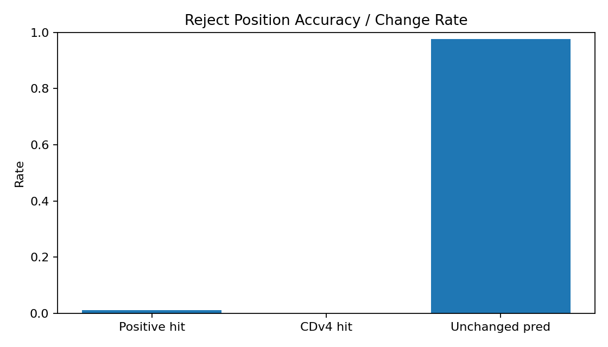
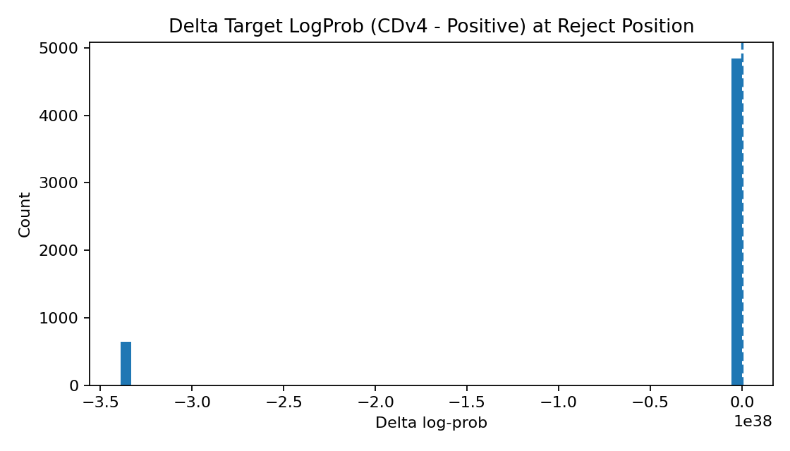
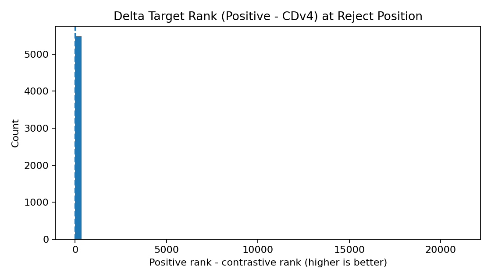
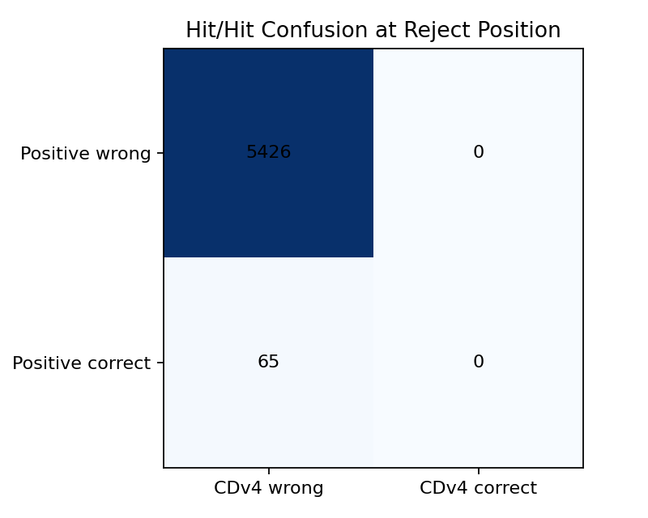
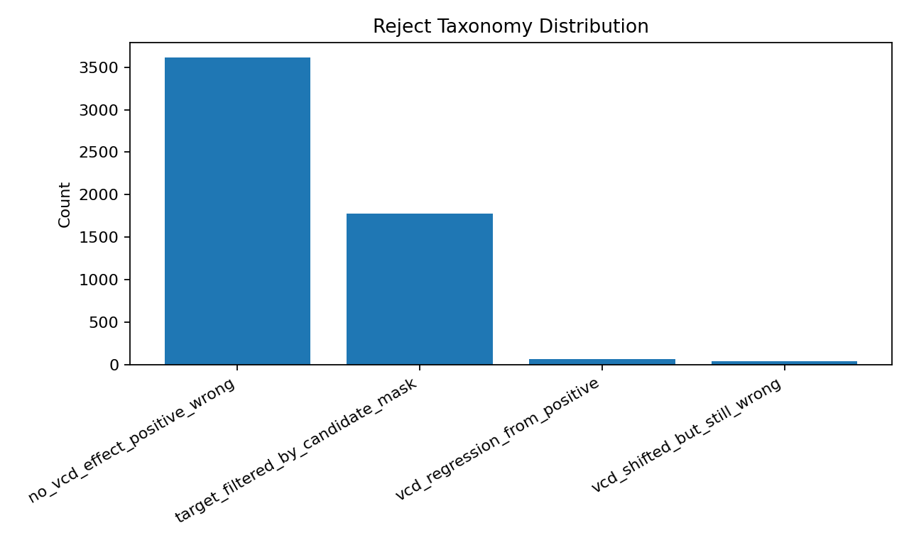

# Reject Token Analysis: Positive vs CDv4

## Overall
- Reject events: **5491**
- Positive hit rate: **1.18%**
- CDv4 hit rate: **0.00%**
- Hit-rate gain (CDv4 - Positive): **-1.18%**
- CDv4 shadow fix rate @reject: **0.00%**
- Mean rescue-prob (Positive / CDv4-shadow): **0.1610 / 0.1615**
- Mean rescue-prob gain (CDv4 - Positive): **+0.0005**
- Rescue-prob improved-rate (>0): **12.00%**
- Prediction changed rate: **2.29%**

## Target LogProb Delta (CDv4 - Positive)
- Mean: -inf
- Median: 0.00000
- P10 / P90: -338953138925153547590470800371487866880.00000 / 0.10755
- Improved rate (>0): 14.35%

## Target Rank Delta (Positive - CDv4)
- Mean: 6.243
- Median: 0.000
- P10 / P90: 0.000 / 0.000
- Improved rate (>0): 8.78%

## Reject Taxonomy
| Taxonomy | Count | Rate |
|---|---:|---:|
| no_vcd_effect_positive_wrong | 3612 | 65.78% |
| target_filtered_by_candidate_mask | 1776 | 32.34% |
| vcd_regression_from_positive | 65 | 1.18% |
| vcd_shifted_but_still_wrong | 38 | 0.69% |

## Plots

## Top Improved Reject Events
| sample | turn | step | abs_pos | taxonomy | target | sampled_draft | positive_pred | contrastive_pred | d_logprob | d_rank | why_reject |
|---:|---:|---:|---:|---|---|---|---|---|---:|---:|---|
| 71 | 0 | 11 | 141 | vcd_shifted_but_still_wrong |  guns (16362) |  bottles (26376) |  squirt (72481) |  bottles (26376) | 1.1320 | 0 | Reject vi draft de xuat ` bottles` (26376) khac posterior ` guns` (16362). Contrastive shadow sample da doi token tu ` bottles` sang ` bottles`. Ca positive va contrastive deu chua dua target token len top-1. |
| 110 | 0 | 13 | 173 | no_vcd_effect_positive_wrong |   (220) | : (25) | : (25) | : (25) | 1.0807 | 0 | Reject vi draft de xuat `:` (25) khac posterior ` ` (220). Contrastive shadow sample khong doi token so voi original o vi tri reject. Ca positive va contrastive deu chua dua target token len top-1. |
| 83 | 0 | 37 | 287 | no_vcd_effect_positive_wrong | erry (5400) |  spends (37102) |  spends (37102) |  spends (37102) | 0.9428 | 1 | Reject vi draft de xuat ` spends` (37102) khac posterior `erry` (5400). Contrastive shadow sample khong doi token so voi original o vi tri reject. Ca positive va contrastive deu chua dua target token len top-1. |
| 42 | 0 | 36 | 327 | no_vcd_effect_positive_wrong | /year (84900) | }\n (532) | }\n (532) | }\n (532) | 0.9029 | 0 | Reject vi draft de xuat `}\n` (532) khac posterior `/year` (84900). Contrastive shadow sample khong doi token so voi original o vi tri reject. Ca positive va contrastive deu chua dua target token len top-1. |
| 63 | 0 | 49 | 376 | no_vcd_effect_positive_wrong | Ford (58563) | \n (198) | \n (198) | \n (198) | 0.9006 | 0 | Reject vi draft de xuat `\n` (198) khac posterior `Ford` (58563). Contrastive shadow sample khong doi token so voi original o vi tri reject. Ca positive va contrastive deu chua dua target token len top-1. |
| 55 | 0 | 1 | 116 | no_vcd_effect_positive_wrong |  Calculate (20517) |  Total (10657) |  Total (10657) |  Total (10657) | 0.8831 | 1 | Reject vi draft de xuat ` Total` (10657) khac posterior ` Calculate` (20517). Contrastive shadow sample khong doi token so voi original o vi tri reject. Ca positive va contrastive deu chua dua target token len top-1. |
| 87 | 0 | 1 | 143 | no_vcd_effect_positive_wrong |  Understand (70894) |  Revenue (37393) |  Revenue (37393) |  Revenue (37393) | 0.8681 | 1 | Reject vi draft de xuat ` Revenue` (37393) khac posterior ` Understand` (70894). Contrastive shadow sample khong doi token so voi original o vi tri reject. Ca positive va contrastive deu chua dua target token len top-1. |
| 20 | 0 | 17 | 271 | no_vcd_effect_positive_wrong |  well (1632) | ly (398) | ly (398) | ly (398) | 0.8308 | 0 | Reject vi draft de xuat `ly` (398) khac posterior ` well` (1632). Contrastive shadow sample khong doi token so voi original o vi tri reject. Ca positive va contrastive deu chua dua target token len top-1. |
| 23 | 0 | 4 | 84 | no_vcd_effect_positive_wrong |  are (525) | ### (14374) | ### (14374) | ### (14374) | 0.8227 | 0 | Reject vi draft de xuat `###` (14374) khac posterior ` are` (525). Contrastive shadow sample khong doi token so voi original o vi tri reject. Ca positive va contrastive deu chua dua target token len top-1. |
| 79 | 0 | 29 | 293 | vcd_shifted_but_still_wrong | pins (74558) | ch (331) | en (268) | ch (331) | 0.8182 | 0 | Reject vi draft de xuat `ch` (331) khac posterior `pins` (74558). Contrastive shadow sample da doi token tu `ch` sang `ch`. Ca positive va contrastive deu chua dua target token len top-1. |
| 90 | 0 | 13 | 157 | no_vcd_effect_positive_wrong | Step (8304) |   (220) |   (220) |   (220) | 0.8010 | 1 | Reject vi draft de xuat ` ` (220) khac posterior `Step` (8304). Contrastive shadow sample khong doi token so voi original o vi tri reject. Ca positive va contrastive deu chua dua target token len top-1. |
| 69 | 0 | 46 | 329 | no_vcd_effect_positive_wrong | 8 (23) | $ (3) | $ (3) | $ (3) | 0.7736 | 0 | Reject vi draft de xuat `$` (3) khac posterior `8` (23). Contrastive shadow sample khong doi token so voi original o vi tri reject. Ca positive va contrastive deu chua dua target token len top-1. |
| 88 | 0 | 19 | 220 | no_vcd_effect_positive_wrong |  Subtract (93210) |  Determine (29901) |  Determine (29901) |  Determine (29901) | 0.7569 | 0 | Reject vi draft de xuat ` Determine` (29901) khac posterior ` Subtract` (93210). Contrastive shadow sample khong doi token so voi original o vi tri reject. Ca positive va contrastive deu chua dua target token len top-1. |
| 47 | 0 | 24 | 236 | no_vcd_effect_positive_wrong | Step (8304) | \n\n (271) | \n\n (271) | \n\n (271) | 0.7516 | 0 | Reject vi draft de xuat `\n\n` (271) khac posterior `Step` (8304). Contrastive shadow sample khong doi token so voi original o vi tri reject. Ca positive va contrastive deu chua dua target token len top-1. |
| 13 | 0 | 47 | 367 | no_vcd_effect_positive_wrong |  drove (23108) |  through (1526) |  through (1526) |  through (1526) | 0.7458 | 1 | Reject vi draft de xuat ` through` (1526) khac posterior ` drove` (23108). Contrastive shadow sample khong doi token so voi original o vi tri reject. Ca positive va contrastive deu chua dua target token len top-1. |
| 70 | 0 | 54 | 356 | no_vcd_effect_positive_wrong | Option (5341) |  ** (3070) |  ** (3070) |  ** (3070) | 0.7398 | 0 | Reject vi draft de xuat ` **` (3070) khac posterior `Option` (5341). Contrastive shadow sample khong doi token so voi original o vi tri reject. Ca positive va contrastive deu chua dua target token len top-1. |
| 3 | 0 | 4 | 132 | no_vcd_effect_positive_wrong |  doing (3730) | ** (334) | ** (334) | ** (334) | 0.7324 | 1 | Reject vi draft de xuat `**` (334) khac posterior ` doing` (3730). Contrastive shadow sample khong doi token so voi original o vi tri reject. Ca positive va contrastive deu chua dua target token len top-1. |
| 127 | 0 | 16 | 199 | no_vcd_effect_positive_wrong | por (4308) | on (263) | on (263) | on (263) | 0.7202 | 2 | Reject vi draft de xuat `on` (263) khac posterior `por` (4308). Contrastive shadow sample khong doi token so voi original o vi tri reject. Ca positive va contrastive deu chua dua target token len top-1. |
| 88 | 0 | 32 | 328 | no_vcd_effect_positive_wrong | $$ (14085) |  so (773) |  so (773) |  so (773) | 0.7188 | 3 | Reject vi draft de xuat ` so` (773) khac posterior `$$` (14085). Contrastive shadow sample khong doi token so voi original o vi tri reject. Ca positive va contrastive deu chua dua target token len top-1. |
| 7 | 0 | 23 | 220 | no_vcd_effect_positive_wrong | 1 (16) |   (220) |   (220) |   (220) | 0.6772 | 0 | Reject vi draft de xuat ` ` (220) khac posterior `1` (16). Contrastive shadow sample khong doi token so voi original o vi tri reject. Ca positive va contrastive deu chua dua target token len top-1. |
| 85 | 0 | 2 | 64 | no_vcd_effect_positive_wrong | Ali (17662) | Initial (6341) | Initial (6341) | Initial (6341) | 0.6727 | 0 | Reject vi draft de xuat `Initial` (6341) khac posterior `Ali` (17662). Contrastive shadow sample khong doi token so voi original o vi tri reject. Ca positive va contrastive deu chua dua target token len top-1. |
| 115 | 0 | 70 | 521 | no_vcd_effect_positive_wrong |  collections (15302) |  per (817) |  per (817) |  per (817) | 0.6701 | 0 | Reject vi draft de xuat ` per` (817) khac posterior ` collections` (15302). Contrastive shadow sample khong doi token so voi original o vi tri reject. Ca positive va contrastive deu chua dua target token len top-1. |
| 68 | 0 | 4 | 92 | no_vcd_effect_positive_wrong | Insurance (78754) | After (6025) | After (6025) | After (6025) | 0.6546 | 0 | Reject vi draft de xuat `After` (6025) khac posterior `Insurance` (78754). Contrastive shadow sample khong doi token so voi original o vi tri reject. Ca positive va contrastive deu chua dua target token len top-1. |
| 55 | 0 | 68 | 473 | no_vcd_effect_positive_wrong | .\n (624) | text (1318) | text (1318) | text (1318) | 0.6536 | 0 | Reject vi draft de xuat `text` (1318) khac posterior `.\n` (624). Contrastive shadow sample khong doi token so voi original o vi tri reject. Ca positive va contrastive deu chua dua target token len top-1. |
| 96 | 0 | 17 | 216 | no_vcd_effect_positive_wrong |  given (2661) |  to (311) |  to (311) |  to (311) | 0.6464 | 1 | Reject vi draft de xuat ` to` (311) khac posterior ` given` (2661). Contrastive shadow sample khong doi token so voi original o vi tri reject. Ca positive va contrastive deu chua dua target token len top-1. |
| 126 | 0 | 49 | 361 | vcd_shifted_but_still_wrong | last (4259) | next (3600) | first (3896) | next (3600) | 0.6110 | 2 | Reject vi draft de xuat `next` (3600) khac posterior `last` (4259). Contrastive shadow sample da doi token tu `next` sang `next`. Ca positive va contrastive deu chua dua target token len top-1. |
| 114 | 0 | 45 | 463 | no_vcd_effect_positive_wrong | R (49) | :\n\n (1447) | :\n\n (1447) | :\n\n (1447) | 0.6081 | 0 | Reject vi draft de xuat `:\n\n` (1447) khac posterior `R` (49). Contrastive shadow sample khong doi token so voi original o vi tri reject. Ca positive va contrastive deu chua dua target token len top-1. |
| 4 | 0 | 24 | 272 | no_vcd_effect_positive_wrong |  Beth (28003) | \n (198) | \n (198) | \n (198) | 0.5951 | 0 | Reject vi draft de xuat `\n` (198) khac posterior ` Beth` (28003). Contrastive shadow sample khong doi token so voi original o vi tri reject. Ca positive va contrastive deu chua dua target token len top-1. |
| 42 | 0 | 26 | 253 | no_vcd_effect_positive_wrong |  is (374) |  minimum (8028) |  minimum (8028) |  minimum (8028) | 0.5914 | 0 | Reject vi draft de xuat ` minimum` (8028) khac posterior ` is` (374). Contrastive shadow sample khong doi token so voi original o vi tri reject. Ca positive va contrastive deu chua dua target token len top-1. |
| 99 | 0 | 38 | 303 | no_vcd_effect_positive_wrong | {x (45340) |   (220) |   (220) |   (220) | 0.5896 | 0 | Reject vi draft de xuat ` ` (220) khac posterior `{x` (45340). Contrastive shadow sample khong doi token so voi original o vi tri reject. Ca positive va contrastive deu chua dua target token len top-1. |

## Top Worsened Reject Events
| sample | turn | step | abs_pos | taxonomy | target | sampled_draft | positive_pred | contrastive_pred | d_logprob | d_rank | why_reject |
|---:|---:|---:|---:|---|---|---|---|---|---:|---:|---|
| 0 | 0 | 14 | 141 | target_filtered_by_candidate_mask |  how (1246) |  Samantha (62808) |  Samantha (62808) |  Samantha (62808) | -338953138925153547590470800371487866880.0000 | 17 | Reject vi draft de xuat ` Samantha` (62808) khac posterior ` how` (1246). Contrastive shadow sample khong doi token so voi original o vi tri reject. Token target khong nam trong candidate mask (beta filter), nen kho duoc contrastive chon. Ca positive va contrastive deu chua dua target token len top-1. |
| 0 | 0 | 18 | 164 | target_filtered_by_candidate_mask | tha (22410) | 's (594) | 's (594) | 's (594) | -338953138925153547590470800371487866880.0000 | 48 | Reject vi draft de xuat `'s` (594) khac posterior `tha` (22410). Contrastive shadow sample khong doi token so voi original o vi tri reject. Token target khong nam trong candidate mask (beta filter), nen kho duoc contrastive chon. Ca positive va contrastive deu chua dua target token len top-1. |
| 0 | 0 | 30 | 280 | target_filtered_by_candidate_mask | } (92) |  amount (3311) |  amount (3311) |  amount (3311) | -338953138925153547590470800371487866880.0000 | 7 | Reject vi draft de xuat ` amount` (3311) khac posterior `}` (92). Contrastive shadow sample khong doi token so voi original o vi tri reject. Token target khong nam trong candidate mask (beta filter), nen kho duoc contrastive chon. Ca positive va contrastive deu chua dua target token len top-1. |
| 0 | 0 | 33 | 319 | target_filtered_by_candidate_mask | \n (198) |  = (284) |  = (284) |  = (284) | -338953138925153547590470800371487866880.0000 | 0 | Reject vi draft de xuat ` =` (284) khac posterior `\n` (198). Contrastive shadow sample khong doi token so voi original o vi tri reject. Token target khong nam trong candidate mask (beta filter), nen kho duoc contrastive chon. Ca positive va contrastive deu chua dua target token len top-1. |
| 0 | 0 | 34 | 327 | target_filtered_by_candidate_mask | Total (7595) | 1 (16) | 1 (16) | 1 (16) | -338953138925153547590470800371487866880.0000 | 6 | Reject vi draft de xuat `1` (16) khac posterior `Total` (7595). Contrastive shadow sample khong doi token so voi original o vi tri reject. Token target khong nam trong candidate mask (beta filter), nen kho duoc contrastive chon. Ca positive va contrastive deu chua dua target token len top-1. |
| 1 | 0 | 18 | 191 | target_filtered_by_candidate_mask | 2 (17) |  \ (1124) |  \ (1124) |  \ (1124) | -338953138925153547590470800371487866880.0000 | 5 | Reject vi draft de xuat ` \` (1124) khac posterior `2` (17). Contrastive shadow sample khong doi token so voi original o vi tri reject. Token target khong nam trong candidate mask (beta filter), nen kho duoc contrastive chon. Ca positive va contrastive deu chua dua target token len top-1. |
| 1 | 0 | 23 | 243 | target_filtered_by_candidate_mask | We (1654) | ** (334) | ** (334) | ** (334) | -338953138925153547590470800371487866880.0000 | 11 | Reject vi draft de xuat `**` (334) khac posterior `We` (1654). Contrastive shadow sample khong doi token so voi original o vi tri reject. Token target khong nam trong candidate mask (beta filter), nen kho duoc contrastive chon. Ca positive va contrastive deu chua dua target token len top-1. |
| 1 | 0 | 32 | 317 | target_filtered_by_candidate_mask | <|endoftext|> (151643) | \n (198) | \n (198) | \n (198) | -338953138925153547590470800371487866880.0000 | 18 | Reject vi draft de xuat `\n` (198) khac posterior `<|endoftext|>` (151643). Contrastive shadow sample khong doi token so voi original o vi tri reject. Token target khong nam trong candidate mask (beta filter), nen kho duoc contrastive chon. Ca positive va contrastive deu chua dua target token len top-1. |
| 2 | 0 | 18 | 219 | target_filtered_by_candidate_mask |  L (444) |  A (362) |  A (362) |  A (362) | -338953138925153547590470800371487866880.0000 | 1 | Reject vi draft de xuat ` A` (362) khac posterior ` L` (444). Contrastive shadow sample khong doi token so voi original o vi tri reject. Token target khong nam trong candidate mask (beta filter), nen kho duoc contrastive chon. Ca positive va contrastive deu chua dua target token len top-1. |
| 2 | 0 | 38 | 414 | target_filtered_by_candidate_mask | 2 (17) | 3 (18) | 3 (18) | 3 (18) | -338953138925153547590470800371487866880.0000 | 0 | Reject vi draft de xuat `3` (18) khac posterior `2` (17). Contrastive shadow sample khong doi token so voi original o vi tri reject. Token target khong nam trong candidate mask (beta filter), nen kho duoc contrastive chon. Ca positive va contrastive deu chua dua target token len top-1. |
| 2 | 0 | 50 | 515 | target_filtered_by_candidate_mask | W (54) | 3 (18) | 3 (18) | 3 (18) | -338953138925153547590470800371487866880.0000 | 1 | Reject vi draft de xuat `3` (18) khac posterior `W` (54). Contrastive shadow sample khong doi token so voi original o vi tri reject. Token target khong nam trong candidate mask (beta filter), nen kho duoc contrastive chon. Ca positive va contrastive deu chua dua target token len top-1. |
| 2 | 0 | 54 | 549 | target_filtered_by_candidate_mask | <|endoftext|> (151643) | \n (198) | \n (198) | \n (198) | -338953138925153547590470800371487866880.0000 | 11 | Reject vi draft de xuat `\n` (198) khac posterior `<|endoftext|>` (151643). Contrastive shadow sample khong doi token so voi original o vi tri reject. Token target khong nam trong candidate mask (beta filter), nen kho duoc contrastive chon. Ca positive va contrastive deu chua dua target token len top-1. |
| 3 | 0 | 2 | 115 | target_filtered_by_candidate_mask |  for (369) |  water (3015) |  water (3015) |  water (3015) | -338953138925153547590470800371487866880.0000 | 2 | Reject vi draft de xuat ` water` (3015) khac posterior ` for` (369). Contrastive shadow sample khong doi token so voi original o vi tri reject. Token target khong nam trong candidate mask (beta filter), nen kho duoc contrastive chon. Ca positive va contrastive deu chua dua target token len top-1. |
| 3 | 0 | 5 | 144 | target_filtered_by_candidate_mask |  per (817) | /h (7530) | /h (7530) | /h (7530) | -338953138925153547590470800371487866880.0000 | 5 | Reject vi draft de xuat `/h` (7530) khac posterior ` per` (817). Contrastive shadow sample khong doi token so voi original o vi tri reject. Token target khong nam trong candidate mask (beta filter), nen kho duoc contrastive chon. Ca positive va contrastive deu chua dua target token len top-1. |
| 3 | 0 | 22 | 280 | target_filtered_by_candidate_mask |  for (369) |   (220) |   (220) |   (220) | -338953138925153547590470800371487866880.0000 | 1 | Reject vi draft de xuat ` ` (220) khac posterior ` for` (369). Contrastive shadow sample khong doi token so voi original o vi tri reject. Token target khong nam trong candidate mask (beta filter), nen kho duoc contrastive chon. Ca positive va contrastive deu chua dua target token len top-1. |
| 3 | 0 | 30 | 328 | target_filtered_by_candidate_mask | 8 (23) | 1 (16) | 1 (16) | 1 (16) | -338953138925153547590470800371487866880.0000 | 5 | Reject vi draft de xuat `1` (16) khac posterior `8` (23). Contrastive shadow sample khong doi token so voi original o vi tri reject. Token target khong nam trong candidate mask (beta filter), nen kho duoc contrastive chon. Ca positive va contrastive deu chua dua target token len top-1. |
| 4 | 0 | 1 | 104 | target_filtered_by_candidate_mask |  run (1598) |   (220) |   (220) |   (220) | -338953138925153547590470800371487866880.0000 | 0 | Reject vi draft de xuat ` ` (220) khac posterior ` run` (1598). Contrastive shadow sample khong doi token so voi original o vi tri reject. Token target khong nam trong candidate mask (beta filter), nen kho duoc contrastive chon. Ca positive va contrastive deu chua dua target token len top-1. |
| 4 | 0 | 3 | 123 | target_filtered_by_candidate_mask |  more (803) | 4 (19) | 4 (19) | 4 (19) | -338953138925153547590470800371487866880.0000 | 0 | Reject vi draft de xuat `4` (19) khac posterior ` more` (803). Contrastive shadow sample khong doi token so voi original o vi tri reject. Token target khong nam trong candidate mask (beta filter), nen kho duoc contrastive chon. Ca positive va contrastive deu chua dua target token len top-1. |
| 4 | 0 | 15 | 204 | target_filtered_by_candidate_mask |   \n (2303) |  in (304) |  in (304) |  in (304) | -338953138925153547590470800371487866880.0000 | 2 | Reject vi draft de xuat ` in` (304) khac posterior `  \n` (2303). Contrastive shadow sample khong doi token so voi original o vi tri reject. Token target khong nam trong candidate mask (beta filter), nen kho duoc contrastive chon. Ca positive va contrastive deu chua dua target token len top-1. |
| 4 | 0 | 16 | 211 | target_filtered_by_candidate_mask | 1 (16) | 4 (19) | 4 (19) | 4 (19) | -338953138925153547590470800371487866880.0000 | 2 | Reject vi draft de xuat `4` (19) khac posterior `1` (16). Contrastive shadow sample khong doi token so voi original o vi tri reject. Token target khong nam trong candidate mask (beta filter), nen kho duoc contrastive chon. Ca positive va contrastive deu chua dua target token len top-1. |
| 5 | 0 | 0 | 104 | target_filtered_by_candidate_mask |  to (311) | Cost (14940) |  costs (7049) | Cost (14940) | -338953138925153547590470800371487866880.0000 | 12 | Reject vi draft de xuat `Cost` (14940) khac posterior ` to` (311). Contrastive shadow sample da doi token tu `Cost` sang `Cost`. Token target khong nam trong candidate mask (beta filter), nen kho duoc contrastive chon. Ca positive va contrastive deu chua dua target token len top-1. |
| 5 | 0 | 2 | 115 | target_filtered_by_candidate_mask | L (43) | Each (4854) | Each (4854) | Each (4854) | -338953138925153547590470800371487866880.0000 | 4 | Reject vi draft de xuat `Each` (4854) khac posterior `L` (43). Contrastive shadow sample khong doi token so voi original o vi tri reject. Token target khong nam trong candidate mask (beta filter), nen kho duoc contrastive chon. Ca positive va contrastive deu chua dua target token len top-1. |
| 5 | 0 | 28 | 211 | target_filtered_by_candidate_mask |  le (512) | mons (23570) | mons (23570) | mons (23570) | -338953138925153547590470800371487866880.0000 | 0 | Reject vi draft de xuat `mons` (23570) khac posterior ` le` (512). Contrastive shadow sample khong doi token so voi original o vi tri reject. Token target khong nam trong candidate mask (beta filter), nen kho duoc contrastive chon. Ca positive va contrastive deu chua dua target token len top-1. |
| 5 | 0 | 40 | 261 | target_filtered_by_candidate_mask |  per (817) | :** (66963) | :** (66963) | :** (66963) | -338953138925153547590470800371487866880.0000 | 0 | Reject vi draft de xuat `:**` (66963) khac posterior ` per` (817). Contrastive shadow sample khong doi token so voi original o vi tri reject. Token target khong nam trong candidate mask (beta filter), nen kho duoc contrastive chon. Ca positive va contrastive deu chua dua target token len top-1. |
| 5 | 0 | 57 | 342 | target_filtered_by_candidate_mask |  years (1635) |  many (1657) |  many (1657) |  many (1657) | -338953138925153547590470800371487866880.0000 | 0 | Reject vi draft de xuat ` many` (1657) khac posterior ` years` (1635). Contrastive shadow sample khong doi token so voi original o vi tri reject. Token target khong nam trong candidate mask (beta filter), nen kho duoc contrastive chon. Ca positive va contrastive deu chua dua target token len top-1. |
| 5 | 0 | 63 | 363 | target_filtered_by_candidate_mask |  call (1618) |  calculate (11047) |  calculate (11047) |  calculate (11047) | -338953138925153547590470800371487866880.0000 | 12 | Reject vi draft de xuat ` calculate` (11047) khac posterior ` call` (1618). Contrastive shadow sample khong doi token so voi original o vi tri reject. Token target khong nam trong candidate mask (beta filter), nen kho duoc contrastive chon. Ca positive va contrastive deu chua dua target token len top-1. |
| 5 | 0 | 66 | 379 | target_filtered_by_candidate_mask |  after (1283) | } (92) | } (92) | } (92) | -338953138925153547590470800371487866880.0000 | 11 | Reject vi draft de xuat `}` (92) khac posterior ` after` (1283). Contrastive shadow sample khong doi token so voi original o vi tri reject. Token target khong nam trong candidate mask (beta filter), nen kho duoc contrastive chon. Ca positive va contrastive deu chua dua target token len top-1. |
| 5 | 0 | 67 | 388 | target_filtered_by_candidate_mask |  x (856) |   (220) |   (220) |   (220) | -338953138925153547590470800371487866880.0000 | 3 | Reject vi draft de xuat ` ` (220) khac posterior ` x` (856). Contrastive shadow sample khong doi token so voi original o vi tri reject. Token target khong nam trong candidate mask (beta filter), nen kho duoc contrastive chon. Ca positive va contrastive deu chua dua target token len top-1. |
| 5 | 0 | 72 | 436 | target_filtered_by_candidate_mask | 0 (15) | } (92) | } (92) | } (92) | -338953138925153547590470800371487866880.0000 | 1 | Reject vi draft de xuat `}` (92) khac posterior `0` (15). Contrastive shadow sample khong doi token so voi original o vi tri reject. Token target khong nam trong candidate mask (beta filter), nen kho duoc contrastive chon. Ca positive va contrastive deu chua dua target token len top-1. |
| 5 | 0 | 80 | 482 | target_filtered_by_candidate_mask | <|endoftext|> (151643) | <|im_end|> (151645) | <|im_end|> (151645) | <|im_end|> (151645) | -338953138925153547590470800371487866880.0000 | 54 | Reject vi draft de xuat `<|im_end|>` (151645) khac posterior `<|endoftext|>` (151643). Contrastive shadow sample khong doi token so voi original o vi tri reject. Token target khong nam trong candidate mask (beta filter), nen kho duoc contrastive chon. Ca positive va contrastive deu chua dua target token len top-1. |

## Detailed Case Explanations
### Case 1: sample=71, turn=0, step=11, pos=141
- Taxonomy: `vcd_shifted_but_still_wrong` - Contrastive co doi huong du doan nhung chua dua target len top-1.
- Proposed draft token: ` bottles` (26376); posterior token: ` guns` (16362)
- Positive pred: ` squirt` (72481), CDv4 pred: ` bottles` (26376)
- Reason: Reject vi draft de xuat ` bottles` (26376) khac posterior ` guns` (16362). Contrastive shadow sample da doi token tu ` bottles` sang ` bottles`. Ca positive va contrastive deu chua dua target token len top-1.
- Candidate mask: target_in=1, sampled_in=1
- Delta target logprob/rank: 1.1320 / 0
- Positive top-3:  squirt (72481, p=0.3909);  bottles (26376, p=0.2227);  guns (16362, p=0.0497)
- CDv4 top-3:  bottles (26376, p=0.4391);  squirt (72481, p=0.3393);  guns (16362, p=0.1542)
- Posterior top-3:  guns (16362, p=1.0000); guns (51821, p=0.0000);  gun (6038, p=0.0000)

### Case 2: sample=110, turn=0, step=13, pos=173
- Taxonomy: `no_vcd_effect_positive_wrong` - Contrastive khong doi huong du doan va positive da sai target tu dau.
- Proposed draft token: `:` (25); posterior token: ` ` (220)
- Positive pred: `:` (25), CDv4 pred: `:` (25)
- Reason: Reject vi draft de xuat `:` (25) khac posterior ` ` (220). Contrastive shadow sample khong doi token so voi original o vi tri reject. Ca positive va contrastive deu chua dua target token len top-1.
- Candidate mask: target_in=1, sampled_in=1
- Delta target logprob/rank: 1.0807 / 0
- Positive top-3: : (25, p=0.8142);   (220, p=0.0972); 1 (16, p=0.0757)
- CDv4 top-3: : (25, p=0.7134);   (220, p=0.2866); # (2, p=0.0000)
- Posterior top-3:   (220, p=0.9999); -by (14319, p=0.0001);  by (553, p=0.0000)

### Case 3: sample=83, turn=0, step=37, pos=287
- Taxonomy: `no_vcd_effect_positive_wrong` - Contrastive khong doi huong du doan va positive da sai target tu dau.
- Proposed draft token: ` spends` (37102); posterior token: `erry` (5400)
- Positive pred: ` spends` (37102), CDv4 pred: ` spends` (37102)
- Reason: Reject vi draft de xuat ` spends` (37102) khac posterior `erry` (5400). Contrastive shadow sample khong doi token so voi original o vi tri reject. Ca positive va contrastive deu chua dua target token len top-1.
- Candidate mask: target_in=1, sampled_in=1
- Delta target logprob/rank: 0.9428 / 1
- Positive top-3:  spends (37102, p=0.1790); \n (198, p=0.0794); erry (5400, p=0.0659)
- CDv4 top-3:  spends (37102, p=0.3134); erry (5400, p=0.1691); ry (884, p=0.0956)
- Posterior top-3: erry (5400, p=1.0000); ERRY (72895, p=0.0000); ery (722, p=0.0000)

### Case 4: sample=42, turn=0, step=36, pos=327
- Taxonomy: `no_vcd_effect_positive_wrong` - Contrastive khong doi huong du doan va positive da sai target tu dau.
- Proposed draft token: `}\n` (532); posterior token: `/year` (84900)
- Positive pred: `}\n` (532), CDv4 pred: `}\n` (532)
- Reason: Reject vi draft de xuat `}\n` (532) khac posterior `/year` (84900). Contrastive shadow sample khong doi token so voi original o vi tri reject. Ca positive va contrastive deu chua dua target token len top-1.
- Candidate mask: target_in=1, sampled_in=1
- Delta target logprob/rank: 0.9029 / 0
- Positive top-3: }\n (532, p=0.8413); /year (84900, p=0.1290); /month (47317, p=0.0254)
- CDv4 top-3: }\n (532, p=0.6817); /year (84900, p=0.3183); # (2, p=0.0000)
- Posterior top-3: /year (84900, p=0.9949);  per (817, p=0.0032); }\n (532, p=0.0019)

### Case 5: sample=63, turn=0, step=49, pos=376
- Taxonomy: `no_vcd_effect_positive_wrong` - Contrastive khong doi huong du doan va positive da sai target tu dau.
- Proposed draft token: `\n` (198); posterior token: `Ford` (58563)
- Positive pred: `\n` (198), CDv4 pred: `\n` (198)
- Reason: Reject vi draft de xuat `\n` (198) khac posterior `Ford` (58563). Contrastive shadow sample khong doi token so voi original o vi tri reject. Ca positive va contrastive deu chua dua target token len top-1.
- Candidate mask: target_in=1, sampled_in=1
- Delta target logprob/rank: 0.9006 / 0
- Positive top-3: \n (198, p=0.5007); \n\n (271, p=0.2680); Ford (58563, p=0.0678)
- CDv4 top-3: \n (198, p=0.5867); \n\n (271, p=0.2465); Ford (58563, p=0.1668)
- Posterior top-3: Ford (58563, p=0.9995); So (4416, p=0.0003); ** (334, p=0.0002)

### Case 6: sample=0, turn=0, step=14, pos=141
- Taxonomy: `target_filtered_by_candidate_mask` - Token target bi loai khoi candidate mask (beta filter), nen draft/contrastive kho de de xuat dung target.
- Proposed draft token: ` Samantha` (62808); posterior token: ` how` (1246)
- Positive pred: ` Samantha` (62808), CDv4 pred: ` Samantha` (62808)
- Reason: Reject vi draft de xuat ` Samantha` (62808) khac posterior ` how` (1246). Contrastive shadow sample khong doi token so voi original o vi tri reject. Token target khong nam trong candidate mask (beta filter), nen kho duoc contrastive chon. Ca positive va contrastive deu chua dua target token len top-1.
- Candidate mask: target_in=0, sampled_in=1
- Delta target logprob/rank: -338953138925153547590470800371487866880.0000 / 17
- Positive top-3:  Samantha (62808, p=0.9536);  the (279, p=0.0326);  Carmen (69958, p=0.0050)
- CDv4 top-3:  Samantha (62808, p=1.0000); # (2, p=0.0000); ! (0, p=0.0000)
- Posterior top-3:  how (1246, p=0.9225);  out (700, p=0.0459);  Samantha (62808, p=0.0316)

### Case 7: sample=0, turn=0, step=18, pos=164
- Taxonomy: `target_filtered_by_candidate_mask` - Token target bi loai khoi candidate mask (beta filter), nen draft/contrastive kho de de xuat dung target.
- Proposed draft token: `'s` (594); posterior token: `tha` (22410)
- Positive pred: `'s` (594), CDv4 pred: `'s` (594)
- Reason: Reject vi draft de xuat `'s` (594) khac posterior `tha` (22410). Contrastive shadow sample khong doi token so voi original o vi tri reject. Token target khong nam trong candidate mask (beta filter), nen kho duoc contrastive chon. Ca positive va contrastive deu chua dua target token len top-1.
- Candidate mask: target_in=0, sampled_in=1
- Delta target logprob/rank: -338953138925153547590470800371487866880.0000 / 48
- Positive top-3: 's (594, p=0.6487); aman (12715, p=0.0532);  Samantha (62808, p=0.0470)
- CDv4 top-3: 's (594, p=1.0000); # (2, p=0.0000); ! (0, p=0.0000)
- Posterior top-3: tha (22410, p=1.0000); th (339, p=0.0000); atha (65726, p=0.0000)

### Case 8: sample=0, turn=0, step=30, pos=280
- Taxonomy: `target_filtered_by_candidate_mask` - Token target bi loai khoi candidate mask (beta filter), nen draft/contrastive kho de de xuat dung target.
- Proposed draft token: ` amount` (3311); posterior token: `}` (92)
- Positive pred: ` amount` (3311), CDv4 pred: ` amount` (3311)
- Reason: Reject vi draft de xuat ` amount` (3311) khac posterior `}` (92). Contrastive shadow sample khong doi token so voi original o vi tri reject. Token target khong nam trong candidate mask (beta filter), nen kho duoc contrastive chon. Ca positive va contrastive deu chua dua target token len top-1.
- Candidate mask: target_in=0, sampled_in=1
- Delta target logprob/rank: -338953138925153547590470800371487866880.0000 / 7
- Positive top-3:  amount (3311, p=0.8343);  combined (10856, p=0.0685);  total (2790, p=0.0367)
- CDv4 top-3:  amount (3311, p=1.0000); # (2, p=0.0000); ! (0, p=0.0000)
- Posterior top-3: } (92, p=0.9909);  money (3220, p=0.0067);  combined (10856, p=0.0015)

### Case 9: sample=0, turn=0, step=33, pos=319
- Taxonomy: `target_filtered_by_candidate_mask` - Token target bi loai khoi candidate mask (beta filter), nen draft/contrastive kho de de xuat dung target.
- Proposed draft token: ` =` (284); posterior token: `\n` (198)
- Positive pred: ` =` (284), CDv4 pred: ` =` (284)
- Reason: Reject vi draft de xuat ` =` (284) khac posterior `\n` (198). Contrastive shadow sample khong doi token so voi original o vi tri reject. Token target khong nam trong candidate mask (beta filter), nen kho duoc contrastive chon. Ca positive va contrastive deu chua dua target token len top-1.
- Candidate mask: target_in=0, sampled_in=1
- Delta target logprob/rank: -338953138925153547590470800371487866880.0000 / 0
- Positive top-3:  = (284, p=0.9324); \n (198, p=0.0675);  \\\n (90155, p=0.0000)
- CDv4 top-3:  = (284, p=1.0000); # (2, p=0.0000); ! (0, p=0.0000)
- Posterior top-3: \n (198, p=0.7773);  = (284, p=0.2227);  \n (715, p=0.0000)

### Case 10: sample=0, turn=0, step=34, pos=327
- Taxonomy: `target_filtered_by_candidate_mask` - Token target bi loai khoi candidate mask (beta filter), nen draft/contrastive kho de de xuat dung target.
- Proposed draft token: `1` (16); posterior token: `Total` (7595)
- Positive pred: `1` (16), CDv4 pred: `1` (16)
- Reason: Reject vi draft de xuat `1` (16) khac posterior `Total` (7595). Contrastive shadow sample khong doi token so voi original o vi tri reject. Token target khong nam trong candidate mask (beta filter), nen kho duoc contrastive chon. Ca positive va contrastive deu chua dua target token len top-1.
- Candidate mask: target_in=0, sampled_in=1
- Delta target logprob/rank: -338953138925153547590470800371487866880.0000 / 6
- Positive top-3: 1 (16, p=0.8097); 5 (20, p=0.0587); 4 (19, p=0.0356)
- CDv4 top-3: 1 (16, p=1.0000); # (2, p=0.0000); ! (0, p=0.0000)
- Posterior top-3: Total (7595, p=1.0000);  Total (10657, p=0.0000); total (5035, p=0.0000)
